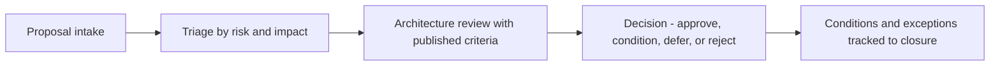

# Enterprise Architecture Governance

> **Core skill:** Running architecture governance that shapes investment and standards while staying fast enough that teams route work through it by choice rather than by mandate.

## Why This Matters

Governance is where architecture stops being advice. Current-state views, targets, and principles only matter if something tests proposals against them at the moment decisions are made — funding, design approval, procurement, or delivery. Without governance, the target is a wall poster; with bad governance, the practice becomes the bottleneck everyone routes around, and its existence accelerates the fragmentation it was meant to prevent.

The enabling model treats governance as a service with customers: clear criteria, published calendars, defined decision rights, and turnaround times measured in days, not months. Teams come because a review improves their proposal — catches a duplication, surfaces a cheaper reuse path, connects them to a standard platform — not merely because a process demands a stamp.

The senior architect designs governance at the right altitude and volume. Tier reviews by risk and cost: most proposals clear at a lightweight channel in hours; the small fraction with enterprise-wide consequences get deep scrutiny. Exceptions are first-class citizens — logged, time-bound, reviewed as a portfolio — because an unmanaged exception culture silently repeals every standard the practice publishes.

## What Governance Covers

| Area | What Is Governed | Typical Decision |
|------|------------------|------------------|
| Investment alignment | Major proposals and business cases | Fund, shape, defer, or reject against target and portfolio |
| Solution compliance | Architectures of projects above a threshold | Conform, conform with conditions, or waive |
| Standards and deviations | Use of platforms, patterns, and technologies | Adopt standard, grant exception, or amend the standard |
| Technology lifecycle | Introduction, retention, and retirement of technology | Adopt, tolerate, migrate, or eliminate |
| Cross-domain coherence | Changes touching multiple domains or units | Accept landscape change; resolve conflicts of direction |

## Governance Bodies

| Body | Composition | Cadence | Decisions |
|------|-------------|---------|-----------|
| Enterprise architecture board | Lead EA plus senior domain architects and business representatives | Monthly | Standards, target revisions, escalated exceptions |
| Architecture review forum | Domain architects plus delivery architects | Weekly or per intake | Solution conformance, conditions, waivers |
| Domain design authorities | Domain architects and senior engineers | As needed | Local designs within enterprise standards |
| Portfolio investment forum | Executives, finance, EA, product | Quarterly | Funding aligned to target and roadmap |

The board owns the rules; the forum applies them; the portfolio forum decides where the money goes. Confusing these three responsibilities is the most common design error in governance.

## The Review Process

| Step | Purpose | Service Level |
|------|---------|---------------|
| Intake | Capture proposal context, scope, and affected landscape | Automated or same-day |
| Triage | Route by risk, cost, and blast radius to the right depth | One to two business days |
| Assessment | Test against principles, target, duplication, cost, risk | Depth scaled to tier |
| Decision | Approve, approve with conditions, defer, or reject | Within published SLA |
| Conditions tracking | Follow up on required changes until delivery | Until closure |

Assessment dimensions for any nontrivial proposal:

| Dimension | Question | Evidence Expected |
|-----------|----------|-------------------|
| Strategic fit | Does this advance a stated priority? | Link to strategy or capability target |
| Target alignment | Which target does this move toward? | Target reference; deviation noted |
| Duplication | Does an existing capability already cover this? | Search of portfolio and service catalog |
| Cost and options | Were reuse, buy, and build compared? | Options paper with lifecycle cost |
| Risk | Security, privacy, resilience, compliance exposure? | Classification, threat notes, data flows |
| Operability | Can this be run and supported at enterprise scale? | Run cost, skills, support model |

## Exceptions and Waivers

| Concept | Rule | Example |
|---------|------|---------|
| Time-bound waiver | Exceptions expire; renewal requires justification | 90-day waiver to use a nonstandard database pending migration |
| Named owner | The exception has an accountable sponsor | Divisional CTO owns the deviation |
| Compensating controls | Risk is consciously accepted with mitigations | Additional monitoring and encryption for a constrained platform |
| Portfolio review | All standing exceptions reviewed quarterly as a set | Pattern of waivers triggers a standard revision |
| Sunset plan | Every waiver states how it ends | Exit criterion and date, tracked to closure |

A rising exception rate is data, not failure: it signals the standard, the target, or the incentive model is out of step with reality. Governance's job is to make that signal visible and act on it.

## Right-Sizing Governance

| Context | Governance Weight |
|---------|-------------------|
| Small or mid-size organization | Single review forum; light intake form; decisions in days |
| Regulated enterprise | Tiered reviews with mandatory compliance checks for high-risk tiers |
| Agile at scale | Lightweight per-team channels; enterprise forum reserved for cross-unit concerns |
| Federated units | Enterprise sets standards and target; unit authorities approve within them |
| Vendor-heavy portfolio | Procurement integration so contract decisions clear architecture criteria |

The tiering principle is constant: intensity scales with blast radius. A team selecting a library does not need a board; a proposal changing the enterprise integration backbone does.

## The Proposal Triage Flow



## Practical Applications

### Governance Effectiveness Checklist

- [ ] Intake, criteria, and SLAs are published where teams can find them
- [ ] Reviews are tiered by risk and cost — most proposals clear quickly
- [ ] Decisions record which principles and targets were applied
- [ ] Exceptions are logged, owned, time-bound, and reviewed as a portfolio
- [ ] Governance metrics include turnaround time and avoided duplication
- [ ] Escalations are rare and resolve conflicts of direction, not of taste

### Architecture Review Intake

```markdown
# Architecture Review Intake

## Proposal
- [What is being proposed, by whom, and why now]

## Landscape Impact
- [Systems, data, integrations, and platforms touched]

## Assessment Inputs
- Strategic fit: [reference to priorities or capability target]
- Target alignment: [which target; any deviation]
- Options considered: [reuse, buy, build comparison]
- Risk: [classification, security, privacy, resilience notes]
- Cost: [build and lifecycle cost summary]

## Request
- [Decision needed: standard adoption, waiver, target amendment, funding endorsement]

## Review Outcome
- [Decision, conditions, owner, and follow-up date]
```

## Common Pitfalls

| Pitfall | Why It Is a Problem | Better Approach |
|---------|---------------------|-----------------|
| **Gatekeeper mentality** | Arriving to block projects makes teams route around governance | Position reviews as services that improve proposals |
| **Review without criteria** | Decisions look arbitrary; trust collapses | Publish criteria and apply them uniformly |
| **Late review** | Reviewing after decisions are effectively made ratifies rather than shapes | Intake at proposal stage; tier early and lightly |
| **Unbounded exceptions** | Standing waivers quietly repeal standards | Time-limit every exception and review the portfolio quarterly |
| **No turnaround SLA** | Slow reviews justify bypassing the practice entirely | Publish and measure SLAs; escalate self-servingly fast tiers |
| **Uniform depth** | Everything reviewed deeply; the queue becomes the bottleneck | Tier by blast radius and cost |

## Success Indicators

- Teams describe reviews as useful, and most submissions improve before decision
- Turnaround metrics meet published SLAs for standard tiers
- Waivers are few, owned, and shrinking — or the standards they challenge get revised
- Duplicate spending is caught before funding, with the catch attributed to review
- Executive decisions on major proposals cite architecture assessment in their records

## Related Topics

- [[05_Architecture_Principles_for_the_Enterprise]]: the rules governance enforces
- [[07_Building_the_EA_Practice]]: governance as a component of the standing practice
- [[06_Transformation_Roadmaps_and_Portfolio/00_overview|Transformation Roadmaps and Portfolio]]: where governance meets funded sequencing
- [[career-path/04_Principal_and_Distinguished_Engineer/03_Decision_Governance_and_Principles/00_overview|Decision Governance and Principles (Principal)]]: the engineering-side governance counterpart

## Summary

Enterprise architecture governance is the mechanism that turns targets and principles into decisions — funded, shaped, conditioned, or refused — through tiered reviews with published criteria, service levels, and exception management. The senior architect designs it as a service teams choose to use: light where the blast radius is small, rigorous where the stakes are enterprise-wide, and honest enough to treat a rising exception rate as a signal to revise the rules rather than police them harder.
