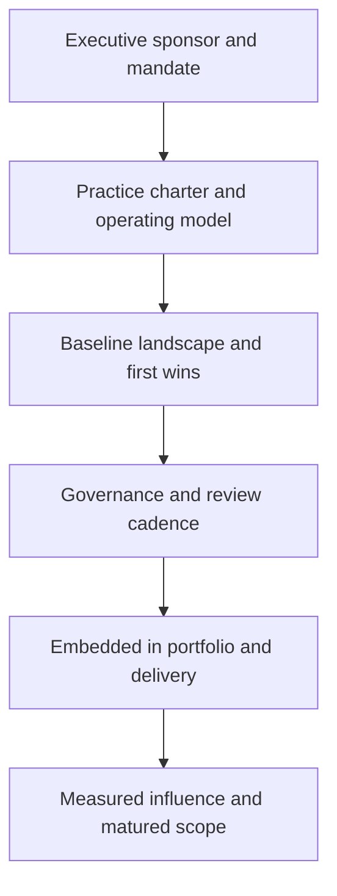

# Building the EA Practice

> **Core skill:** Standing up and maturing the architecture function — operating model, team shape, stakeholder engagement, and measurement — so the practice earns influence instead of assuming it.

## Why This Matters

An enterprise architect hired into a company without a practice is not joining an architecture function; they are founding one. The graveyard of these efforts is well known: months of framework study, a landscape assessment shipped to nobody, a governance board that meets twice and fades. Practices fail for a consistent reason — they produce artifacts and mandate processes before delivering a single decision anyone needed.

Successful practices are built outside-in. They start by finding the decisions leadership already struggles with — a duplication nobody can adjudicate, a migration with no target, a portfolio with no disposition — and resolving one visibly, with a small artifact and a fast timeline. Influence is earned decision by decision; the mandate follows the track record.

The senior architect designs the practice like a product: a clear charter, a right-sized team shape, an engagement model that serves delivery teams, and metrics that measure influence rather than activity. Maturity is then a staircase — from ad hoc to embedded — climbed deliberately, with the practice's scope expanding only as fast as its credibility.

## EA Operating Models

| Model | Structure | Strengths | Risks | Fits |
|-------|-----------|-----------|-------|------|
| **Centralized** | Single EA team owns all domains | Coherence, clear accountability | Bottleneck; disconnected from delivery | Smaller enterprises; strong mandate cultures |
| **Federated** | Domain architects in business units; light center | Proximity to delivery; local context | Drift; weak enterprise coherence | Large diversified groups |
| **Hub and spoke** | Central core plus embedded architects | Coherence with delivery proximity | Role ambiguity between hub and spoke | Most large enterprises |
| **Embedded** | Architects live inside delivery programs | Maximum delivery relevance | Enterprise view at risk | Transformation-heavy periods |
| **Virtual** | Part-time architects with a coordinating lead | Low cost; uses existing talent | Competing priorities; slow cadence | Early-stage practices; mid-size firms |

Most practices converge on hub-and-spoke with a small core: enterprise-level target, principles, and governance from the hub; domain and solution depth from the spokes. The model is less important than the clarity of decision rights between them.

## The EA Team Shape

| Role | Owns | Typical Background |
|------|------|--------------------|
| Lead or chief EA | Enterprise target, principles, board, external face | Senior architect with business exposure |
| Business architect | Capability model, value streams, operating model | BA or consulting background |
| Data architect | Domains, models, data governance direction | Data architecture or data management |
| Application and integration architect | Portfolio, patterns, interface standards | Solution architecture at scale |
| Technology architect | Platforms, standards, lifecycle | Infrastructure or platform engineering |
| Solution architects | Project-level designs within enterprise frames | Delivery-side architecture |
| EA analyst | Registers, tooling, reporting | Analysis and documentation |

Small practices merge roles; the mistake is merging the capability map owner with the governance owner, which puts the same person in the position of grading their own homework.

## Maturing the Practice

| Level | State | Evidence | Next Move |
|-------|-------|----------|-----------|
| 1 — Ad hoc | No landscape; decisions informal | Conversations cite anecdotes | Capture a minimal landscape; publish principles |
| 2 — Defined | Foundational artifacts exist; light governance | Artifacts start appearing in decisions | Add assessment and target work |
| 3 — Integrated | Governance in planning and funding flows | Proposals cite targets; duplications caught | Embed architects in major programs |
| 4 — Managed | Practice measured; exceptions managed | Influence metrics reported; standards current | Tie portfolio and strategy cycles together |
| 5 — Adaptive | Practice self-renews with strategy | Framework and principles revised deliberately | Continuous; coach other functions |

Maturity is not a scorecard to chase; it is a description of what the practice can currently deliver. Claiming level 4 without the evidence of level 3 is how practices lose the credibility they will need later.

## First 90 Days

| Phase | Focus | Concrete Output |
|-------|-------|-----------------|
| Weeks 1–3 | Listen | Stakeholder map; decision inventory; pain list from delivery and executives |
| Weeks 4–6 | Baseline | Minimal landscape view; principle draft; one target sketch for the loudest decision |
| Weeks 7–9 | First wins | One decision resolved with an artifact; intake channel opened for reviews |
| Weeks 10–12 | Rhythm | Review cadence running; charter agreed; first metrics published |

The order matters: no governance before a landscape, no landscape before relationships, no relationships without listening.

## Engagement Model

| Stakeholder | What the Practice Gives | What the Practice Needs |
|-------------|-------------------------|-------------------------|
| CIO and CTO | Coherent direction; options with trade-offs | Sponsorship; escalation path |
| Business executives | Translation of strategy into capability change | Access; priorities; honest constraints |
| Delivery and product teams | Fast reviews; reuse paths; standards that help | Intake honesty; participation in reviews |
| Finance and portfolio | Evidence-based portfolio dispositions | Cost data; investment calendar |
| Security and risk | Early integration of controls into designs | Threat context; compliance requirements |
| Procurement and vendors | Architecture criteria in purchasing | Contract visibility; vendor management channel |

## Measuring the Practice

| Type | Metric | Reading |
|------|--------|---------|
| Lagging | Duplicate spending avoided; retirements delivered | Value created by decisions |
| Lagging | Portfolio disposition coverage | Whether the landscape drives action |
| Leading | Review turnaround time | Service quality of governance |
| Leading | Artifact citation rate in proposals and funding papers | Whether the practice is used |
| Leading | Waiver volume and age | Whether standards match reality |
| Leading | Stakeholder demand for reviews | Pull, not push |

## Growing the Practice



## Practical Applications

### Practice Building Checklist

- [ ] A charter names the practice's decisions, customers, and decision rights
- [ ] The operating model is chosen deliberately, with hub and spoke roles clarified
- [ ] A minimal landscape exists within the first month — coarse and current beats complete and late
- [ ] One decision-relevant win is delivered before any governance mandate is proposed
- [ ] Metrics measure influence and pull, not artifact counts and meeting attendance
- [ ] Maturity claims are matched by evidence at the level below

### EA Practice Charter

```markdown
# Enterprise Architecture Practice Charter

## Purpose
[The decisions this practice exists to improve; the customers it serves]

## Scope
- In: [enterprise target, principles, landscape, governance, standards]
- Out: [project delivery, product decisions, service operations]

## Operating Model
[Hub and spoke; decision rights between center and domains]

## Engagement
- Intake: [how teams bring proposals]
- Cadence: [review forums, board, office hours]

## Metrics
- [Leading and lagging measures, with targets]

## Sponsor
[Named executive owner and escalation path]
```

## Common Pitfalls

| Pitfall | Why It Is a Problem | Better Approach |
|---------|---------------------|-----------------|
| **Framework first, value never** | Months of method setup produce no decision anyone needed | Resolve one visible decision within weeks; formalize later |
| **Hiring only for vocabulary** | Framework-certified staff without delivery judgment lose every credibility test | Weight real landscape and delivery experience |
| **Tooling as the practice** | A repository is bought before the practice knows its questions | Choose tooling after views and decisions are defined |
| **Boiling the ocean** | Assessing everything at once delays all value to the end | Depth by criticality; publish coarse and current |
| **No executive sponsor** | Without air cover the practice loses every funding and priority fight | Secure a named sponsor with a real decision to win |
| **Measuring activity** | Artifact counts and meeting attendance hide irrelevance | Measure citations, turnaround, and avoided duplication |

## Success Indicators

- The practice is pulled into decisions rather than pushing into processes
- Leaders can name a decision the practice shaped in the last quarter
- Stakeholders request reviews because past ones improved their proposals
- Scope grows by invitation, not by mandate
- The practice can state its maturity level with evidence for every claim

## Related Topics

- [[06_Enterprise_Architecture_Governance]]: the mechanism through which the practice exerts influence
- [[01_Enterprise_Architecture_Frameworks]]: framework tailoring as a founding decision
- [[career-path/03_Staff_Engineer/05_Systems_Thinking_and_Organizational_Design/00_overview|Systems Thinking and Organizational Design (Staff)]]: organizational design behind the operating model
- [[07_Architecture_Communication/00_overview|Architecture Communication]]: how a young practice makes itself understood

## Summary

Building an EA practice means founding a function that earns its mandate: a deliberate operating model and team shape, a first-ninety-days sequence that resolves a real decision before formalizing governance, an engagement model that serves delivery teams and executives alike, and metrics that measure influence rather than activity. Maturity is climbed in evidence-backed steps — from ad hoc to embedded — with scope expanding only as fast as credibility.
