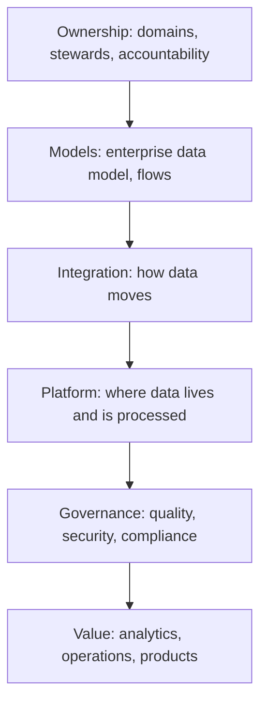

# Enterprise Data Architecture

> **Core capability:** The architect treats data as an enterprise asset — aligning ownership, flow, quality, governance, and value across the organization's systems and business units.

## Why This Matters

Data is the enterprise's most reused asset and its most neglected one: duplicated across systems, owned by nobody, trusted by few. Enterprise data architecture is the discipline of seeing data across the whole organization — where it originates, how it flows, who owns it, how quality is maintained, and how its value is realized.

This area bridges DMBOK's data management disciplines with architecture practice: not building pipelines or tuning databases (that is the data engineer's craft), but defining the enterprise view — data domains, integration patterns, governance structures, and the platform architecture that serves analytics, operations, and compliance alike.

## Topics in This Capability Area

| Topic | Core Skill | When It Matters |
|-------|------------|-----------------|
| [[01_Data_as_an_Enterprise_Asset]] | Establishing data ownership, stewardship, and accountability | Data strategy; governance setup |
| [[02_Enterprise_Data_Models_and_Flows]] | Conceptual enterprise data models and cross-system flows | Integration; master data |
| [[03_Data_Governance_and_Quality]] | Governance structures and quality management at scale | Enterprise data programs |
| [[04_Data_Integration_and_Interoperability]] | Integration patterns across the enterprise landscape | System integration; analytics |
| [[05_Analytics_and_Data_Platform_Architecture]] | Warehouse, lake, lakehouse, and analytics architecture choices | Platform strategy |
| [[06_Data_Security_Privacy_and_Compliance]] | Classification, protection, privacy regulation, retention | Regulatory compliance; trust |
| [[07_Data_Lifecycle_and_Value_Realization]] | From creation to archival to value: lifecycle and data products | Strategy; cost; monetization |

## The Data Architecture Stack

Ownership first — everything downstream depends on someone being accountable.

## Practical Applications

### Enterprise Data Architecture Checklist

- [ ] Data domains have named owners and stewards
- [ ] An enterprise data model exists at the conceptual level
- [ ] Cross-system data flows are documented with integration patterns
- [ ] Data quality is managed with defined dimensions and accountability
- [ ] Classification, privacy, and retention rules are designed, not improvised

## Common Pitfalls

| Pitfall | Why It Is a Problem | Better Approach |
|---------|---------------------|-----------------|
| **Data ownership vacuum** | Nobody accountable; quality erodes | Named owners and stewards per domain |
| **Integration spaghetti** | Point-to-point links multiply; change becomes impossible | Governed integration patterns and canonical flows |
| **Good-enough data quality** | Bad data propagates to decisions | Quality managed at the source, measured at consumption |

## Success Indicators

- Data domains have owners who are actually accountable
- Duplicate data stores are identified and rationalized
- Analytics teams trust and use the enterprise data model
- Compliance requirements are designed into data flows, not retrofitted

## Related Capabilities

- [[03_Enterprise_Architecture_Practice/00_overview|Enterprise Architecture Practice]]: data is one of the four EA domains
- [[05_Security_Risk_and_Compliance/00_overview|Security Risk and Compliance]]: data protection and privacy overlap
- [[career-path/09_Data_and_ML_Engineer/00_overview|Data and ML Engineer]]: the data engineering craft
- [[career-path/06_Software_Architect/06_Data_Architecture/00_overview|Data Architecture (Architect)]]: solution-level data design

## Summary

Enterprise data architecture sees data across the whole organization: ownership and stewardship, conceptual models and flows, governed integration, platform choices, and lifecycle management that realizes value. The architect does not build the pipelines — the architect makes sure the enterprise knows where its data is, who owns it, and what it is worth.