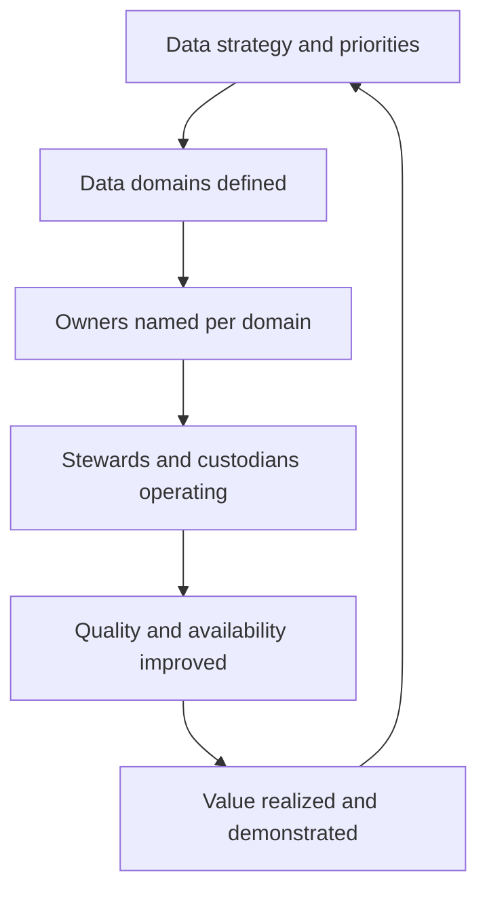

# Data as an Enterprise Asset

> **Core skill:** Turning "data is an asset" from a slogan into an operating model — data domains with named owners, stewards with real authority, and accountability that survives reorganizations.

## Why This Matters

Every enterprise says data is an asset; few manage it like one. Assets have owners, inventories, lifecycles, and value statements. Data usually has none of these — it is duplicated across systems, maintained as a by-product of applications, and owned by whoever happens to be closest when a problem surfaces. The result is the familiar pattern: nobody trusts the numbers, every report needs reconciliation, and regulatory questions take weeks to answer.

The root cause is not technology. It is an accountability vacuum. Applications have owners because outages demand one; data has no analogous forcing function, so accountability never forms. Enterprise data architecture's first job is to install that accountability deliberately: domain definitions aligned to how the business thinks, owners who are accountable for meaning and quality, stewards who operate the domain day to day, and custodians who run the platforms.

The senior architect knows the distinction between accountability and custody. The team running the warehouse is responsible for the plumbing; the business domain owner is responsible for whether the data means what it says. Confusing the two produces the classic failure where the data platform team is blamed for business definitions it never had the authority to fix.

## From Slogan to Operating Model

| Asset Concept | Data Equivalent | Concrete Mechanism |
|---------------|-----------------|--------------------|
| Asset inventory | Data domain and store catalog | Catalog populated with owners, locations, sensitivity |
| Ownership | Named data owner per domain | Decision rights over definitions, quality, and access |
| Caretaking | Stewards and custodians | Steward network operating rules; platform teams running stores |
| Quality assurance | Quality dimensions and rules | Measured at source, reported on scorecards |
| Lifecycle | Retention and disposal policy | Retention schedules applied and audited |
| Valuation | Value and cost tracking | Value hypotheses per domain; storage and processing cost |

The table is the transformation agenda: for each row, either a mechanism exists or the asset claim is unfinished.

## Data Domains

| Domain | Core Entities | Accountability Focus | Example Systems |
|--------|---------------|----------------------|-----------------|
| Customer | Party, customer, contact, consent | Identity resolution; privacy; single view | CRM, billing, support |
| Product | Product, catalog, pricing | Definition and lifecycle of offerings | PIM, e-commerce, ERP |
| Finance | Ledger, account, transaction | Accuracy, auditability, controls | ERP, billing, treasury |
| Employee | Worker, position, org unit | Privacy, access, org integrity | HRIS, identity systems |
| Supplier | Vendor, contract, performance | Risk, obligations, spend visibility | Procurement, AP |
| Asset | Equipment, facility, maintenance | Utilization, safety, maintenance history | EAM, IoT platforms |
| Reference | Codes, hierarchies, calendars | Consistency across the enterprise | MDM, shared services |

A domain taxonomy is a business artifact, not a database schema: it should match how the organization argues about its business, because those arguments are where ownership must intervene.

## Roles and Responsibilities

| Role | Decisions Owned | Explicitly Not Owned |
|------|-----------------|----------------------|
| **Data owner** | Domain definitions, quality targets, access policy, issue escalation | Platform implementation; budget for tooling alone |
| **Data steward** | Rules, standards in the domain, quality monitoring, issue triage | Enterprise policy; priorities across domains |
| **Data custodian** | Storage, pipelines, backup, security controls implementation | Business meaning; access policy approval |
| **Data consumer** | Usage within granted rights; raising quality issues | Definitions; access grants for others |
| **CDO or data office** | Enterprise policy, cross-domain arbitration, program direction | Day-to-day domain decisions |

The most common design fault: stewards appointed without time, authority, or escalation path — a role in name only. Stewardship must be a funded responsibility with executive backing, or it decays into an inbox nobody reads.

## Ownership Models

| Model | How It Works | Strengths | Weaknesses | Fits |
|-------|--------------|-----------|------------|------|
| Centralized | Single data organization owns domains | Consistency; single authority | Bottleneck; far from business context | Small organizations; early programs |
| Federated | Business units own their domains; center sets policy | Context proximity; scalability | Inconsistent practices; arbitration gaps | Large diversified enterprises |
| Hybrid | Domains federated; enterprise owns cross-domain and reference data | Balance of coherence and scale | Requires strong arbitration forum | Most mature programs |

Decision rights across models matter more than the label. Write them down: who defines an entity, who approves a new attribute, who grants access to sensitive fields, who resolves conflicts between domains, and who can declare an issue resolved.

## Value Dimensions of Data

| Value Type | How It Shows Up | Rough Measurement Approach |
|------------|-----------------|----------------------------|
| Revenue | Better targeting, pricing, new products | Attribution studies; A/B tests on data-driven features |
| Cost | Eliminated reconciliation, fewer manual fixes | Hours saved; rework rate; storage and pipeline efficiency |
| Risk | Avoided penalties, faster audits, fewer breaches | Audit effort; findings count; incident exposure |
| Efficiency | Faster onboarding, faster integration | Time to integrate a new system; time to answer regulatory queries |
| Optionality | Reuse in new products and analytics | Number of reuses per curated dataset |

Value hypotheses should be stated per domain when ownership is established — not to justify the program, but to give owners a reason beyond compliance to invest in quality.

## The Ownership Operating Loop



## Practical Applications

### Data Ownership Checklist

- [ ] A domain taxonomy exists and matches business language
- [ ] Every domain has a named owner with documented decision rights
- [ ] Stewardship is funded time, not a volunteer side job
- [ ] Custodians are assigned for every store and pipeline
- [ ] A cross-domain arbitration forum exists and has resolved at least one dispute
- [ ] Each domain states its value hypothesis and tracks one quality metric against it

### Data Domain Charter

```markdown
# Data Domain Charter — [Domain Name]

## Scope
- Entities: [conceptual entities in this domain]
- Boundaries: [what is explicitly another domain's concern]

## Owner
- Name and role: [accountable business leader]
- Decision rights: [definitions, quality targets, access policy, escalation]

## Stewards and Custodians
- Stewards: [names; responsibilities and time allocation]
- Custodians: [platform teams; systems of record]

## Quality Commitments
- Dimensions and targets: [completeness, accuracy, timeliness targets]
- Measurement: [where measured; reporting cadence]

## Value Hypothesis
- [How better data in this domain creates measurable value]
```

## Common Pitfalls

| Pitfall | Why It Is a Problem | Better Approach |
|---------|---------------------|-----------------|
| **Ownership without authority** | Owners who cannot decide anything become figureheads | Write decision rights into the charter and back them with sponsorship |
| **Stewards as unpaid volunteers** | Quality work loses every priority contest to project work | Fund stewardship explicitly; count it as real work |
| **Domains mirroring the org chart** | Reorganizations churn the model; entities cut across units | Define domains around business concepts, not reporting lines |
| **"Everyone owns data"** | Diffuse accountability equals none | One accountable owner per domain, named |
| **Custody mistaken for ownership** | Platform teams are blamed for business definitions | Separate business meaning from technical custody in every charter |
| **Asset language without valuation** | "Asset" rhetoric invites the question "what is it worth?" with no answer | State and test value hypotheses per domain |

## Success Indicators

- Business leaders accept the owner role and make recorded decisions
- Quality issues route to domain owners and get resolved without escalation rituals
- New systems are onboarded by mapping to domains, not by inventing new entities
- Audits and regulatory queries are answered from governed sources in days
- At least one domain can show a value case enabled by improved ownership

## Related Topics

- [[03_Data_Governance_and_Quality]]: the structures that make accountability operational
- [[07_Data_Lifecycle_and_Value_Realization]]: where ownership pays off across the lifecycle
- [[03_Enterprise_Architecture_Practice/00_overview|Enterprise Architecture Practice]]: data as one of the four enterprise domains
- [[career-path/09_Data_and_ML_Engineer/00_overview|Data and ML Engineer]]: the engineering craft that operates under these accountabilities

## Summary

Treating data as an enterprise asset means installing accountability: a domain taxonomy that matches business language, named owners with real decision rights over definitions and quality, funded stewards operating those decisions daily, custodians running the stores, and value hypotheses that give ownership a purpose beyond compliance. The senior architect separates business meaning from technical custody, funds stewardship as real work, and measures success by how rarely data questions stall for lack of an owner.
