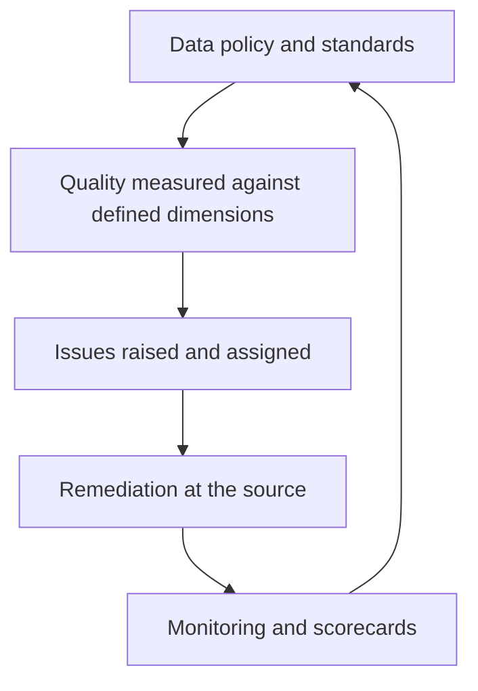

# Data Governance and Quality

> **Core skill:** Standing up data governance as a decision-rights system — councils, policies, stewards — and managing data quality with defined dimensions, measured targets, and clear accountability for remediation.

## Why This Matters

Data governance has a reputation problem because most programs start at the wrong end: a policy document, a committee, a tool purchase. None of these change a single decision. Governance works when it is understood as decision rights — who may define, change, approve, and escalate data matters — made operational through a small set of bodies and artifacts that remove recurring friction for real teams.

Data quality is the visible output of those rights exercised well. Quality without governance is a series of heroics: an analyst notices the numbers are wrong, an engineer patches a pipeline, nothing changes upstream, and the defect returns. Governance without quality work is a paper regime: standards published, exceptions invisible, decline invisible. The two belong together, because quality failures are how governance earns its keep and quality improvements are how governance proves it matters.

The senior architect's approach is deliberately mundane: define quality dimensions, measure a handful of them against targets on the most decision-critical data, assign issues to their owners, and let scorecards do the arguing. The ambition is not perfect data — perfect data is not a requirement any business case survives — but data whose fitness for its stated purposes is known, owned, and improving.

## Governance Structures

| Body | Composition | Owns | Cadence |
|------|-------------|------|---------|
| Executive data council | C-level sponsors, CDO, business owners | Policy, priorities, cross-domain arbitration | Quarterly |
| Data governance office | CDO staff, governance leads | Program operation, standards process, reporting | Continuous |
| Domain governance groups | Owners, stewards, key consumers | Domain rules, quality targets, issue resolution | Monthly |
| Steward network | Stewards across domains | Rule implementation, issue triage, catalog upkeep | Continuous |
| Architecture forum | Data architects, enterprise architects | Data architecture alignment with governance decisions | As needed |

The smallest viable structure is a single council plus engaged owners. Adding bodies before decisions exist produces governance theater with more meetings than outcomes.

## Governance Artifacts

| Artifact | Purpose | Owner | Failure Symptom If Missing |
|----------|---------|-------|----------------------------|
| Data policy | Enterprise-level rules and principles | Council | Every dispute becomes ad hoc |
| Standards and rules | Concrete definitions and thresholds per domain | Domain groups | "Best effort" quality with no yardstick |
| Business glossary | Authoritative business definitions | Stewards | Endless semantic arguments |
| Data catalog | Inventory of data assets with owners and locations | Governance office | Discovery by rumor; duplicate procurement |
| Issue log | Tracked quality and policy issues | Stewards with owners | Problems recur with no memory |
| Scorecards | Measured quality against targets | Governance office | Improvement claims without evidence |

Artifacts are kept only while they inform decisions. A glossary nobody edits and a catalog nobody searches are liabilities dressed as assets.

## Data Quality Dimensions

| Dimension | Definition | Typical Measure |
|-----------|------------|-----------------|
| Accuracy | Values reflect the real-world fact | Error rate against validated sources |
| Completeness | Required elements are present | Null rate on mandated fields |
| Consistency | Values agree across systems and time | Cross-system mismatch rate |
| Timeliness | Data is current enough for its use | Freshness lag versus requirement |
| Validity | Values conform to format and rules | Rule violation rate at ingestion |
| Uniqueness | Entities are not duplicated | Duplicate rate after resolution rules |

Dimension targets are chosen per data set and purpose: a marketing segment tolerates lateness a payment run never would. Uniform targets across all data is a sign nobody asked the consumers what they need.

## Quality Management Lifecycle

| Stage | Activity | Output |
|-------|----------|--------|
| Profile | Discover actual quality in existing data | Baseline statistics per dimension |
| Define | Set rules and thresholds with consumers and owners | Quality rules and targets agreed |
| Measure | Automate checks at source and at consumption | Monitoring and alerts |
| Remediate | Fix at the source; correct downstream | Issue log with owners and dates |
| Monitor | Scorecards and trend review | Governance reporting and prioritization |
| Improve | Feed patterns back into design standards | Prevention built into new systems |

The remediation rule that separates working programs from rituals: fix at the source, always. Cleaning downstream copies leaves the defect factory running.

## Operating Cadence

| Horizon | What Happens | Who |
|---------|--------------|-----|
| Continuous | Rules execute; issues log captures; catalog updates | Automated systems plus stewards |
| Weekly | Steward triage of new issues; assignment | Stewards |
| Monthly | Domain quality review; remediation progress | Domain groups |
| Quarterly | Enterprise scorecard; policy decisions; pattern analysis | Council |

## The Governance Operating Loop



## Practical Applications

### Data Governance Checklist

- [ ] Decision rights for definitions, quality targets, and access are written down
- [ ] A business glossary exists for the most contested terms and is actually used
- [ ] Quality dimensions and targets are set per critical data set, with consumer input
- [ ] Issues are logged, assigned to owners, and tracked to closure
- [ ] Every remediation fixes the source, not only downstream copies
- [ ] Scorecards are reviewed by a body with the power to reprioritize work

### Data Quality Scorecard

```markdown
## Data Quality Scorecard — [Domain]

| Data Set | Dimension | Target | Actual | Trend | Owner | Open Issues |
|----------|-----------|--------|--------|-------|-------|-------------|
| Customer master | Completeness | 98% | 96.2% | Improving | Domain steward | 3 |
| Customer master | Uniqueness | 99.5% | 99.7% | Stable | Domain steward | 0 |
| Product catalog | Timeliness | Under 4 hours | 6.1 hours | Degrading | Product owner | 1 |
| Finance ledger | Accuracy | 99.9% | 99.93% | Stable | Controller | 0 |
```

## Common Pitfalls

| Pitfall | Why It Is a Problem | Better Approach |
|---------|---------------------|-----------------|
| **Governance by committee** | Decisions stall in forums with no authority to act | Write decision rights first; convene only bodies with teeth |
| **Policy without enforcement** | Rules that never bite teach everyone to ignore rules | Attach each policy to a decision, control, or metric that applies it |
| **Perfection as the goal** | Unbounded quality ambition costs more than the use case earns | Set targets per purpose with the consumers who bear the cost |
| **Blaming downstream** | Cleaning copies hides the defect factory upstream | Fix at the source; track prevention in design standards |
| **Catalog as graveyard** | An unused inventory demoralizes and misleads | Keep the catalog to entries with owners and users |
| **Measuring everything** | Wide shallow metrics crowd out the few that drive action | Measure a handful of decision-critical sets deeply |

## Success Indicators

- Quality issues get resolved at the source and stay resolved
- Business glossary terms appear in project discussions without prompting
- Scorecards show trends that guide prioritization, not just numbers
- New systems are designed with quality rules for their critical data from the start
- Domain groups make decisions without escalation to the council for routine matters

## Related Topics

- [[01_Data_as_an_Enterprise_Asset]]: the owners and stewards governance operates through
- [[06_Data_Security_Privacy_and_Compliance]]: policy domains that share the governance machinery
- [[career-path/09_Data_and_ML_Engineer/00_overview|Data and ML Engineer]]: engineering practices that implement quality at the source
- [[03_Enterprise_Architecture_Practice/00_overview|Enterprise Architecture Practice]]: governance design as an enterprise discipline

## Summary

Data governance and quality work as one system: decision rights made explicit through a small set of bodies, artifacts, and cadences; quality managed on defined dimensions with targets set by purpose; issues logged, owned, and fixed at the source; and scorecards reviewed by people who can act on them. The senior architect keeps the structure minimal, ties every artifact to a decision it informs, and measures success by whether quality issues stop recurring rather than by how many are detected.
