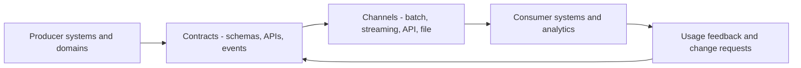

# Data Integration and Interoperability

> **Core skill:** Choosing enterprise integration patterns and data-sharing mechanisms — batch, messaging, events, APIs, files — with contracts that survive change, so systems compose instead of accumulating point-to-point debt.

## Why This Matters

Integration is where systems meet reality. A single undocumented interface is a manageable curiosity; forty of them, each with its own quirk, form the tangle that makes every change a multi-team negotiation and every incident an archaeology project. The enterprise architect's job is not to build the pipes but to set the pattern: which mechanisms are standard for which situations, how contracts are expressed, and how semantic disagreement is surfaced before it becomes a reconciliation war.

Interoperability is the deeper property integration serves. Two systems can exchange bytes flawlessly and still be unable to work together because "customer" or "order status" means different things on each side. Technical connectivity is the easy layer; semantic agreement is where the enterprise actually spends its integration effort. The architect maintains the mechanisms that make both layers explicit: canonical definitions from the enterprise data model, versioned contracts, and registries of who exchanges what.

The classic anti-patterns are well known and still extremely common: the shared database as an integration mechanism, point-to-point links as the default, and coupling to a source system's internal schema. Avoiding them is not a matter of taste — each one converts a source system's private decision into a set of dependencies that outlive everyone who made it.

## Enterprise Integration Patterns

| Pattern | Mechanism | Best For | Avoid When |
|---------|-----------|----------|------------|
| **Batch file exchange** | Scheduled extracts and loads | Bulk volume; legacy partners; tolerance for staleness | Freshness requirements are tight |
| **ETL and ELT pipelines** | Staged transform and load to targets | Analytics; warehouse loading; cleansing | Operational, low-latency needs |
| **API-driven pull** | Synchronous request and response | Lookups; user-initiated queries | Volumes are high or callers can fail alone |
| **Messaging** | Queues and brokers with delivery guarantees | Work distribution; decoupled processing | Broadcast semantics are needed |
| **Event streaming** | Publish and subscribe to change events | Reacting across domains; read-model sync | Strong global ordering is required |
| **Change data capture** | Reads the source log | Replication with low intrusion | The source cannot expose its log safely |
| **Shared database** | Multiple systems on one schema | Almost never as integration | Nearly always — this is a coupling trap |
| **Data virtualization** | Federated query over sources | Exploration; occasional joins | Performance-critical or repeated access |

The list is a menu for pattern selection, not an endorsement of variety. Each additional mechanism a team must operate raises the enterprise's learning and on-call burden; standards are how that burden stays bounded.

## Pattern Selection

| Requirement | Lean Toward | Notes |
|-------------|-------------|-------|
| Sub-second, user-facing | API or cached read model | Only where synchronous failure is acceptable |
| Near real time, decoupled | Events or CDC | Idempotent consumers are mandatory |
| Reliable work distribution | Messaging with queues | Prefer at-least-once with dedupe over fragile exactly-once |
| Large volumes, bounded staleness | Batch pipelines | Simplicity is a feature; state the staleness budget |
| Partner boundary | Files or governed APIs | Contracts are the interoperability surface |
| Analytics from operations | One-way replication | Latency stated; no write-back without governance |

## Interoperability Levels

| Level | Question | Mechanism | Failure Symptom |
|-------|----------|-----------|-----------------|
| Technical | Can the systems exchange bytes? | Protocols, transports, security | Integration exists but data misread |
| Semantic | Do the terms mean the same thing? | Enterprise model, glossaries, canonical schemas | Daily reconciliation disagreements |
| Organizational | Who operates and owns the exchange? | Ownership, SLAs, escalation | Finger-pointing when flows stall |
| Legal and regulatory | Is the exchange permitted? | Data agreements, residency, consent | Compliance findings on sharing |

Most "integration projects" that fail do so above the technical level. Wire-level success is table stakes; the other three levels are where architecture adds value.

## Contracts and Canonical Models

| Element | Purpose | Discipline |
|---------|---------|------------|
| Interface contract | Defines payload, semantics, and guarantees | Versioned; reviewed; no implicit behavior |
| Canonical schema | Shared representation for an entity across systems | Derived from the enterprise model; not owned by one consumer |
| Versioning policy | How change reaches consumers | Additive changes preferred; breaking changes require migration windows |
| Deprecation process | How interfaces retire | Announced, dual-run period, tracked decommission |
| Schema registry | Where contracts live and are validated | Enforced at build and runtime where possible |

Canonical does not mean universal: some domains warrant bilateral contracts instead. What matters is that the choice is explicit and versioned, not accidental.

## Integration Infrastructure Options

| Option | Role | Trade-Off |
|--------|------|-----------|
| API gateway | Managed, governed API exposure | Adds a hop; governance must stay lightweight |
| Event backbone | Publish-subscribe across domains | Operational complexity; schema discipline required |
| iPaaS or integration platform | Mediated connections for SaaS and partners | Avoids bespoke glue; can become a low-code sprawl |
| Legacy service bus | Central mediation of all flows | Rich routing, but a classic bottleneck and anti-pattern when overloaded |
| Point-to-point links | Direct connections | Fastest to build; the debt that funds future tangles |

## The Integration Path



## Practical Applications

### Integration Architecture Checklist

- [ ] Standard patterns are published with selection criteria, not just catalogs
- [ ] Shared-database integration is prohibited as an enterprise rule
- [ ] Every interface has a versioned contract with semantics documented
- [ ] Canonical schemas trace to the enterprise data model
- [ ] Interoperability is checked at all four levels for new exchanges
- [ ] Interfaces are registered with owners, and decommissions are tracked

### Integration Decision Record

```markdown
# Integration Decision — [Initiative]

## Exchange
- Data: [entities and direction]
- Systems: [producer and consumers]

## Pattern Choice
- Selected: [batch, messaging, events, API, file, CDC]
- Rationale: [latency, volume, coupling requirements]
- Rejected options: [and why]

## Contract
- Schema: [canonical or bilateral; where versioned]
- Semantics: [definitions of shared terms]
- Guarantees: [delivery, ordering, idempotency expectations]

## Operations
- Owner: [team accountable for the exchange]
- Failure behavior: [retry, quarantine, degrade]
- Deprecation path: [how this interface ends]
```

## Common Pitfalls

| Pitfall | Why It Is a Problem | Better Approach |
|---------|---------------------|-----------------|
| **Point-to-point default** | Every pair of systems adds a bespoke link; change cost compounds | Route through standard patterns and shared channels |
| **Shared database integration** | One schema becomes a public API nobody governs | Integrate through interfaces with contracts |
| **Semantic neglect** | Bytes flow; meanings diverge; reconciliation becomes permanent | Check semantic level; use canonical definitions for shared entities |
| **No versioning** | Every change is breaking; upgrades become standoffs | Version contracts; prefer additive evolution; deprecate deliberately |
| **Bus for everything** | Central mediation becomes the bottleneck and the single point of failure | Use buses for what they are good at; keep direct paths where sound |
| **Unregistered interfaces** | No one can assess change impact or decommission safely | Register every interface with owner and dependency data |

## Success Indicators

- New integrations select from standard patterns with recorded rationale
- Interface inventories are complete enough to answer change-impact questions in hours
- Semantic disputes are resolved through the model and glossary, not by reconciliation
- Decommissioned interfaces actually disappear from operating cost
- Teams reuse existing exchanges rather than building near-duplicates

## Related Topics

- [[02_Enterprise_Data_Models_and_Flows]]: entities and flow registrations these patterns carry
- [[05_Analytics_and_Data_Platform_Architecture]]: pipelines that feed the analytics estate
- [[02_Solution_Architecture_and_Design/00_overview|Solution Architecture and Design]]: where integration choices are made concrete per solution
- [[career-path/06_Software_Architect/06_Data_Architecture/00_overview|Data Architecture (Architect)]]: the solution-level view of data movement

## Summary

Data integration and interoperability are governed by pattern choice and contract discipline: publish selection criteria for batch, API, messaging, event, CDC, and file mechanisms; prohibit shared-database coupling; check every exchange at technical, semantic, organizational, and legal levels; and express agreements as versioned contracts traced to the enterprise model. The senior architect measures success by how fast change impact can be assessed and how rarely near-duplicate integrations get built.
