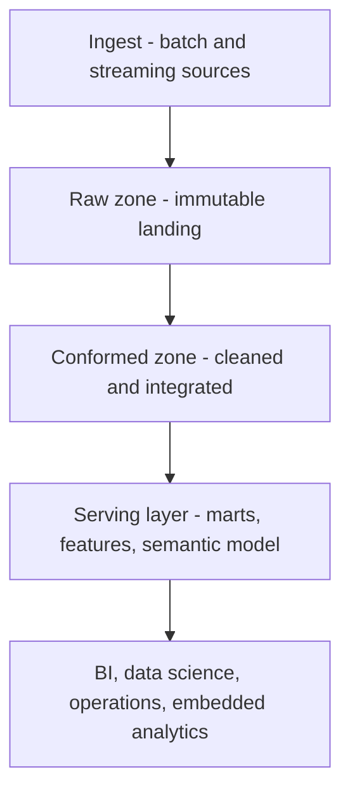

# Analytics and Data Platform Architecture

> **Core skill:** Choosing the enterprise analytics platform shape — warehouse, lake, lakehouse, streaming — and the zone architecture that serves business intelligence, operations, and data science from governed, cost-aware foundations.

## Why This Matters

Platform decisions are decade decisions. The warehouse pattern, the lake pattern, and their successors each encode assumptions about who consumes data, how quickly they need it, and how much governance the organization can actually operate. Enterprises that switch platform philosophy every three years spend the decade migrating and re-migrating; enterprises that pick a shape deliberately, and evolve it incrementally, compound their data capability instead of renting it.

The workloads keep multiplying: regulated reporting, self-service business intelligence, operational analytics embedded in applications, data science, and increasingly real-time and machine-learning consumers. No single storage engine serves all of them equally well. The architectural question is not "which platform wins" but "which zones, engines, and contracts let each workload be served at the right cost and latency without duplicating the estate."

The senior architect's discipline is twofold. First, treat the platform as zones with a single governed set of definitions flowing through them, so analysts and scientists argue about analysis rather than data locations. Second, make cost and freshness explicit design dimensions — the two properties most often discovered after the fact, in the budget review and the first outage of a critical dashboard.

## Workload Classes

| Workload | Consumers | Latency Need | Platform Implication |
|----------|-----------|--------------|----------------------|
| Regulated reporting | Finance, auditors, regulators | Batch, scheduled | Curated, versioned, reproducible |
| Self-service BI | Analysts, business users | Minutes to hours | Semantic layer; governed self-serve access |
| Operational analytics | Operations, support | Seconds | Near-real-time feeds; read models |
| Data science | Scientists, ML engineers | Hours to days | Raw access; experimentation sandboxes |
| Embedded analytics | Customer-facing products | Sub-second | Serving store at the edge of the platform |
| Real-time monitoring | Operations, platforms | Seconds or less | Stream processing; alerting paths |

One platform rarely serves all six natively. The design question is which workloads share zones and engines, and which get dedicated serving layers fed from the same governed core.

## Platform Patterns Compared

| Pattern | Characteristics | Strengths | Costs | Best Fit |
|---------|-----------------|-----------|-------|----------|
| **Data warehouse** | Schema-on-write; structured; SQL-centric | Reliability; performance; governance | Rigidity for unstructured data; cost at scale | Core regulated and BI workloads |
| **Data lake** | Schema-on-read; raw retention; flexible formats | Cheap scale; exploration; ML access | Governance risk; becomes a swamp without catalogs | Exploratory and data science zones |
| **Lakehouse** | Open table formats over object storage; warehouse-like semantics | Unified batch and BI on one copy; open formats | Newer operations; discipline required | Convergence of lake and warehouse needs |
| **Dependent data marts** | Domain marts fed from a conformed core | Domain autonomy; performance isolation | Duplication if not traceable to core | Domains with strong BI demands |
| **Independent marts** | Self-contained per-team platforms | Fast local value | Definition drift; estate sprawl | Almost never; a signal of missing platform |
| **Operational data store** | Integrated near-real-time operational view | Cross-system operational decisions | Another store to operate and govern | Real-time operational analytics |
| **Streaming platform** | Continuous processing and serving | Freshness; event-native consumers | Complexity; skills; operational discipline | Real-time monitoring and embedded analytics |

## Zone Architecture

| Zone | Content | Rules |
|------|---------|-------|
| **Landing** | Immutable arrival of source data | Write-only; retention per policy; provenance recorded |
| **Raw** | Preserved source-aligned copies | No transformation without traceability; reprocessable |
| **Conformed** | Cleaned, standardized, integrated | Enterprise definitions applied; lineage maintained |
| **Serving** | Marts, features, semantic models | Built for consumers; performance-optimized; SLA-bound |
| **Sandbox** | Exploration space | Time-boxed; promotes results back through governed paths |

The rule that keeps zones from collapsing into each other: data moves forward through governed transformations, and consumers read from serving or conformed zones — never from landing or raw, except scientists with explicit sanction.

## Batch, Streaming, and Hybrid

| Mode | Freshness | Fit | Watch Out For |
|------|-----------|-----|---------------|
| Batch | Hours | Reporting, reconciliation, large transformations | Misread as obsolete; it is usually cheapest and most robust |
| Streaming | Seconds | Monitoring, embedded analytics, event reactions | Cost and operational burden out of proportion to need |
| Hybrid | Mixed | Most enterprises: batch core, streaming exceptions | Duplicated logic across both paths |

Hybrid is the realistic destination for most organizations. The architectural commitment is that both paths apply the same definitions — the semantic layer, not each pipeline, is where consistency lives.

## Cost and Consumption Dimensions

| Dimension | Design Question | Lever |
|-----------|-----------------|-------|
| Storage | What must be kept, at what granularity, for how long? | Tiering; retention policy; columnar formats |
| Compute | Who pays for idle and for spikes? | Elastic clusters; workload isolation; auto-suspend |
| Duplication | How many copies exist per dataset? | Zone discipline; reuse of conformed layers |
| Concurrency | How many consumers contend at peak? | Serving-layer isolation; caching |
| Egress | Where does data leave, and at what price? | Residency-aware placement |

Cost is an architectural property, not an operational afterthought: every zone, copy, and engine choice carries a bill that scales with usage patterns the architect can forecast.

## The Zone-Based Platform



## Practical Applications

### Platform Architecture Checklist

- [ ] Workload classes are enumerated with latency, cost, and governance needs
- [ ] The platform pattern per zone is explicit, including sandbox boundaries
- [ ] One set of enterprise definitions flows through all zones via a semantic layer
- [ ] Batch and streaming paths share logic or explicitly reconcile in the serving layer
- [ ] Cost per zone is forecast and reviewed, with storage and compute levers stated
- [ ] Consumers know which zone to use for which need, and it is enforced

### Platform Decision Matrix

```markdown
# Platform Decision — [Scope]

## Workloads Served
- [Classes with latency and concurrency expectations]

## Zone Design
- Landing and raw: [retention, provenance rules]
- Conformed: [definitions and lineage mechanism]
- Serving: [marts, features, semantic layer, SLAs]
- Sandbox: [access, time-boxing, promotion path]

## Pattern Choices
- Core store: [warehouse, lake, lakehouse, hybrid]
- Freshness tiers: [batch, micro-batch, streaming per workload]

## Cost Model
- Storage: [projection and tiering]
- Compute: [isolation and elasticity approach]
- Duplication: [copies per dataset and justification]

## Risks
- [Governance, skills, lock-in, growth assumptions]
```

## Common Pitfalls

| Pitfall | Why It Is a Problem | Better Approach |
|---------|---------------------|-----------------|
| **Lake becomes swamp** | Raw flexibility without catalogs and zones destroys findability and trust | Enforce zones, catalogs, and promotion paths from day one |
| **Warehouse-only rigidity** | Unstructured and exploratory needs get forced into unnatural schemas | Add governed exploration zones; do not bend the core |
| **Tool-first selection** | A product is chosen before workloads are understood | Enumerate workloads and properties first; evaluate against them |
| **Definition chaos at the edge** | Every team recalculates metrics its own way | Central semantic layer; certifications for governed datasets |
| **Ignoring the cost model** | Consumption scales invisibly until the budget review | Forecast per zone; review cost as an architecture metric |
| **One platform for everything** | Over-general engines underperform on every niche | Serve niche workloads from dedicated layers fed by the core |

## Success Indicators

- Analytics teams argue about insights, not about where data lives or whose copy is right
- New workloads are onboarded by mapping to zones, not by standing up new estates
- Semantic-layer metrics are the default in BI and reporting
- Platform cost grows sub-linearly with data volume
- Sandbox experiments reach production through a governed promotion path

## Related Topics

- [[02_Enterprise_Data_Models_and_Flows]]: the definitions and flows the platform serves
- [[04_Data_Integration_and_Interoperability]]: the patterns that feed the zones
- [[career-path/09_Data_and_ML_Engineer/00_overview|Data and ML Engineer]]: the craft that builds and operates the pipelines
- [[06_Data_Security_Privacy_and_Compliance]]: access and residency constraints on platform design

## Summary

Analytics platform architecture is the deliberate choice of zones, patterns, and serving layers that let business intelligence, operations, and data science draw from one governed set of definitions at fit-for-purpose cost and latency. The senior architect enumerates workloads before tools, keeps zones disciplined so lakes do not become swamps, unifies definitions in a semantic layer across batch and streaming paths, and treats cost and freshness as design dimensions rather than discoveries.
