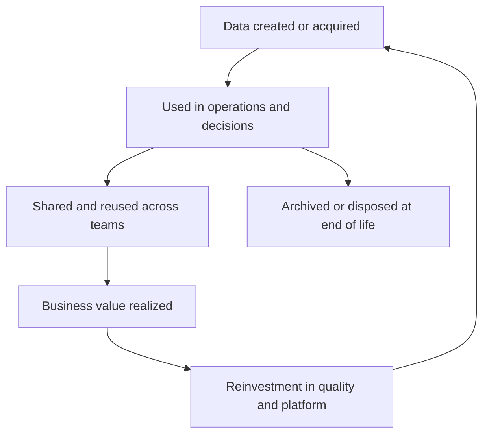

# Data Lifecycle and Value Realization

> **Core skill:** Managing data across its full lifecycle — creation to archival to disposal — and connecting governed data products to realized business value, so the enterprise knows what its data costs, what it earns, and when it should end.

## Why This Matters

Data enters the enterprise with a purpose and stays long past it. The default behavior of every system is to keep everything forever at full cost, with full risk exposure, and with freshness decaying quietly — and most organizations cannot say which datasets earn their keep and which are simply expensive sediment. Lifecycle management is the discipline that ends the default: stated lifespans, tiered storage, and deletion that actually happens.

Value realization is the other half. Data improves decisions, accelerates operations, and enables products — but those effects are claimed far more often than they are measured. Without measurement, data investments compete for budget on faith, and the next downturn cuts them first because their return is invisible. The senior architect's move is to make value concrete: data products with owners and consumers, value hypotheses stated in advance, and evidence gathered from use.

The connecting idea is the data product: a curated, governed, discoverable dataset with an owner, a contract, and a lifecycle — treated like any other product of the enterprise. Products have customers, which means usage is observable; they have quality statements, which means trust is explicit; and they have lifespans, which means the end is planned rather than suffered.

## Lifecycle Stages

| Stage | Questions | Architecture Concerns |
|-------|-----------|----------------------|
| Create and acquire | Why is this collected, under what basis? | Purpose tags; minimization; source contracts |
| Store | Where, at what tier, with what protection? | Classification; tiering; residency; cost model |
| Use and share | Who consumes it, for what decisions? | Access policy; semantic layer; product interfaces |
| Maintain | How does it stay correct and current? | Quality rules; stewardship; lineage |
| Archive | When does active use end? | Retrieval promises; format durability; indexes |
| Dispose | What must end, and how is it proven? | Retention schedules; holds; deletion propagation |

Each stage has an owner and a trigger. Lifecycle management fails when stages are governed only at creation and only until the project funding ends.

## Data Products and Reuse

| Artifact | Definition | Consumer Promise |
|----------|------------|------------------|
| Raw extract | Source-aligned copy | Availability and provenance only |
| Curated dataset | Cleaned, documented, governed | Quality statement; refresh cadence |
| Data product | Curated data with an owner, contract, and support model | SLAs; versioning; discoverability; support channel |
| Insight or metric | Analysis built on products | Definitions, lineage, freshness |
| Feature set | ML-ready, engineered attributes | Point-in-time correctness; reproducibility |

| Product Attribute | What It Answers | Failure Symptom If Missing |
|-------------------|-----------------|----------------------------|
| Owner team | Who answers when it breaks or changes | Nobody to call; silent decay |
| Contract and schema | What consumers can rely on | Every change breaks someone |
| Quality statement | How good is it, measured how | Trust by rumor |
| Discoverability | How new consumers find it | Duplicate products built sideways |
| Usage telemetry | Who consumes it, how much | Value claims with no evidence |
| Deprecation policy | How it ends | Eternal maintenance of unused data |

## Value Dimensions and Measurement

| Value Type | Mechanism of Value | Measurement Approach |
|------------|-------------------|----------------------|
| Revenue | Pricing, targeting, new offerings | Attribution or experiments; revenue per data-enabled product |
| Cost | Reduced reconciliation, automation | Hours saved; rework rate; platform efficiency |
| Risk | Faster audits, fewer findings, controlled exposure | Audit effort and findings trend; incident exposure |
| Efficiency | Faster time to insight and integration | Time to onboard an analytics use case |
| Optionality | Reuse across teams and products | Reuse count and distinct consumers per product |

State a value hypothesis before building, and record one measurement after — the discipline matters more than the sophistication. An enterprise that consistently pairs products with evidence accumulates a portfolio argument that survives leadership changes.

## Cost Management

| Cost Driver | Control | Architect's Lever |
|-------------|---------|------------------|
| Storage growth | Tiering and retention | Zone rules; format choice; archive strategy |
| Compute usage | Isolation and elasticity | Workload placement; scheduling; auto-suspend |
| Duplication | Single governed copies per purpose | Zone discipline; product interfaces over extracts |
| Data movement | Placement-aware design | Residency zones; locality of processing |
| Maintenance | Deprecation of unused products | Usage telemetry; retirement discipline |

Duplication is the cost driver most invisible in budgets and most addressable by architecture: every unauthorized copy is storage, processing, quality effort, and risk exposure multiplied.

## Sharing and Monetization

| Mode | What It Involves | Watch Out For |
|------|------------------|---------------|
| Internal sharing | Cross-unit reuse within policy | Access sprawl; definition drift |
| Partner sharing | Contracts, schemas, and settlement | Semantics and liability; termination terms |
| Public release | Open data or transparency programs | Privacy re-identification; reputational risk |
| Monetization | Data or insight sold or exchanged | Legal basis; quality promises; competitive exposure |

Monetization gets the excitement, but for most enterprises the larger and sooner return is internal reuse — and it requires exactly the same foundations: ownership, quality, contracts, and lifecycle discipline. Monetize after the internal flywheel turns, never before.

## The Value Realization Loop



## Practical Applications

### Lifecycle and Value Checklist

- [ ] Every catalogued dataset has a retention class and a disposal trigger
- [ ] Storage tiers map to stage and access frequency, not to habit
- [ ] Key datasets are managed as products with owners, contracts, and SLAs
- [ ] Usage telemetry exists for products, and unused products get deprecated
- [ ] Value hypotheses are stated before build and measured after
- [ ] Deletion and archiving are tested capabilities, not assumed ones

### Data Product Definition

```markdown
# Data Product — [Name]

## Consumers and Use Cases
- [Who uses it, for what decisions or features]

## Contract
- Schema and versioning: [location and policy]
- Refresh cadence and latency: [commitment]
- Quality statement: [dimensions and measured levels]

## Support
- Owner team: [name]
- Issue channel: [where consumers report problems]

## Lifecycle
- Retention and archive rule: [schedule]
- Deprecation policy: [notice period and migration support]

## Value Evidence
- Hypothesis: [expected value type and mechanism]
- Measurement: [how value is observed; review date]
```

## Common Pitfalls

| Pitfall | Why It Is a Problem | Better Approach |
|---------|---------------------|-----------------|
| **Keep everything forever** | Storage, risk, and confusion grow while value stays unexamined | Retention classes with disposal triggers; tier by access |
| **Deletion untested** | Erasure promises collapse the first time they are audited | Design and rehearse deletion propagation across copies |
| **Value claimed, not measured** | Data budgets lose to any competing visible return | Pair hypotheses with measured evidence per product |
| **Products without owners** | Decay is silent; consumers drift to shadow extracts | Owner team and support channel per product |
| **Monetization before trust** | Selling data the enterprise cannot itself trust invites liability | Fix ownership, quality, and lifecycle first |
| **Archive without retrievability** | Archives become write-only costs | Indexed, tested restoration to the promised standard |

## Success Indicators

- Disposal runs occur on schedule and are provable when challenged
- Products carry usage numbers, and unused ones are retired without drama
- At least one data investment renewal cites measured value, not anecdote
- Consumers prefer governed products over private extracts because the products are better
- Platform cost grows slower than data volume as tiering and deprecation take effect

## Related Topics

- [[01_Data_as_an_Enterprise_Asset]]: the ownership that makes lifecycle discipline possible
- [[05_Analytics_and_Data_Platform_Architecture]]: the zones where lifecycle stages execute
- [[06_Transformation_Roadmaps_and_Portfolio/00_overview|Transformation Roadmaps and Portfolio]]: where data investments compete for funding
- [[career-path/09_Data_and_ML_Engineer/00_overview|Data and ML Engineer]]: the engineering behind products, pipelines, and archives

## Summary

Data lifecycle and value realization close the loop on treating data as an asset: stated lifespans and tested disposal across every copy, tiered storage matched to actual use, curated data products with owners, contracts, and support, and value hypotheses paired with measured evidence so investments renew on record rather than faith. The senior architect connects cost, risk, and value into one managed curve — and insists that archiving, deletion, and deprecation are designed capabilities, not deferred intentions.
