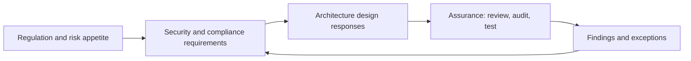

# Security, Risk and Compliance

> **Core capability:** The architect integrates security, privacy, resilience, and compliance into solution and enterprise design — treating them as architecture requirements, not post-hoc reviews.

## Why This Matters

In enterprise and customer-facing architecture, security and compliance are not optional quality attributes — they are gating constraints. A solution that cannot pass an audit, protect customer data, or survive a due-diligence review is not a solution. The architect works with these constraints from the first design conversation, not after the build.

This area is where the architect connects to the specialists: the Security Engineer (path 08) owns the depth of security engineering; the architect owns the integration — how security requirements shape solution structure, how risk is assessed and accepted at architecture level, and how compliance regimes become design inputs. The architect who understands the regulatory landscape and designs for it early saves the organization from expensive retrofitting.

## Topics in This Capability Area

| Topic | Core Skill | When It Matters |
|-------|------------|-----------------|
| [[01_Enterprise_Security_Architecture]] | Enterprise security domains, patterns, and posture | Every design review |
| [[02_Risk_Management_for_Architects]] | Assessing and managing risk at architecture level | Option selection; governance |
| [[03_Compliance_and_Regulatory_Architecture]] | Regulatory regimes as architecture requirements | Regulated industries; audits |
| [[04_Privacy_by_Design]] | Privacy principles, data protection, consent architecture | Customer data; PDPA/GDPR contexts |
| [[05_Resilience_and_Business_Continuity]] | BCP/DR requirements shaping architecture | Business-critical systems |
| [[06_Third_Party_and_Supply_Chain_Risk]] | Vendor risk, supply chain security, due diligence | Procurement; vendor platforms |
| [[07_Security_Governance_and_Assurance]] | Governance, audits, and assurance of security posture | Ongoing compliance; certifications |

## Security as Architecture Constraint

Compliance is a design input; assurance is the feedback loop.

## Practical Applications

### Security and Compliance Checklist

- [ ] Applicable regulations and standards are identified per solution
- [ ] Risk assessment is part of the solution design process
- [ ] Privacy requirements are designed in (data minimization, consent, retention)
- [ ] Resilience and continuity requirements shape the architecture
- [ ] Third-party and vendor risks are assessed before commitment
- [ ] Assurance activities (audits, reviews, testing) are planned, not improvised

## Common Pitfalls

| Pitfall | Why It Is a Problem | Better Approach |
|---------|---------------------|-----------------|
| **Compliance-as-afterthought** | Retrofit costs dwarf design-time costs | Regulatory scan at initiative start |
| **Risk register for show** | Risks documented, never managed | Risk ownership and treatment at architecture level |
| **Vendor trust by contract alone** | Security risk is operational, not just legal | Technical due diligence on vendor platforms |

## Success Indicators

- Audits find evidence of design-time compliance thinking
- Privacy and security requirements are traceable to architecture decisions
- Vendor risk assessments influence selection decisions
- Resilience requirements are validated before go-live

## Related Capabilities

- [[03_Enterprise_Architecture_Practice/00_overview|Enterprise Architecture Practice]]: governance reviews security posture
- [[06_Transformation_Roadmaps_and_Portfolio/00_overview|Transformation Roadmaps and Portfolio]]: security debt in the portfolio
- [[career-path/08_Security_Engineer/00_overview|Security Engineer]]: the security engineering depth
- [[career-path/06_Software_Architect/05_Security_Architecture/00_overview|Security Architecture (Architect)]]: solution-level security design

## Summary

Security, risk, and compliance are architecture constraints in the enterprise world: regulations become design requirements, risk assessment shapes options, privacy is designed in, and assurance validates the result. The architect integrates the specialists' depth into solution and enterprise design — because in the enterprise, compliance is not a phase, it is a precondition.