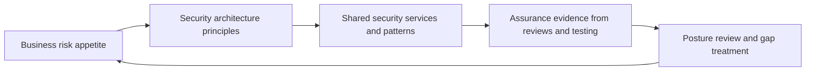

# Enterprise Security Architecture

> **Core skill:** The architect defines security architecture at enterprise scope — identity, network, data, application, and operations domains governed by shared principles and central services — so that security is a coherent property of the estate rather than an accumulation of tactical controls.

## Why This Matters

Security at enterprise scale is an architecture property, not a product. A strong firewall, a well-configured identity provider, or a mature operations team does not make an enterprise secure; the posture emerges from the structure of the estate — where trust boundaries fall, which data moves where, who can assert identity, and what every system assumes about its neighbors. The enterprise security architecture makes those structural commitments once, so individual solutions inherit security instead of reinventing it.

The architect's role here is integration, not depth. The Security Engineer owns cryptographic depth, detection engineering, and incident response; the architect owns how security requirements shape the landscape — which shared services every solution must consume, which patterns are mandatory, where controls belong, and how risk appetite becomes design constraints. The test of a security architecture is whether a new solution built from standard patterns is secure by default, without a security expert in the room.

Security architecture also sets the economics of protection. Fragmented controls cost more to build, operate, and audit than shared ones. Central identity, key management, secrets handling, and logging turn security from a per-project tax into an estate-level capability. The architect designs that consolidation deliberately, because the alternative — every team solving security alone — ends in a landscape of unmanaged edge cases.

## Security Architecture Domains

| Domain | Scope | Central Design Question | Shared Service Example |
|--------|-------|------------------------|------------------------|
| Identity and access | Who can act, on what, with what proof | How are identities asserted and least privilege enforced everywhere? | Identity provider, privileged access, entitlement review |
| Network and perimeter | How zones, segments, and channels are trusted | Where do trust boundaries fall and what may cross them? | Segmentation, service mesh policy, private connectivity |
| Data protection | How data is classified, encrypted, and controlled | What is sensitive, where may it live, who may touch it? | Key management, classification, masking and tokenization |
| Application security | How software is built and behaves safely | How do standard patterns make secure behavior the default? | Secure SDLC gates, dependency scanning, secrets management |
| Operations and monitoring | How the estate is watched and responded to | Can we detect, investigate, and respond across boundaries? | Central logging, detection platform, vulnerability management |

## Defense in Depth and Zero Trust

| Model | Core Idea | Architecture Implication | Where It Fails Alone |
|-------|-----------|--------------------------|----------------------|
| Defense in depth | Layered controls so no single failure is fatal | Multiple independent controls along the path of every critical transaction | Layers decay quietly; nobody removes them, they just stop working |
| Zero trust | No implicit trust from location; verify every request | Identity-centric access, per-request policy, micro-segmentation | Degenerates into a slogan when the identity foundations are missing |

The two compose rather than compete. Zero trust describes the direction of access design; defense in depth describes redundancy where boundaries are crossed. The architect uses both as design lenses, because security models age badly when adopted as religions.

## Security Architecture Principles

| Principle | Meaning | Design Consequence |
|-----------|---------|--------------------|
| Secure by default | The safe path is the easiest path | Standard patterns pre-wired with authentication, encryption, and logging |
| Least privilege | Access is granted per need and reviewable | Entitlement design; no standing administrative rights |
| Explicit trust boundaries | Every crossing is designed and inspected | Views annotate boundaries; inspection points match them |
| Shared controls over local ones | Security capability is estate-level | Central identity, keys, secrets, and logging are required services |
| Honest compensating controls | A gap is documented with its treatment | Exceptions register with scope, owner, and expiry |
| Visible security debt | Deferred controls are tracked like financial debt | Accepted deviations become register entries with review dates |

## Shared Security Services

| Service | What It Provides | Why Central |
|---------|------------------|-------------|
| Identity and federation | One identity assertion, uniform strong authentication | Every access decision starts here; fragmentation doubles work |
| Key and secret management | Custody, rotation, and audit of cryptographic material | Keys managed per team are keys mishandled |
| Central logging and detection | Correlated evidence across the estate | Investigations need one timeline, not many silos |
| Vulnerability management | Estate-wide visibility of exposure | Prioritization requires estate context |
| Policy decision and admission control | Uniform enforcement of guardrails | Policy enforced once, not re-implemented per team |

## The Posture Loop



## Practical Applications

### Security Architecture Review Checklist

- [ ] Every solution class has an approved security pattern naming its shared services
- [ ] Trust boundaries and sensitive data flows are drawn on architecture views, not left implicit
- [ ] Identity, keys, secrets, and logging are consumed from shared services by default
- [ ] Deviations and compensating controls sit in an exceptions register with owners and expiry
- [ ] Assurance activities trace evidence back to the principles they demonstrate

### Enterprise Security Snapshot

```markdown
## Enterprise Security Snapshot — <period>

| Domain | Current Posture | Gaps | Treatment | Owner |
|--------|----------------|------|-----------|-------|
| Identity | <summary> | <gap> | <action> | <role> |
| Network | <summary> | <gap> | <action> | <role> |
| Data | <summary> | <gap> | <action> | <role> |
| Application | <summary> | <gap> | <action> | <role> |
| Operations | <summary> | <gap> | <action> | <role> |
```

## Common Pitfalls

| Pitfall | Why It Is a Problem | Better Approach |
|---------|---------------------|-----------------|
| **Bolt-on security** | Reviews happen after design is frozen; controls wrap structures that cannot support them | Security patterns enter at option framing; requirements are design inputs |
| **Domain silos** | Identity, network, and data controls designed separately; gaps live at the seams | One architecture owns all domains; seam reviews at every boundary |
| **Zero trust as slogan** | A marketing phrase adopted without identity and policy foundations | Sequence the foundations; treat zero trust as a direction, not a deliverable |
| **Control sprawl** | Every team buys and runs its own tools; cost and blind spots multiply | Shared services catalog with consolidation targets in the roadmap |
| **Exceptions that live forever** | Compensating controls accepted informally and never revisited | Exceptions register with expiry dates and renewal decisions |
| **Posture measured by activity** | Counts of scans and policies rise while exposure is unchanged | Measure coverage, time to remediate, and control effectiveness |

## Success Indicators

- New solutions inherit security from standard patterns without bespoke negotiation
- The shared services catalog is consumed by default across the estate
- Boundary crossings in architecture views match inspection points in operations
- Exceptions are few, owned, and time-boxed
- Assurance evidence comes from operational sources, not audit-time assembly

## Related Topics

- [[02_Risk_Management_for_Architects]]
- [[03_Compliance_and_Regulatory_Architecture]]
- [[05_Resilience_and_Business_Continuity]]
- [[career-path/06_Software_Architect/05_Security_Architecture/00_overview|Security Architecture (Architect)]]
- [[career-path/08_Security_Engineer/00_overview|Security Engineer]]

## Summary

Enterprise security architecture turns security from a per-project negotiation into an estate property: domains governed by shared principles, trust boundaries made explicit, and central services — identity, keys, logging, policy — that every solution consumes by default. The architect integrates the specialists' depth into structural commitments so that secure behavior is the default path, deviations are visible and time-boxed, and posture is measured by exposure rather than activity.
