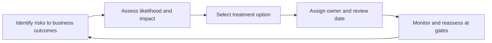

# Risk Management for Architects

> **Core skill:** The architect assesses and manages risk at architecture level — naming threats to business outcomes, sizing likelihood and impact, selecting treatment, and keeping every accepted risk owned, documented, and revisited at the gates where the decision can still change.

## Why This Matters

Every architecture decision is a risk decision. Choosing a platform, a topology, a vendor, or a migration strategy shifts the distribution of possible outcomes — some better, some worse. The architect's job is not to eliminate risk, which is neither possible nor affordable, but to make the carried risks explicit and proportionate: know which risks the estate is running, who owns them, and what treatment justifies the exposure.

Risk management at architecture level is about outcomes, not artifacts. A register kept to satisfy governance is worse than none, because it creates the appearance of control while changing nothing. The working version connects each risk to the decision it constrains, the treatment it received, and the review point where conditions may have changed enough to revisit the choice.

Architects also live between two risk languages. Enterprise risk management speaks of aggregate exposure, appetite, and regulatory consequence; engineering speaks of failure modes, technology debt, and delivery uncertainty. The architect translates in both directions, so a technical uncertainty becomes visible as business exposure and an appetite statement becomes a concrete design constraint.

## Risk at Four Levels

| Level | Central Question | Typical Owner | Architect's Role |
|-------|------------------|---------------|------------------|
| Strategic | Are we pursuing the right changes? | Executive leadership | Frame architectural options and their strategic risk |
| Architecture | Is the target structure sound and feasible? | Architect, design authority | Assess, document, and treat architectural risk |
| Delivery | Can this be built and transitioned as planned? | Program and project leadership | Surface architectural dependencies and sequencing risk |
| Operational | Will it keep running safely? | Operations and service owners | Design for known operational failure modes |

## The Assessment Model

Risk assessment at architecture level is qualitative and disciplined rather than numerically precise. Likelihood and impact are rated against explicit bands, with a stated rationale; the combination produces an exposure band that drives treatment priority. The distinction between inherent risk — before treatment — and residual risk — after — is what makes the register a management tool instead of a scare list.

| Rating | Likelihood | Impact on Business Outcomes |
|--------|------------|-----------------------------|
| High | Expected within the planning horizon | Material harm to revenue, customers, regulation, or trust |
| Medium | Possible; conditions are plausible | Noticeable disruption or cost; recoverable with effort |
| Low | Unlikely but not excluded | Minor friction; absorbed by normal operations |

## Treatment Options

| Treatment | Meaning | Architecture Example |
|-----------|---------|----------------------|
| Avoid | Remove the activity that creates the risk | Do not process the data class that drags in unmanageable obligations |
| Reduce | Change the design to lower likelihood or impact | Add isolation, redundancy, or staged rollout to contain failure |
| Transfer | Shift financial consequence to another party | Insurance; contractual allocation; vendor guarantees |
| Accept | Carry the risk knowingly, with authority | Documented acceptance with owner, rationale, and review date |

## From Risk to Managed Exposure



## The Architecture Risk Register

```markdown
## Architecture Risk Register — <program or landscape>

| ID | Risk | Decision Affected | Likelihood | Impact | Treatment | Residual | Owner | Review |
|----|------|-------------------|------------|--------|-----------|----------|-------|--------|
| R-01 | <risk statement> | <ADR or option> | High | Medium | Reduce: <action> | Medium | <role> | <date> |
| R-02 | <risk statement> | <decision> | Medium | High | Accept: <rationale> | High | <role> | <date> |
```

## Risk Appetite and Escalation

| Appetite Statement | Architecture Translation | Escalation Trigger |
|--------------------|--------------------------|--------------------|
| No tolerance for regulatory breach | Compliance controls are mandatory; no exceptions without executive sign-off | Any control gap touching regulated data |
| Cautious on new platforms | New technology enters through pilots with exit paths | Proposal to run critical workload on unproven platform |
| Accepts controlled delivery risk for speed | Phased releases allowed; rollback required | Any release without a tested rollback route |

## Practical Applications

### Risk Management Checklist

- [ ] Each significant architecture decision names the risks it was chosen against
- [ ] Risks are expressed in outcome terms a business stakeholder can restate
- [ ] Every accepted risk has a named owner, a rationale, and a review date
- [ ] Residual exposure is assessed after treatment, not assumed to vanish
- [ ] The register is consulted at decision gates, not only produced for them

### Risk Review Prompt

```markdown
## Risk Review — <decision or gate>

| Question | Answer |
|----------|--------|
| What has changed since this risk was assessed? | <change> |
| Is the treatment still in place and effective? | <evidence> |
| Does the residual exposure remain acceptable to the owner? | <yes or no> |
| Continue, adjust, or stop? | <decision> |
```

## Common Pitfalls

| Pitfall | Why It Is a Problem | Better Approach |
|---------|---------------------|-----------------|
| **Register as paperwork** | Filled once for governance, never consulted when deciding | Link every risk to the decision it constrains; review at gates |
| **Risk without an owner** | A risk owned by everyone is owned by no one | Named owner per risk with authority to treat or accept |
| **Precision theater** | Numeric scores imply accuracy the inputs cannot support | Qualitative bands with explicit rationale; avoid false precision |
| **Set-and-forget assessment** | Conditions change while the register stays frozen | Review dates and trigger conditions; reassess at checkpoints |
| **Acceptance by habit** | Accepting becomes the default; unowned exposure accumulates | Acceptance requires authority at the right level and an aggregate view |
| **Technical risk kept technical** | Failure modes phrased in engineering terms never reach the business conversation | Translate each risk into the outcome it threatens |

## Success Indicators

- Architecture decisions cite the risks they were selected against
- Accepted risks are few, owned, and reviewed on schedule
- Risk reviews at gates visibly change plans when warranted
- Business stakeholders can restate the top architecture risks in outcome terms
- Escalations arrive while treatment options still exist

## Related Topics

- [[01_Enterprise_Security_Architecture]]
- [[03_Compliance_and_Regulatory_Architecture]]
- [[05_Resilience_and_Business_Continuity]]
- [[06_Transformation_Roadmaps_and_Portfolio/00_overview|Transformation Roadmaps and Portfolio]]
- [[career-path/06_Software_Architect/04_Architecture_Evaluation_and_Trade_Offs/00_overview|Architecture Evaluation and Trade Offs (Architect)]]

## Summary

Risk management for architects makes the exposure carried by design decisions explicit: threats named in outcome terms, rated against honest bands, treated by avoidance, reduction, transfer, or documented acceptance, and revisited at the gates where decisions can still change. The register is a management instrument, not a compliance artifact — its worth is measured by whether decisions are different because the risks were visible.
