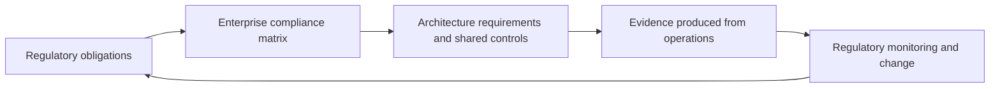

# Compliance and Regulatory Architecture

> **Core skill:** The architect turns regulatory obligations into enterprise architecture requirements — maintaining a compliance matrix from regulation to obligation to shared control to evidence — so that compliance is designed once, satisfied consistently, and audited by lookup rather than archaeology.

## Why This Matters

Regulated enterprises do not choose whether compliance shapes their architecture; they choose only whether it shapes it deliberately. Obligations arrive as legal text but land as structural constraints: where data may reside, how long it may be kept, who may access it, what must be provable afterward, and how quickly incidents must be reported. An architect who treats these as paperwork discovers late that the estate's structure contradicts a regulation, and structure is the slowest thing to change.

At enterprise scale the problem is not one regulation but many — overlapping regimes, shared controls, ambiguous clauses, and constant change. A per-project approach re-interprets the same law in every initiative and produces a landscape of inconsistent answers. An enterprise compliance matrix solves this once: obligations mapped to shared controls that many solutions consume, with interpretation decisions recorded where they can be reused.

The architect is not the compliance owner. Legal and compliance functions interpret the regime; internal audit assures it. The architect's contribution is the translation layer in the middle: converting obligations into requirements, requirements into structure, and structure into evidence that comes from operations rather than from audit-time assembly.

## Regulatory Regimes as Design Inputs

| Regime Class | Typical Obligations | Architecture Impact |
|--------------|---------------------|---------------------|
| Data protection | Lawful basis, residency, retention limits, individual rights | Data topology, lifecycle design, deletion propagation, consent records |
| Financial and reporting | Control integrity, segregation of duties, auditable change | Workflow separation, change records, immutable audit trails |
| Payment and card data | Scope reduction, encryption, access restriction | Tokenization, segmentation, key custody, scope boundaries |
| Sector safety and continuity | Operational resilience, incident reporting windows | Redundancy, detection paths, notification workflows |
| Public sector and procurement | Sovereignty, accessibility, transparency duties | Hosting location, interface standards, publication design |
| Contractual and assurance | Customer-imposed control expectations, certifications | Shared control coverage, evidence production, assurance calendar |

## Frameworks and Their Architectural Use

| Framework | Purpose | How the Architect Uses It |
|-----------|---------|---------------------------|
| ISO 27001 family | Management system for information security | Organizing control ownership and certification scope |
| NIST Cybersecurity Framework | Outcome-based security posture structure | Gap language shared with security leadership |
| SOC 2 style attestations | Independent assurance over controls | Aligning evidence expectations with customer due diligence |
| Control catalogs | Reusable control definitions | Mapping many obligations to a small set of shared controls |

## The Enterprise Compliance Matrix

The matrix is the translation instrument. At enterprise scale it differs from a per-system view by naming shared controls explicitly, so the same control can be seen satisfying obligations from several regimes.

```markdown
## Enterprise Compliance Matrix — <regulation set>

| Regulation | Obligation | Shared Control | Solution Control | Evidence | Owner | Status |
|------------|-----------|----------------|------------------|----------|-------|--------|
| <regime> | <obligation statement> | <estate-level control> | <local control> | <artifact> | <role> | <state> |
| <regime> | <obligation> | <control> | <control> | <artifact> | <role> | <state> |
```

## Regulatory Change as a Designed Loop



## Shared versus Solution Controls

| Control Type | Example | Owner | Reuse Pattern |
|--------------|---------|-------|---------------|
| Shared platform control | Central identity with recertification workflow | Platform or security team | Consumed by all solutions in scope |
| Shared process control | Change management with approval records | Engineering operations | Referenced in each solution's evidence |
| Solution control | Field-level encryption for a specific data class | Solution team | Designed per solution; mapped to obligations |
| Interpretive control | Documented reading of an ambiguous clause | Architect with compliance | Recorded once; reused where applicable |

## Practical Applications

### Compliance Architecture Checklist

- [ ] Applicable regimes are identified per domain and solution before design, not before audit
- [ ] Every obligation maps to a control, and every control names an owner and evidence
- [ ] Shared controls are defined once and referenced, not rebuilt per solution
- [ ] Interpretation decisions for ambiguous clauses are recorded and reusable
- [ ] Evidence expectations are designed into operations rather than assembled at audit time

### Regulatory Impact Assessment

```markdown
## Regulatory Impact Assessment — <new or changed regulation>

| Question | Answer |
|----------|--------|
| Which obligations are new or changed? | <list> |
| Which matrix rows and controls are affected? | <rows> |
| Which structures must change, if any? | <views affected> |
| What evidence will demonstrate compliance? | <artifacts> |
| What is the deadline and owning role? | <date and owner> |
```

## Common Pitfalls

| Pitfall | Why It Is a Problem | Better Approach |
|---------|---------------------|-----------------|
| **Per-project compliance** | Every initiative re-reads the same regulation; answers diverge and audits multiply | One enterprise matrix as the reference; projects consume it |
| **Control duplication** | One obligation satisfied five different ways; cost and drift grow | Shared control mapping; consolidate before automating |
| **Audit-time evidence** | Screenshots and recollection are assembled under pressure and rarely reproducible | Evidence designed into operations and produced on demand |
| **Unpinned interpretations** | Nobody records the chosen reading of an ambiguous clause | Record interpretation with the decision it drove |
| **Strictest reading everywhere** | Gold-plating without requirement; cost with no obligation behind it | Match control strength to the obligation; document the rationale |
| **Change as surprise** | Regulation updates land late, as fire drills | Monitoring feeds the matrix; impact assessed within days |

## Success Indicators

- A new obligation is impact-assessed in days using the matrix
- Audits retrieve evidence from operational systems by lookup
- Shared controls visibly satisfy obligations from multiple regimes
- Interpretations are recorded alongside the architecture decisions they shaped
- Regulatory change reaches the roadmap before it reaches the audit

## Related Topics

- [[01_Enterprise_Security_Architecture]]
- [[02_Risk_Management_for_Architects]]
- [[04_Privacy_by_Design]]
- [[07_Security_Governance_and_Assurance]]
- [[career-path/08_Security_Engineer/00_overview|Security Engineer]]

## Summary

Compliance and regulatory architecture converts legal text into estate structure: obligations mapped in one matrix to shared and solution controls with named evidence, interpretations recorded once and reused, and regulatory change flowing through a designed loop back into requirements. The architect owns the translation, not the legal judgment — and the enterprise that builds it learns that audits become lookups, not emergencies.
