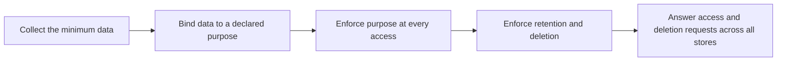

# Privacy by Design

> **Core skill:** The architect embeds data protection principles — minimization, purpose limitation, consent, retention, and individual rights — into the structure of systems, so privacy is a property of the design rather than a promise in a policy.

## Why This Matters

Privacy regimes the world over agree on a direction: collect less, bind data to declared purposes, let people exercise rights over their information, and delete what is no longer needed. In practice these obligations land on architecture — what data the estate collects, where copies flow, how purposes are enforced at access time, and which workflows can answer an access or deletion request across every store. Privacy that is not designed is eventually enforced by incident.

The hard part is not the principle but the propagation. A system that deletes on request from its primary store while caches, backups, analytics warehouses, and partner feeds keep copies is not compliant with the obligation it claims to satisfy. Responsibility, like deletion, must propagate: every derived copy inherits the classification, the purpose binding, and the lifecycle of its source. The architect designs the flow, not just the database.

Privacy by design is also an economic and reputational architecture question. Data that is never collected cannot leak, be subpoenaed, or be repurposed; data minimized at collection is cheaper to protect, retain, and govern. The architect who designs minimization as a structural default gives the enterprise both a smaller attack surface and a smaller compliance surface.

## Privacy Principles and Their Architecture Consequences

| Principle | Obligation | Architecture Consequence |
|-----------|------------|--------------------------|
| Lawfulness and purpose limitation | Data used only for declared purposes | Purpose tags attached at collection and enforced at access |
| Data minimization | Collect what the purpose requires, nothing more | Collection interfaces designed to reject unnecessary fields |
| Accuracy | Data is correct and updatable | Correction workflows that propagate like the data itself |
| Storage limitation | Delete when purpose is spent | Lifecycle rules bound to classification, not to habit |
| Integrity and confidentiality | Protection proportionate to sensitivity | Classification drives encryption, access, and masking |
| Accountability | The enterprise can demonstrate compliance | Records of processing, decisions, and evidence trails |

## Consent and Preference Architecture

Consent that exists in a database row but not in the enforcement path is theater. The architecture pattern is a consent and preference store that acts as a policy input: decisions to process, contact, or share consult the current state before acting, and every change of preference propagates to systems that hold derived data.

| Component | Function | Failure Mode If Missing |
|-----------|----------|-------------------------|
| Consent and preference store | Single record of what a person agreed to, with version and timestamp | Conflicting consents across channels; no auditable basis |
| Policy enforcement point | Checks purpose permission before access or transfer | Consent recorded but bypassed by direct system access |
| Propagation mechanism | Pushes preference changes to downstream systems and partners | Opt-out honored in one system, ignored in others |
| Evidence trail | Records who checked what, when, and against which policy version | No defensible answer during an investigation |

## Protective Techniques

| Technique | What It Protects | Trade-Off |
|-----------|------------------|-----------|
| Pseudonymization | Separates identity from behavior; reduces direct exposure | Re-identification risk if linkage keys are poorly held |
| Tokenization | Replaces sensitive values with references held elsewhere | Requires vault availability and lifecycle management |
| Encryption and key isolation | Protects data at rest, in transit, in use where possible | Key custody becomes a critical dependency |
| Aggregation and differential privacy | Enables insight without exposing individuals | Utility loss; requires statistical literacy to tune |
| Data masking and synthetic data | Safe environments for testing and analytics | Must stay synchronized with production schemas |

## Individual Rights as Architecture Flows



Each right — access, correction, deletion, portability — is a workflow that must reach every store holding a copy. The test of the design is whether an engineer can enumerate the stores, or only the primary one.

## Practical Applications

### Privacy Design Checklist

- [ ] Every data element carries a classification and a declared purpose from collection onward
- [ ] Collection interfaces reject fields no purpose requires
- [ ] Consent and preferences are enforced at access time, not merely stored
- [ ] Deletion and correction propagate to every derived copy, caches and partners included
- [ ] An inventory names every store where personal data lives, with an owner for each

### Privacy Impact Assessment

```markdown
## Privacy Impact Assessment — <initiative>

| Question | Answer |
|----------|--------|
| What personal data is involved, and what is the purpose? | <data and purpose> |
| Where does it flow, and who receives it? | <flows and recipients> |
| What is the minimization story? | <what is excluded and why> |
| How are rights fulfilled across every store? | <workflows and coverage> |
| What residual privacy risk remains, and who accepts it? | <risk and owner> |
```

## Common Pitfalls

| Pitfall | Why It Is a Problem | Better Approach |
|---------|---------------------|-----------------|
| **Consent as checkbox** | Collected once, never enforced; bases for processing are indefensible | Consent store as policy input checked at every decision point |
| **Privacy notice as design** | The notice describes intent; the structure contradicts it | Build the flows the notice promises, then describe them honestly |
| **Deletion without propagation** | Caches, backups, and analytics retain copies indefinitely | Deletion as an end-to-end flow with per-store confirmation |
| **Purpose creep** | Data collected for one purpose quietly reused for others | Purpose bound at collection and enforced at access; reuse requires new basis |
| **Pseudonymization overclaimed** | Linkage keys make the data effectively identifiable | Treat pseudonymized data as personal; protect the linkage |
| **Inventory by memory** | Nobody can enumerate where personal data lives | Maintained inventory with owners; refreshed by discovery tooling |

## Success Indicators

- The personal data inventory is complete and owned, not reconstructed during incidents
- Access and deletion requests complete with per-store evidence inside the required window
- Purposes are enforced at access, so misuse requires an explicit exception
- New features pass privacy review without structural redesign
- Minimization decisions are visible in the data model, not only in policy text

## Related Topics

- [[03_Compliance_and_Regulatory_Architecture]]
- [[01_Enterprise_Security_Architecture]]
- [[06_Third_Party_and_Supply_Chain_Risk]]
- [[04_Enterprise_Data_Architecture/00_overview|Enterprise Data Architecture]]

## Summary

Privacy by design makes data protection structural: purposes bound at collection and enforced at access, consent stored and consulted rather than merely recorded, protective techniques matched to sensitivity, and individual rights implemented as flows across every store that holds a copy. The architect's test is simple and unforgiving — could the enterprise answer an access or deletion request from its design, or would it need an excavation?
