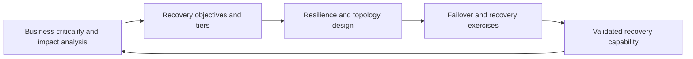

# Resilience and Business Continuity

> **Core skill:** The architect translates business continuity requirements — criticality tiers, recovery time and recovery point objectives — into structural decisions on redundancy, failover, replication, and degraded operation that the business has validated and is prepared to fund.

## Why This Matters

Continuity requirements are business statements about acceptable harm, and they only become real when architecture pays for them. "The system must not go down" is not a requirement; "trading must resume within fifteen minutes with no confirmed transactions lost" is. The architect turns the second kind of statement into structure: what is redundant, what replicates where, how failover is triggered, and what the enterprise will operate in degraded mode rather than stop entirely.

The gap between a plan and a capability is discovered at the worst possible moment. A documented recovery time objective that has never been tested against a real failover is an assumption, not a capability. Resilience architecture therefore treats testing as part of the design: scenarios are defined, exercises are scheduled, results feed back into the architecture, and the business is told honestly what the estate can and cannot survive.

Resilience also has to be scoped by criticality, because resilience is expensive. Applying the highest tier everywhere buys cost without value; applying a low tier to a critical service transfers the risk to the customer. The architect's judgment is in the tiers: which services justify active-active topology, which can tolerate hours of recovery, and which are genuinely optional under stress.

## From Business Impact Analysis to Architecture

| BIA Output | Architecture Decision |
|------------|----------------------|
| Criticality tier per service | Resilience pattern and investment level |
| Recovery time objective | Topology, failover automation, staffing model |
| Recovery point objective | Replication strategy: synchronous, asynchronous, snapshot |
| Minimum viable service during disruption | Degraded mode design and feature shedding |
| Regulatory reporting windows | Detection and notification paths designed to the clock |
| Interdependency map | Sequencing of recovery across services and shared platforms |

## Criticality Tiers and Architecture Patterns

| Tier | Recovery Time / Point | Typical Pattern | Cost Shape |
|------|----------------------|-----------------|------------|
| Mission critical | Minutes; near-zero data loss | Active-active across sites or zones; continuous replication | Highest; automation required to meet window |
| Business critical | Under an hour; minutes of data loss | Warm standby with automated failover; frequent replication | High; some manual steps bounded by runbooks |
| Important | Within a day; hours of data loss | Backup and restore with tested runbooks; cold standby | Moderate; discipline matters more than spend |
| Tolerable | Days; rebuild acceptable | Standard backup; documented rebuild path | Low; clear statement of accepted downtime |

## Resilience Mechanisms

| Mechanism | What It Provides | When It Is Justified |
|-----------|------------------|----------------------|
| Redundancy within a zone | Protection against component failure | Every service above tolerable tier |
| Multi-zone or multi-site topology | Protection against site-level failure | Business critical and above |
| Continuous data replication | Recovery point near zero | Where transaction loss is unacceptable |
| Automated failover and health routing | Recovery time inside minutes | Where human response cannot meet the window |
| Degraded mode and feature shedding | Continued partial service under stress | Where partial service preserves customers or safety |
| Game-day exercises | Evidence the capability works | Every tier; scaled to criticality |

## The Continuity Loop



## Exercises and Evidence

| Exercise Type | What It Proves | Frequency Guidance |
|---------------|----------------|--------------------|
| Component failure injection | Redundancy works before anything depends on it | Continuous in mature practices |
| Failover drill | Recovery time and automation behave as designed | At least per critical service per period |
| Restore test | Backups are readable and complete | Regular; randomly sampled |
| Full scenario exercise | People, process, and technology cooperate | Annual at enterprise scale |
| Dependency walkthrough | Shared platforms and vendors recover in the right order | After significant landscape change |

## Practical Applications

### Continuity Architecture Checklist

- [ ] Every service has a criticality tier agreed by the business, not assigned by engineering alone
- [ ] Recovery objectives are translated into specific topology and replication decisions
- [ ] Degraded operation is designed: what continues, what sheds, who decides
- [ ] Recovery order across dependencies — including shared platforms and vendors — is defined
- [ ] Exercises are scheduled, evidence recorded, and findings fed back into design

### Continuity Requirements Template

```markdown
## Continuity Requirements — <service>

| Attribute | Value |
|-----------|-------|
| Criticality tier | <tier> |
| Recovery time objective | <duration> |
| Recovery point objective | <data loss tolerance> |
| Degraded mode | <what continues> |
| Dependencies and recovery order | <list> |
| Exercise schedule and evidence owner | <plan> |
```

## Common Pitfalls

| Pitfall | Why It Is a Problem | Better Approach |
|---------|---------------------|-----------------|
| **Objectives assumed, never bought** | The business states a window nobody funded; the gap surfaces in an incident | Price each tier; let the business choose with cost visible |
| **Backups tested, failover never** | Restore works in isolation; the real end-to-end recovery path does not | Exercise full failover, not just restores |
| **Infrastructure-only view** | Systems recover; data, identity, and support functions do not | Recover the whole service chain: identity, data, people, vendors |
| **Plan divorced from architecture** | A plan describes steps the estate cannot actually perform | Design the capability; the plan documents what was built |
| **Hidden single points** | Shared platform or network link quietly couples every service | Dependency map maintained and walked before each exercise |
| **Highest tier everywhere** | Cost explodes; attention dilutes across services that did not need it | Tier by genuine impact; concentrate investment where it matters |

## Success Indicators

- Recovery objectives are stated with the cost attached, and chosen by the business
- Exercises produce results inside the promised windows, with evidence retained
- Degraded modes have been used deliberately, not discovered accidentally
- Dependency maps reflect reality and drive recovery sequencing
- Findings from exercises demonstrably change architecture within the next cycle

## Related Topics

- [[01_Enterprise_Security_Architecture]]
- [[02_Risk_Management_for_Architects]]
- [[03_Compliance_and_Regulatory_Architecture]]
- [[06_Migration_and_Coexistence_Strategies]]
- [[career-path/12_Technical_Program_Manager/00_overview|Technical Program Manager]]

## Summary

Resilience and business continuity translate acceptable harm into architecture: criticality tiers that price protection, recovery objectives that determine topology and replication, degraded modes that preserve partial service under stress, and exercises that turn documented plans into validated capability. The architect's discipline is sequencing and honesty — recovering the whole service chain, not just the servers, and telling the business what the estate can genuinely survive.
