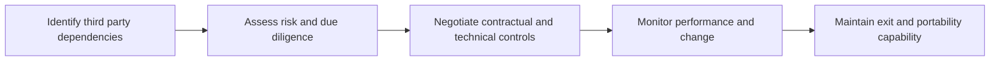

# Third Party and Supply Chain Risk

> **Core skill:** The architect assesses and manages the risk that enters the estate through vendors, platforms, and suppliers — due diligence before commitment, technical and contractual controls during the relationship, and exit paths that keep the enterprise viable when the relationship ends badly.

## Why This Matters

A modern estate runs on other people's software, infrastructure, and services. Each dependency is also a transfer of control: the vendor's outage becomes the enterprise's outage, the vendor's breach becomes the enterprise's incident, and the vendor's change of strategy becomes the enterprise's migration. The architect maps where third parties sit inside the architecture and treats each dependency as a designed relationship with visible risk, not an assumed utility.

Third party risk is not primarily a procurement question that closes at signature. The riskiest phases are often in the middle of a relationship: silent subprocessor changes, degraded support, price shifts at renewal, and product roadmaps that abandon the features the architecture depends on. Managing this requires technical awareness — what the enterprise consumes, what alternatives exist, and what state it would be in if the relationship ended tomorrow.

Supply chain security adds a second dimension: software itself arrives assembled from third-party components, and the estate inherits the vulnerabilities of everything in the build. The architect's instruments here are the ones that make composition visible — inventories, bills of materials, provenance — combined with the discipline to keep critical paths free of unmaintained dependencies.

## Where Third Party Risk Enters

| Category | Risk Carried | Architecture Concern |
|----------|--------------|----------------------|
| SaaS platforms | Availability, data custody, feature dependence, exit cost | Integration depth; data egress; business continuity alignment |
| Infrastructure and hosting | Regional concentration, isolation, control-plane dependence | Topology; residency; resilience beyond the provider's own tiers |
| Managed and outsourced services | Operational quality, insider access, knowledge transfer | Access boundaries; oversight model; reversibility |
| Software components and open source | Vulnerabilities, provenance, maintainer abandonment | Composition visibility; patch cadence; license exposure |
| Integration and channel partners | Shared data, joint interfaces, mutual dependence | Interface contracts; identity federation; incident coordination |
| Data processors and subprocessors | Privacy obligations further down the chain | Purpose binding; residency of the whole chain; audit rights |

## Due Diligence Before Commitment

| Stage | Central Question | Evidence to Demand |
|-------|------------------|--------------------|
| Fit assessment | Does the vendor's architecture align with ours? | Interface documentation; integration references |
| Security evaluation | Can they protect what we entrust to them? | Certifications; control reports; testing summaries |
| Continuity evaluation | What happens to us when they fail? | Availability history; incident processes; recovery posture |
| Data protection review | Where does our data go, and who else touches it? | Data flow documentation; subprocessor list; residency guarantees |
| Exit assessment | How do we leave, and what does leaving cost? | Export formats; termination assistance; escrow arrangements |

## Concentration and Fourth Party Risk

| Risk Pattern | Description | Mitigation Direction |
|--------------|-------------|----------------------|
| Platform concentration | Many critical services ride on one provider | Map exposure; define the acceptable concentration limit |
| Geographic concentration | Providers share regions, networks, or legal jurisdictions | Diversify topology; model correlated failure |
| Fourth party opacity | Subprocessors and upstream providers are invisible | Contractual disclosure duties; supply chain inventories |
| Skill concentration | Only a few people understand the integration | Documentation; internal capability building |
| Standards concentration | Everyone adopted one framework or format | Keep exit formats open where feasible |

## The Vendor Risk Lifecycle



## Contract and Technical Controls

| Concern | Contractual Control | Technical Control |
|---------|--------------------|-------------------|
| Data protection | Processing terms; breach notification windows | Encryption; tokenization; least-privilege integration |
| Availability | Service levels; remedies; continuity obligations | Redundant paths; graceful degradation on vendor failure |
| Change transparency | Notice periods for subprocessors and material change | Monitoring of interfaces; dependency tracking |
| Exit | Termination assistance; data return formats | Export tooling tested before it is needed |
| Supply chain | Component disclosure duties | Software composition analysis; vulnerability intake process |

## Practical Applications

### Third Party Risk Checklist

- [ ] Every significant vendor dependency appears on the architecture landscape with an owner
- [ ] Due diligence covers security, continuity, data protection, and exit — not price alone
- [ ] Critical integrations have a documented exit path with estimated cost and time
- [ ] Subprocessor and component chains are inventoried and monitored for change
- [ ] Vendor risk is reviewed on a cycle, not only at procurement

### Vendor Risk Assessment

```markdown
## Vendor Risk Assessment — <vendor or service>

| Dimension | Finding | Residual Risk | Treatment |
|-----------|---------|---------------|-----------|
| Security posture | <evidence> | <rating> | <action> |
| Continuity fit | <evidence> | <rating> | <action> |
| Data protection | <evidence> | <rating> | <action> |
| Exit and portability | <assessment> | <rating> | <action> |
| Recommended disposition | <approve, condition, reject> | <conditions> | <owner> |
```

## Common Pitfalls

| Pitfall | Why It Is a Problem | Better Approach |
|---------|---------------------|-----------------|
| **Questionnaire-only diligence** | Paper answers sanitize reality; technical fit and security are assumed | Evidence-based review: reports, tests, references, architecture sessions |
| **Set-and-forget reviews** | Risk changes across the relationship; nobody looks after signature | Cyclic review with triggers on incidents and change notices |
| **No exit path** | Leaving becomes a multi-year project discovered under duress | Exit design at adoption; test exports before they are needed |
| **Invisible fourth parties** | Subprocessors and upstream providers expand exposure unseen | Disclosure duties plus component and subprocessor inventories |
| **Concentration unnoticed** | Correlated failure takes down services believed independent | Concentration map with explicit limits and diversification decisions |
| **Roadmap dependence** | The architecture relies on features a vendor may abandon | Track dependence; design around critical vendor-specific paths |

## Success Indicators

- Vendor risk assessments change decisions — some conditions imposed, some vendors declined
- Exit paths exist and have been rehearsed for critical dependencies
- Concentration exposure is known, bounded, and reviewed by leadership
- Subprocessor and component changes arrive through monitoring, not surprises
- Third party incidents and outages find the enterprise prepared, with alternatives mapped

## Related Topics

- [[02_Risk_Management_for_Architects]]
- [[03_Compliance_and_Regulatory_Architecture]]
- [[04_Privacy_by_Design]]
- [[06_Transformation_Roadmaps_and_Portfolio/00_overview|Transformation Roadmaps and Portfolio]]

## Summary

Third party and supply chain risk treats every external dependency as a designed relationship: due diligence that tests security, continuity, data protection, and exit before commitment; contractual and technical controls that keep obligations aligned; monitoring that catches subprocessor, component, and roadmap change; and exit capability maintained while the relationship is still healthy. The architect keeps the enterprise's options open in a landscape it only partly controls.
