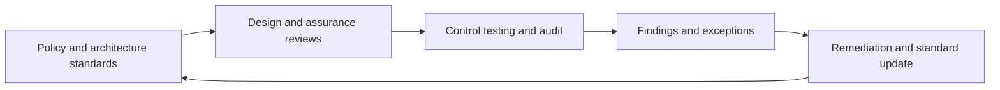

# Security Governance and Assurance

> **Core skill:** The architect establishes governance that keeps security decisions, exceptions, and evidence aligned with the architecture — layered decision rights, continuous assurance, time-boxed exceptions, and metrics that show real posture rather than activity.

## Why This Matters

Every day the enterprise makes hundreds of security-relevant decisions — add a dependency, widen an access path, skip a hardening step, waive a control. Governance is what keeps those decisions consistent with the architecture's principles instead of letting each team optimize locally. Without governance, principles are suggestions, exceptions accumulate invisibly, and the estate drifts away from the design the board believes it approved.

Assurance is governance's feedback loop. Reviews, control tests, penetration tests, audits, and certifications verify that the design works in practice and produce the evidence customers, regulators, and leadership need. The architect's job is to keep assurance continuous and connected: findings feed architecture decisions and pattern updates, rather than accumulating in a report that is filed and forgotten.

The hardest governance question at enterprise scale is calibration. Gates heavy enough to catch material risk become bottlenecks teams route around; gates light enough to be ignored catch nothing. The architect tunes the mechanism — what is reviewed, by whom, how fast decisions return — and chooses metrics that tell the truth about posture, because a governance system that measures activity will confidently report busyness while exposure grows.

## Governance Layers

| Layer | Purpose | Typical Artifacts |
|-------|---------|-------------------|
| Board and executive | Own risk appetite and material acceptance | Appetite statement; accepted exposure report |
| Security steering | Prioritize security investment; resolve cross-domain trade-offs | Investment decisions; exception escalations |
| Architecture and design authority | Ensure solutions conform to patterns; approve deviations | Design reviews; exceptions register; pattern decisions |
| Operational security | Run controls, respond to events, maintain evidence | Runbooks; control operation records; incident reports |

## Assurance Types and What They Prove

| Assurance Activity | Question It Answers | Performed By |
|--------------------|---------------------|--------------|
| First line control operation | Are engineers performing the controls as designed? | Delivery and operations teams |
| Second line review and testing | Do controls actually work against realistic threats? | Security function |
| Third line internal audit | Is the control system reliable and honestly reported? | Internal audit |
| External audit and certification | Does an independent party attest to the posture? | External auditors, certification bodies |
| Adversarial testing | How does the estate behave under attack? | Red teams and penetration testers |
| Architecture review | Do designs conform to principles and patterns? | Design authority with the architect |

## Exceptions and Risk Acceptance

| Element | Rule |
|---------|------|
| Who may accept | Only an authority at the level of the risk being carried; never the team that created it |
| Scope | Bounded: one system, one control gap, one data class — not a blanket waiver |
| Expiry | Every exception has an end date; renewal requires a fresh decision |
| Register | All exceptions visible in one place, reviewed by steering on a cycle |
| Compensating control | Every exception names what reduces the exposure in the meantime |
| Aggregate view | The board sees the sum of accepted exposure, not a list of isolated waivers |

## The Assurance Loop



## Metrics That Matter

| Metric | What It Actually Shows | Gaming Risk |
|--------|------------------------|-------------|
| Mean time to remediate findings | Responsiveness on real exposure | Teams close trivial findings fast and avoid hard ones |
| Exception aging | Whether accepted risk is converging or accumulating | Exceptions split into smaller pieces to reset clocks |
| Shared control coverage | How much of the estate inherits protection | Coverage counted per policy, not per asset |
| Control test pass rate | Whether mechanisms work, not whether they exist | Testing the easy controls repeatedly |
| Assets on standard patterns | Degree of drift from designed estate | Systems reclassified as out of scope |
| Recovery exercise success | Whether continuity claims hold | Exercises scripted to succeed |

## Practical Applications

### Governance and Assurance Checklist

- [ ] Every layer of governance has a charter, a decision scope, and a meeting cadence
- [ ] Assurance activities produce evidence as a byproduct, not as extra work
- [ ] Exceptions carry scope, compensating controls, owners, and expiry dates
- [ ] The aggregate accepted exposure is visible to the level that owns the appetite
- [ ] Findings from assurance demonstrably feed pattern and policy updates

### Governance Calendar

```markdown
## Security Governance Calendar — <year>

| Cycle | Forum | Inputs | Decisions Expected |
|-------|-------|--------|--------------------|
| Monthly | Architecture and security review | Designs, exceptions, findings | Approvals; deviation rulings |
| Quarterly | Security steering | Metrics, exception register, investment proposals | Priorities; escalations |
| Semiannual | Executive risk review | Aggregate exposure; audit results | Appetite adjustments; acceptances |
| Annual | Board assurance | External audit; certification; posture trend | Sign-off; mandate for change |
```

## Common Pitfalls

| Pitfall | Why It Is a Problem | Better Approach |
|---------|---------------------|-----------------|
| **Governance as meeting** | Forums convene, discuss, and decide nothing traceable | Every forum has a decision scope and decisions are recorded |
| **Audit as annual event** | Posture is unknown for eleven months, then discovered all at once | Continuous assurance; audits confirm, not discover |
| **Exceptions without expiry** | Accepted gaps become permanent configuration | Time-boxed exceptions with renewal decisions |
| **Activity metrics** | Dashboards show volume while exposure is unchanged | Outcome metrics with explicit gaming analysis |
| **Findings without owners** | Reports accumulate; remediation stalls | Every finding has an owner, a date, and a re-test |
| **Governance as bottleneck** | Review queues slow delivery; teams route around the process | Risk-tiered reviews; fast path for standard-pattern designs |

## Success Indicators

- Reviews are fast for conforming designs and rigorous for deviations
- Exception count trends down, and what remains is visible and owned
- Assurance evidence answers customer and regulator questions from live sources
- Metrics move because remediation changed reality, not because definitions changed
- Teams treat governance as help — pattern guidance — rather than an obstacle

## Related Topics

- [[03_Compliance_and_Regulatory_Architecture]]
- [[02_Risk_Management_for_Architects]]
- [[06_Transformation_Roadmaps_and_Portfolio/00_overview|Transformation Roadmaps and Portfolio]]
- [[career-path/08_Security_Engineer/00_overview|Security Engineer]]

## Summary

Security governance and assurance keep the estate consistent with its architecture over time: layered decision rights with explicit scopes, assurance that runs continuously and produces evidence as a byproduct, exceptions that are bounded and expire, and metrics that measure posture rather than busyness. The architect designs the mechanism so that conformance is the easy path, deviation is visible, and the board's view of risk matches the estate's reality.
