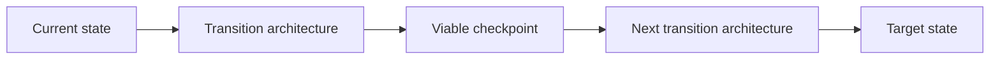

# Transition Planning

> **Core skill:** The architect designs the intermediate architectures between current and target state — each one operationally viable, explicitly scoped, and sequenced with its dependencies — so the enterprise can function safely at every step of a multi-year journey.

## Why This Matters

A target architecture describes where the enterprise should be. A transition architecture describes what it actually is next — and next year. Transformation happens through intermediate states, and each state must be operationally real: running systems, supported technology, trained people, maintained controls, and acceptable cost. The transition architecture is the architect's most honest artifact, because it has to work in the present tense while the target waits.

The most common failure is treating the transition as a schedule rather than an architecture. A plan says when work happens; a transition architecture says what exists at each checkpoint, how old and new relate, what guarantees the checkpoint must satisfy, and what gets removed. Without that design, programs produce target-state components in isolation while nobody is accountable for the estate's coherence mid-flight.

Transition planning is where architects earn delivery trust. It means proposing intermediate states that are safe and honest about interim conditions, with explicit criteria for leaving each state. Delivery teams can plan work; only the architect can promise that the enterprise will still stand at every point along the way.

## Target versus Transition Architecture

| Dimension | Target Architecture | Transition Architecture |
|-----------|---------------------|-------------------------|
| Tense | Future: what should exist | Present: what will exist at a checkpoint |
| Purpose | Destination and direction | Safe operations along the way |
| Completeness | Coherent whole | Deliberately partial; some duplication accepted |
| Lifespan | Years | Months to a couple of years, then superseded |
| Main risk | Wrong destination | Intermediate state that is not viable |

## Viability Dimensions of a Checkpoint

| Dimension | Viability Question |
|-----------|--------------------|
| Operations | Can the estate be run, monitored, and supported in this state? |
| Data | Is data consistent, owned, and flowing where it must? |
| Security | Are trust boundaries and controls intact through the transition? |
| Continuity | Do recovery and continuity claims still hold mid-transition? |
| Customers | Is the service experience acceptable, even if temporarily different? |
| Cost | Is the double-running or duplication cost known and funded? |
| People | Do teams know which systems they own in this state? |

## Strategy Patterns

| Pattern | Mechanism | When Appropriate | Main Risk |
|---------|-----------|------------------|-----------|
| Phased by capability | One business capability migrates at a time | Capabilities are loosely coupled | Cross-capability flows degrade temporarily |
| Phased by segment | Customers, regions, or channels migrate in waves | Segments can be isolated operationally | Divergent experiences and support complexity |
| Strangler | New system grows around the old; routes shift incrementally | Legacy cannot be replaced in one move | Interface debt and a long coexistence tail |
| Parallel run | Old and new operate simultaneously with reconciliation | Correctness must be proven before cutover | Double cost and reconciliation burden |
| Big-bang cutover | One transition to the target | Small scope, strong rollback, low coupling | Failure has no fallback path |

## The Transition Sequence



Each checkpoint is a gate: delivery progress and architecture viability are assessed together before the next state begins.

## Managing Interim Conditions

| Interim Condition | How Long It Should Live | Containment |
|-------------------|------------------------|-------------|
| Duplicate data entry | One phase, ideally less | Automate synchronization; measure error rates |
| Temporary integration bridge | Phases until native interface lands | Owner and removal date from day one |
| Split identity or access models | Until identity consolidation lands | Compensating controls; explicit exception record |
| Dual reporting paths | Until the golden source is agreed | Reconciliation with named owner |
| Manual operational steps | Until automation is built | Runbook, monitoring, and staffing plan |

## Practical Applications

### Transition Planning Checklist

- [ ] Each transition state is described in architecture terms — systems, data, identity, operations
- [ ] Every checkpoint has viability criteria across operations, data, security, and continuity
- [ ] Temporary bridges and duplicated mechanisms carry owners and removal dates
- [ ] Double-running costs are known and funded before the phase starts
- [ ] Rollback or fallback options are defined for the riskiest steps

### Transition State Canvas

```markdown
## Transition State — <name and date range>

| Element | Description |
|---------|-------------|
| Systems live in this state | <list> |
| Systems retired at this checkpoint | <list> |
| Data flows and owners | <description> |
| Temporary mechanisms and expiry | <list> |
| Viability criteria to exit | <criteria> |
| Risks and fallback | <description> |
```

## Common Pitfalls

| Pitfall | Why It Is a Problem | Better Approach |
|---------|---------------------|-----------------|
| **Schedule mistaken for architecture** | Work is planned; the resulting estate is never designed or judged | Describe and validate each future state as an architecture |
| **Temporary bridges become permanent** | Convenience hardens into hidden infrastructure nobody owns | Removal date and owner assigned at creation |
| **Checkpoints not validated** | The next phase starts on top of an unproven state | Viability review before leaving every checkpoint |
| **No fallback for risky steps** | A failed cutover has nothing to return to | Design rollback or degraded operation for irreversible-risk phases |
| **Decommissioning absent** | Old systems linger; cost and risk carry to the target | Retirement is a planned deliverable of the transition, not an afterthought |

## Success Indicators

- Every transition state has been reviewed and judged viable before entry
- Temporary mechanisms are removed on schedule, with records
- The estate remains supportable and secure at every checkpoint
- Delivery teams plan inside a transition architecture they did not have to invent
- Fewer surprises: each phase's start date is defended by checkpoint criteria

## Related Topics

- [[02_Transformation_Roadmap_Development]]
- [[06_Migration_and_Coexistence_Strategies]]
- [[07_Transformation_Governance_and_Benefits]]
- [[career-path/03_Staff_Engineer/02_Cross_Team_Technical_Leadership/04_Migration_Leadership|Migration Leadership (Staff)]]

## Summary

Transition planning designs the middle of the journey: intermediate architectures that are explicitly scoped, operationally viable, and validated at checkpoints before the enterprise moves on. Duplication and temporary mechanisms are deliberate, owned, and time-boxed; double-running costs are funded; risky steps carry fallbacks. The architect's promise is not that transformation will be elegant, but that at every point along the way the enterprise will still work.
