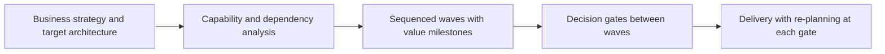

# Transformation Roadmap Development

> **Core skill:** The architect converts strategy and target architecture into a sequenced, dependency-aware roadmap — waves with explicit dependencies, value delivered at each step, and decision gates — rather than a monolithic multi-year plan that only works if nothing changes.

## Why This Matters

Sequencing is where transformations succeed or die. The target can be right and the funding available, and the program still fails because it attempted dependencies in the wrong order, deferred all value to the end, or locked a five-year plan that reality invalidated in year one. The roadmap is the architect's instrument for controlling sequence, and sequence is most of the risk.

A roadmap is also the primary communication artifact between architecture and the rest of the organization. Executives read it for value and timing, delivery reads it for what comes next, finance reads it for funding waves, and risk reads it for exposure over time. One roadmap, several readings — which means the roadmap must express value, dependencies, and assumptions so plainly that each audience can do its own arithmetic.

The best roadmaps are living instruments. They show what is committed now, what is planned next, and what is directional — with decision gates where funding and scope are re-examined against evidence. A roadmap that is never revised is not a commitment to a plan; it is a refusal to learn.

## Anatomy of a Transformation Roadmap

| Element | Purpose |
|---------|---------|
| Waves | Time-bounded groups of change with a coherent outcome |
| Dependencies | What must exist before each item can start or finish |
| Enablers | Foundation work — identity, data, platforms — that unblocks later value |
| Value milestones | Observable outcomes delivered at each wave, not just activity completed |
| Decision gates | Points where funding, scope, and continuation are re-decided |
| Assumptions and constraints | What the sequencing relies on being true |

## Sequencing Principles

| Principle | Rule | Failure If Ignored |
|-----------|------|--------------------|
| Foundations first | Enablers that many waves depend on start earliest | Everything stalls in later waves on missing foundations |
| Retire risk early | Attack the hardest, most uncertain items while options remain | The unmovable obstacle is discovered too late to change course |
| Value at every step | Each wave delivers something the business can observe | Transformation becomes a cost with no visible return |
| Increments over monoliths | Prefer capability slices to full-system swaps | Big steps concentrate risk and delay feedback |
| Fixed external dates are constraints | Regulatory and contractual deadlines anchor the sequence | Legal exposure; emergency scrambles |
| Sequence by dependency, not preference | The order serves the architecture's real couplings | Parallel work collides at integration |

## Dependency Types

| Dependency Type | Example | How to Detect |
|-----------------|---------|---------------|
| Technical | Service cannot run until a platform capability exists | Interface and platform inventories |
| Data | Migration requires cleansed, owned data first | Data quality assessments and ownership maps |
| Organizational | New operating model needed before support can shift | Skills and staffing analysis |
| Vendor | Contract or product capability from a third party gates progress | Procurement and roadmap reviews |
| Regulatory | A deadline or approval gates go-live | Compliance calendar and impact assessments |

## The Roadmap as a Decision Instrument



## Roadmap Views by Audience

| Audience | What They Read | Horizon |
|----------|----------------|---------|
| Executive | Waves, value, cost, risk of the sequence | Multi-year, low detail |
| Delivery | Next wave items, dependencies, readiness criteria | Current and next quarter |
| Finance | Funding waves tied to gates | Planning cycles |
| Risk and compliance | Regulatory anchors and exposure windows | Deadlines first |

## Practical Applications

### Roadmap Development Checklist

- [ ] Every wave has a stated outcome and a value milestone the business recognizes
- [ ] Dependencies are explicit and tested, not assumed from org charts
- [ ] Enablers that multiple waves need are sequenced first
- [ ] Decision gates exist between waves with criteria for continuing, adjusting, or stopping
- [ ] The roadmap names its assumptions and is reviewed when they change

### Roadmap One-Pager

```markdown
## Transformation Roadmap — <initiative>

| Wave | Outcome | Key Dependencies | Value Milestone | Gate Decision |
|------|---------|------------------|-----------------|---------------|
| 1 | <outcome> | <dependencies> | <observable value> | <decision to proceed> |
| 2 | <outcome> | <dependencies> | <value> | <decision> |
| 3 | <outcome> | <dependencies> | <value> | <decision> |

Assumptions: <list>
Fixed external dates: <list>
```

## Common Pitfalls

| Pitfall | Why It Is a Problem | Better Approach |
|---------|---------------------|-----------------|
| **Gantt chart as roadmap** | A schedule of tasks without outcomes; value and risk invisible | Waves with outcomes, milestones, and gates; schedule follows |
| **Everything is priority one** | Parallelism exceeds capacity; nothing finishes | Explicit sequence with capacity-realistic waves |
| **Dependencies discovered late** | Integration and data couplings surprise mid-wave | Dependency map built and maintained before sequencing |
| **Benefits deferred to the end** | Years of cost with no visible return; support erodes | Value milestones in every wave, even small ones |
| **Locked multi-year plan** | Reality changes; the plan becomes fiction nobody updates | Gates re-decide funding and scope against evidence |
| **Roadmap owned by nobody** | It decays between planning cycles | Named owner; regular review at gates and planning cycles |

## Success Indicators

- Waves complete with their value milestones observable by the business
- Re-planning happens at gates with evidence, not under crisis
- Delivery teams know what comes next and what must be ready
- Dependencies are surfaced early enough to act on
- The roadmap survives funding cycles because results keep it credible

## Related Topics

- [[01_Transition_Planning]]
- [[03_Application_Portfolio_Management]]
- [[07_Transformation_Governance_and_Benefits]]
- [[career-path/12_Technical_Program_Manager/07_Benefits_and_Outcome_Measurement/00_overview|Benefits and Outcome Measurement (TPM)]]
- [[career-path/13_Project_and_Program_Manager/00_overview|Project and Program Manager]]

## Summary

Transformation roadmap development turns strategy into a sequence that can survive contact with reality: waves with observable value, dependencies mapped before commitment, enablers moved to the front, and gates where funding and scope are re-decided against evidence. The roadmap is simultaneously a plan, a communication instrument, and a risk-control device — and it stays credible exactly as long as it keeps being revised.
