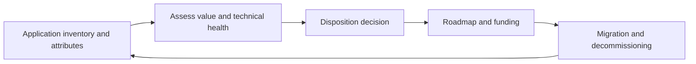

# Application Portfolio Management

> **Core skill:** The architect assesses the application portfolio — business value against technical health — to decide invest, tolerate, migrate, or eliminate, and keeps the estate contracting as capabilities consolidate instead of growing with every new initiative.

## Why This Matters

Every enterprise accumulates applications faster than it retires them. Each one carries run cost, failure risk, integration weight, and cognitive load. Left alone, the portfolio grows until the estate becomes unhangeable — every change touches a spiderweb of overlapping systems, and nobody dares remove anything because the dependencies are unknown. Application portfolio management is the discipline that keeps the landscape from becoming a museum.

APM is an architecture instrument, not a spreadsheet exercise. Every disposition decision — invest, tolerate, migrate, eliminate — changes the landscape, feeds the roadmap, and shifts the integration burden. The architect is well placed to run it because the assessment requires both business value (what the app does for the enterprise) and technical health (how well it does it, and what it costs to keep). Neither view alone produces good dispositions.

The hardest part is retirement. Decommissioning is a project with prerequisites — data migration, integration redirection, records retention, user transition, license exit — and it competes for funding against new work that feels more exciting. The architect designs the retirement path so that "eliminate" is a plan with dates and owners, not an aspiration that leaves zombies in the landscape for another decade.

## The Inventory: What to Capture

| Attribute | Why It Matters |
|-----------|----------------|
| Business capability served | Links the app to what the enterprise does; exposes duplication |
| Users and criticality | Determines tolerance for disruption and retirement sequencing |
| Cost profile | Build, run, license, support — the price of keeping it |
| Technical health | Age, support status, security posture, maintainability |
| Integration footprint | Interfaces consume and export; retirement complexity |
| Data holdings | What would need migration or retention if retired |
| Owner | Systems without an owner drift and fossilize |

## The Assessment Model

| Quadrant | Business Value | Technical Health | Typical Action |
|----------|----------------|------------------|----------------|
| Invest | High | Strong | Extend; make it a consolidation target for similar functions |
| Tolerate | High | Weak | Contain risk; plan replacement or modernization on the roadmap |
| Migrate or consolidate | Low | Strong | Fold into a strategic platform; sunset the duplicate |
| Eliminate | Low | Weak | Retire as soon as dependencies and data are handled |

Calibration matters more than the model. Assessments run by one team with one scale drift toward whatever outcome is politically convenient; the architect anchors the scales with evidence — cost data, incident history, usage figures — and re-scores periodically.

## Disposition Options and Prerequisites

| Disposition | Criteria | Prerequisites Before Commitment |
|-------------|----------|--------------------------------|
| Retain and invest | Strategic fit; value justifies modernization | Funding and a modernization plan |
| Tolerate | Valuable but not worth changing now | Risk containment; review date |
| Consolidate | Duplicate capability exists elsewhere | Migration of functionality and data |
| Replace | Health or fit has fallen below threshold | Target platform ready; exit route defined |
| Retire | Value absent; cost and risk persist | Data disposition; dependency redirection |

## The Portfolio Loop



## Making Retirement Happen

| Obstacle | Countermeasure |
|----------|----------------|
| Dependencies unknown | Integration inventory; tracing before the decision, not after |
| Data retention duties | Retention schedule; archive before decommissioning |
| Users resist change | Early communication; migration support; training budget |
| Cost of exit ignored | Exit costs included in the disposition business case |
| Nobody owns removal | Decommissioning as a deliverable with an owner and date |
| Political attachment | Evidence-based scoring; steering-level endorsement |

## Practical Applications

### Portfolio Management Checklist

- [ ] The inventory is maintained as an estate asset with owners, not refreshed ad hoc
- [ ] Assessments combine value and technical health evidence, recalibrated each cycle
- [ ] Every application has a current disposition with a reason and a review date
- [ ] Retirement work is explicitly funded and staffed, not left implicit
- [ ] Landscape views shrink — retirements actually land on the architecture diagram

### Portfolio Review Summary

```markdown
## Portfolio Review — <period>

| Metric | This Cycle | Prior Cycle | Trend |
|--------|-----------|-------------|-------|
| Applications in inventory | <count> | <count> | <direction> |
| Retired this cycle | <count> | <count> | <direction> |
| In tolerance with review dates | <count> | <count> | <direction> |
| Duplicate capabilities found | <count> | <count> | <direction> |
| Weighted run cost | <amount> | <amount> | <direction> |
```

## Common Pitfalls

| Pitfall | Why It Is a Problem | Better Approach |
|---------|---------------------|-----------------|
| **Inventory out of date** | Decisions are made about an estate that no longer exists | Maintained inventory refreshed by discovery and ownership duties |
| **Uncalibrated scoring** | Assessments drift into justification of prior decisions | Anchored scales, evidence inputs, periodic re-scoring |
| **Add without remove** | New platforms arrive; nothing exits; cost compounds | Every delivery wave identifies what it retires |
| **Retirement without a plan** | Zombie systems remain live, supported, and risky | Decommissioning projects with dates, owners, and exit costs |
| **Cost of keeping invisible** | Run cost is spread across budgets; nobody sees the total | Cost profile per app, aggregated at the portfolio level |
| **Assessment as annual theater** | A big review changes nothing until next year | Continuous upkeep; dispositions feed funding cycles |

## Success Indicators

- The application count trends down while capabilities improve
- Duplicate capabilities are identified and consolidated on schedule
- Retirement projects finish with data disposed and dependencies redirected
- Run cost per capability falls as the portfolio contracts
- Teams consult the inventory before buying or building anything new

## Related Topics

- [[04_Technology_Portfolio_and_Standards]]
- [[02_Transformation_Roadmap_Development]]
- [[06_Migration_and_Coexistence_Strategies]]
- [[04_Enterprise_Data_Architecture/00_overview|Enterprise Data Architecture]]

## Summary

Application portfolio management keeps the estate honest about what it runs: an owned inventory, assessments that weigh business value against technical health, dispositions that say invest, tolerate, consolidate, or retire, and retirement treated as funded delivery work with prerequisites handled. The architect's goal is a portfolio that contracts as capabilities consolidate — because an estate that never removes anything will eventually have no room to change anything.
