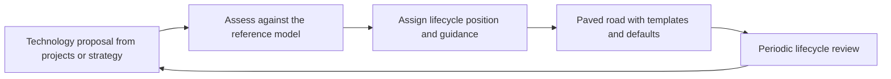

# Technology Portfolio and Standards

> **Core skill:** The architect manages technology as a portfolio with lifecycles — strategic, emerging, tactical, contained, retiring — so adoption decisions are informed, variation is deliberate, and the estate never becomes a museum of accumulated experiments.

## Why This Matters

Every technology choice that enters the estate must one day be maintained, patched, staffed, audited, and eventually retired. Variation multiplies those costs: five message brokers, three identity stacks, and a dozen orchestrators means five times the skills, five times the vulnerabilities, and five times the migration debt when the industry moves. A technology portfolio with explicit lifecycle positions is how the enterprise keeps variation deliberate rather than accidental.

Standards governance has a reputation problem because it is often practiced as a list of bans enforced by a review board, which drives adoption underground into shadow projects. The working version is enabling: a small set of well-supported choices, guidance and templates that make standard paths the fastest path, and a radar that tells teams where each technology stands and where it is going.

The architect also owes the organization honesty about transitions. Technologies exit the portfolio, and that exit is a project: systems built on a retirant need migration paths, timelines, and support commitments. The lifecycle position is a promise about the future — announced early enough that downstream decisions can take it into account.

## Standards Lifecycle Positions

| Position | Meaning | Adoption Guidance |
|----------|---------|-------------------|
| Strategic | The direction of travel; replacing predecessors | Default for new work; migration targets named |
| Emerging | Under evaluation; potential future standard | Pilot and learn, with exit path; not for critical workloads |
| Tactical | Useful with known limits or a shelf life | Allowed with a stated purpose and review date |
| Contained | Legacy that is not extended | Maintained and secured; no new use; migration planned |
| Retiring | Being actively replaced | No new adoption; exit plan communicated per system |

## The Technology Reference Model

| Layer | Scope of Standards Decision | Typical Decision Owner |
|-------|-----------------------------|------------------------|
| Infrastructure and runtime | Compute, storage, network, orchestration choices | Platform owner with architecture |
| Data and persistence | Stores, streaming, analytics engines | Data architecture with the architect |
| Application and integration | Frameworks, API styles, messaging, identity | Architect with engineering leadership |
| Security and operations | Controls, tooling, observability, secrets | Security and operations owners |
| End-user and productivity | Workplace, collaboration, low-code | Business technology function |

## Exceptions and Variants

| Element | Rule |
|---------|------|
| Justification | An exception states the requirement the standard cannot meet — not preference |
| Register | All variants visible with owner, scope, and expiry |
| Cost awareness | The variant's lifecycle burden becomes visible in the decision |
| Consolidation path | Every exception names when and how the system returns to standard |
| Aggregation | Recurring exceptions signal a standard that should change |

## The Standards Lifecycle Loop



## Making Standards Stick

| Mechanism | Effect | Anti-Pattern It Replaces |
|-----------|--------|--------------------------|
| Paved road with defaults | Standard choice is the fastest choice | Review gates that delay without helping |
| Templates and reference implementations | Teams start already conforming | Documents prescribing without examples |
| Exceptions register | Deviation is visible and managed | Underground adoption nobody can see |
| Recurring-exception analysis | Standards evolve with real needs | Frozen standards the business abandons |
| Early transition announcements | Downstream plans can adjust | Surprise retirements that strand systems |

## Practical Applications

### Technology Standards Checklist

- [ ] Every technology in significant use has a lifecycle position and an owner
- [ ] Strategic positions name what they replace and by when
- [ ] Retiring technologies have migration paths and communicated timelines
- [ ] Exceptions are registered, time-boxed, and reviewed for consolidation
- [ ] The radar is refreshed on a cycle and used in solution designs

### Radar Entry Template

```markdown
## Technology Radar Entry — <technology>

| Attribute | Value |
|-----------|-------|
| Lifecycle position | <strategic, emerging, tactical, contained, retiring> |
| Problem it solves | <description> |
| Replaces / replaced by | <technology> |
| Guidance for new work | <adopt, pilot, allow with limits, avoid> |
| Watch items | <risks, licensing, staffing> |
| Review date | <date and owner> |
```

## Common Pitfalls

| Pitfall | Why It Is a Problem | Better Approach |
|---------|---------------------|-----------------|
| **Standards as bureaucracy** | Slow approval pushes teams around the process into shadow estates | Paved road and defaults; gates only for genuine risk |
| **Frozen standards** | The list ages while the industry moves; teams defect quietly | Periodic lifecycle review; retiring positions announced early |
| **Bans without alternatives** | A prohibition with no supported path forces non-compliance | Every "no" carries a "use this instead" |
| **Unmanaged exceptions** | Variants multiply invisibly until consolidation is hopeless | Register with expiry and consolidation paths |
| **Choosing winners early** | Strategy anoints a tool before evidence; sunk-cost defends it | Emerging position with pilot criteria before strategic anointment |
| **No retire lifecycle** | End-of-life technologies run forever because no exit was planned | Retirement is a communicated program, not a discovery |

## Success Indicators

- New solutions start on the paved road by default, without negotiation
- The number of standards in significant use trends down, not up
- Strategic and retiring positions are known across engineering, not just architecture
- Exceptions shrink at each review because consolidation actually happens
- Downstream teams plan migrations before forced deadlines, not after

## Related Topics

- [[03_Application_Portfolio_Management]]
- [[05_Investment_and_Funding_Models]]
- [[03_Enterprise_Architecture_Practice/00_overview|Enterprise Architecture Practice]]
- [[career-path/03_Staff_Engineer/02_Cross_Team_Technical_Leadership/04_Migration_Leadership|Migration Leadership (Staff)]]

## Summary

Technology portfolio management keeps variation deliberate: lifecycle positions from strategic through retiring, a reference model that assigns ownership per layer, exceptions that are visible and time-boxed, and a paved road that makes the standard choice the fast choice. The architect's test is behavioral — do teams adopt the standards because they work, or evade them because they obstruct? Only the first kind of standard survives contact with delivery.
