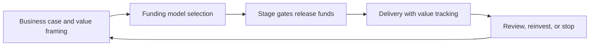

# Investment and Funding Models

> **Core skill:** The architect frames transformation investment with evidence — full lifecycle cost, benefits, risk, and optionality — and works with funding models that match how architecture delivers: phased gates, honest run costs, and money for the unglamorous work of coexistence and decommissioning.

## Why This Matters

Funding models shape architecture more than most design debates, because money decides what gets built. A funding regime that only pays for new construction systematically starves the estate of maintenance, migration, and retirement — producing exactly the sprawl the portfolio is trying to fix. The architect who understands funding can argue for the work the architecture actually requires: transition costs, double-running, decommissioning, and capability building.

Transformation investments are unusually hard to justify because their returns are structural: reduced risk, lower run cost, faster change, fewer incidents. These are real but diffuse, and they arrive after the costs. The architect's contribution is to make the full picture fundable — not by overselling, but by framing benefits in terms finance recognizes and costs at their true, lifecycle scale.

Funding also decides optionality. Wholesale commitment to a multi-year plan locks the enterprise into assumptions that will decay; phased funding with gates preserves the ability to adjust as evidence arrives. The architect argues for structures that buy information cheaply — pilots, first waves, proof points — so the big commitments are made with better data than the business case had.

## What Funders Need to See

| Question | Evidence the Architect Provides |
|----------|--------------------------------|
| What does it deliver? | Benefits in business terms: cost, risk, capability, speed |
| What does it truly cost? | Lifecycle cost including run, transition, and exit |
| What could go wrong? | Risk assessment with treatments and residual exposure |
| Why now? | Cost of delay; regulatory or competitive forcing functions |
| What optionality remains? | Phased structure with gates and stop points |

## The True Cost Anatomy

| Cost Category | Includes | Commonly Forgotten |
|---------------|----------|--------------------|
| Build and change | Design, development, integration, testing | Internal staff time; opportunity cost |
| Run | Licenses, infrastructure, support, operations | Growth in run cost as scope expands |
| Transition | Migration, data work, retraining, parallel operation | Extended coexistence with double tooling |
| Decommissioning | Exit work, data archival, contract termination | The cost of doing nothing that a "cheap" option implies |
| Capability | Training, hiring, practice building | Time for teams to become effective on new platforms |
| Risk and contingency | Insurance, buffers, uncertainty reserves | Correlated risk across parallel initiatives |

## Funding Models

| Model | Mechanism | Appropriate When | Watch Out For |
|-------|-----------|------------------|---------------|
| Project funding | One-off budget per initiative | Bounded deliverables | Starves run, maintenance, and retirement |
| Program funding | Pooled budget across related projects | Multi-project transformation | Weak line of sight to value per wave |
| Product and platform funding | Persistent team with ongoing budget | Platforms and products that evolve | Requires product discipline; oversight of outcomes |
| Phased gate funding | Releases of funds after gate decisions | High-uncertainty transformations | Gates must genuinely be able to stop funding |
| Venture-style tranches | Small bets, scaled on evidence | Emerging technology and new models | Governance patience for negative results |

## The Funding Loop



## Run versus Change

| Situation | Funding Implication |
|-----------|---------------------|
| New platform enters service | Run cost must be budgeted from day one, not discovered in year two |
| Coexistence period | Double-running costs funded explicitly as part of the transition |
| Decommissioning | Exit work funded as a deliverable, or it never happens |
| Security and compliance obligations | Non-discretionary; funded outside competition with features |
| Technical debt remediation | Framed as risk and speed capacity, or it loses every prioritization round |

## Practical Applications

### Investment Framing Checklist

- [ ] The business case presents lifecycle cost, not just build cost
- [ ] Benefits are stated in terms the funding authority measures
- [ ] Transition, coexistence, and decommissioning costs are included
- [ ] Funding is phased with gates that can genuinely stop or redirect
- [ ] The cost of delay and the cost of doing nothing are both stated

### Business Case Skeleton

```markdown
## Investment Case — <initiative>

| Section | Content |
|---------|---------|
| Outcome and beneficiaries | <what changes, for whom> |
| Options considered | <at least three, including doing nothing> |
| Recommended option and rationale | <choice and why> |
| Lifecycle cost | <build, run, transition, exit> |
| Benefits and measurement | <baseline, target, owner> |
| Risks and residual exposure | <top risks with treatment> |
| Funding structure and gates | <tranches and decision criteria> |
```

## Common Pitfalls

| Pitfall | Why It Is a Problem | Better Approach |
|---------|---------------------|-----------------|
| **Capex-only thinking** | Run and exit costs hide; the "cheap" option is expensive | Lifecycle cost statements for every option |
| **Benefits never quantified** | The case promises direction, not value; nothing can be measured | Baselines and targets with named owners |
| **No funding for the unglamorous** | Migration, coexistence, and decommissioning stall unfinished | Fund the whole journey, not just construction |
| **Everything at once** | Wholesale commitment buys maximum exposure to bad assumptions | Phased gates that buy information before big money |
| **Gates that cannot stop** | A "gate" that always passes is a formality | Honest continue, adjust, or stop criteria |
| **Case never revisited** | Assumptions decay; spending continues on inertia | Review at every gate against actual evidence |

## Success Indicators

- Approved cases include lifecycle cost and measurable benefits
- Funding releases at gates respond to evidence, including stopping
- Transition and decommissioning work is staffed and scheduled
- Run cost of the estate is visible and managed, not discovered annually
- Architects are consulted before funding structures are fixed, not after

## Related Topics

- [[02_Transformation_Roadmap_Development]]
- [[03_Application_Portfolio_Management]]
- [[07_Transformation_Governance_and_Benefits]]
- [[career-path/12_Technical_Program_Manager/07_Benefits_and_Outcome_Measurement/00_overview|Benefits and Outcome Measurement (TPM)]]

## Summary

Investment and funding models decide which architectures are possible: lifecycle costing replaces build-cost illusions, benefits are framed in the terms funders measure, and phased gates preserve the ability to stop, adjust, or accelerate as evidence arrives. The architect fights for the unglamorous lines — transition, coexistence, decommissioning, capability — because those are the costs that, left unfunded, turn a transformation into a permanent half-finished estate.
