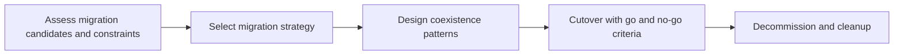

# Migration and Coexistence Strategies

> **Core skill:** The architect chooses migration strategies — strangler, parallel run, phased cutover — and designs coexistence explicitly, so that old and new systems operate side by side safely across data, identity, interfaces, and support until the old can actually be retired.

## Why This Matters

Migrations rarely happen in one clean move. The normal state of a transformation is coexistence: the old system and its replacement running together while data synchronizes, interfaces route both ways, staff support both, and the business continues without noticing the surgery. Coexistence is where migrations are won or lost, and it is an architecture problem before it is a project problem.

Strategy selection follows from risk and reversibility. A big-bang cutover concentrates risk but ends coexistence immediately; a strangler spreads risk across many small moves but stretches the coexistence tail. Parallel run proves correctness before commitment at the cost of running everything twice. The architect's job is to choose per migration candidate — because a portfolio contains several kinds of moves, not one.

Every coexistence period needs an exit. Temporary synchronization, dual entry, and bridge interfaces are debts with interest; if they are not scheduled for removal, they outlive the migration and become the next legacy problem. The architect designs coexistence with expiry dates and decommissioning as a funded deliverable, so the transformation actually finishes.

## Migration Strategy Options

| Strategy | Mechanism | Best When | Primary Risk |
|----------|-----------|-----------|--------------|
| Phased by segment | Move customers, regions, or channels in waves | Segments can be isolated | Divergent experiences; prolonged dual support |
| Strangler | New capability grows around the old; routes shift incrementally | Legacy is indivisible but its edges are routable | Long coexistence; interface debt |
| Parallel run | Both systems process in full; outputs reconciled | Correctness must be proven first | Cost; reconciliation effort; divergent bugs |
| Lift and reshuffle | Move largely as-is, then reshape | Deadline pressure; limited time to redesign | Carrying legacy structure forward |
| Big-bang cutover | Single switch to the new system | Small scope; strong rollback; low coupling | No fallback if the move fails |

## Coexistence Concerns

| Concern | Design Question | Typical Pattern |
|---------|-----------------|-----------------|
| Data | Which system is the golden source for each entity, and how do changes flow? | One-way replication with a designated source; strict ownership |
| Dual write | Where must both systems accept changes, and how are conflicts resolved? | Avoid where possible; queue and reconciliation where unavoidable |
| Identity | Does a person exist once or twice across the two systems? | Central identity with mapping; no duplicate credential stores |
| Interfaces | Who calls whom, in which direction, during coexistence? | Facade at the boundary; routing controlled in one place |
| Reporting | Where does consolidated reporting read from during transition? | Designated reporting source; reconcile discrepancies explicitly |
| Support | Who answers for each process while both systems run? | Ownership matrix by process, not by system |

## Coexistence Patterns

| Pattern | Purpose | Caution |
|---------|---------|---------|
| Facade at the boundary | Shields consumers from the move | Facade must be versioned and eventually removed |
| Event-based synchronization | Keeps both sides current without coupling | Ordering and replay semantics must be designed |
| Batch reconciliation | Periodic comparison and correction | Latency between error and detection |
| Routing by feature flag | Moves behavior piece by piece with fast reversal | Flag sprawl; removal discipline required |
| Golden source designation | Prevents conflicting truth | Requires enforcement; exceptions will be requested |

## The Migration Sequence



## Cutover Design

| Element | Content |
|---------|---------|
| Go and no-go criteria | Testable conditions, agreed before the window |
| Freeze scope | What changes are locked, and for how long |
| Rollback trigger and route | The specific signal that returns the estate to the old system |
| Data verification | How completeness and correctness are proven post-cutover |
| Communications | Who is told what, when, and by which channel |
| Hypercare | Support intensity and duration after the switch |

## Practical Applications

### Migration Design Checklist

- [ ] Each migration candidate has an explicitly chosen strategy with its rationale recorded
- [ ] Coexistence concerns — data, identity, interfaces, reporting, support — each have owners
- [ ] Every temporary mechanism has an expiry date and a removal owner
- [ ] Cutover has go and no-go criteria and a tested rollback route
- [ ] Decommissioning is planned and funded as part of the same migration

### Coexistence Design Template

```markdown
## Coexistence Design — <migration>

| Aspect | Design |
|--------|--------|
| Golden source per entity | <entity: system> |
| Synchronization mechanism | <pattern and frequency> |
| Conflict resolution rule | <rule and owner> |
| Routing control point | <component> |
| Temporary mechanisms and expiry | <list with dates> |
| Exit criteria from coexistence | <conditions> |
```

## Common Pitfalls

| Pitfall | Why It Is a Problem | Better Approach |
|---------|---------------------|-----------------|
| **No rollback plan** | A failed cutover becomes a crisis with no route back | Tested rollback or degraded-mode fallback before the window |
| **Coexistence without an end** | Temporary bridges outlive the migration and become permanent | Expiry dates and removal owners assigned at design time |
| **Dual-write conflicts** | Two systems accept conflicting truth; corrections become manual | Designated golden source; avoid dual write where possible |
| **Reconciliation left to the end** | Data drift discovered at cutover, when options are few | Incremental reconciliation through the coexistence period |
| **Decommissioning unfunded** | The old system lingers; cost and risk continue silently | Decommission as a scheduled, funded deliverable of the migration |
| **Cutover by optimism** | The switch happens because the date arrived, not because criteria passed | Pre-agreed go and no-go criteria, honored |

## Success Indicators

- Each migration ran with a strategy consciously chosen and recorded
- Cutovers passed their criteria, with rollback available but rarely needed
- Every temporary mechanism is removed on schedule, verified in the landscape
- Coexistence periods end: the old systems retire on the planned date
- Business disruption stays inside the agreed windows

## Related Topics

- [[01_Transition_Planning]]
- [[03_Application_Portfolio_Management]]
- [[07_Transformation_Governance_and_Benefits]]
- [[career-path/03_Staff_Engineer/02_Cross_Team_Technical_Leadership/04_Migration_Leadership|Migration Leadership (Staff)]]

## Summary

Migration and coexistence strategies turn system replacement into a controlled operation: strategies chosen per candidate according to risk and reversibility, coexistence concerns designed explicitly across data, identity, interfaces, reporting, and support, cutovers governed by pre-agreed criteria, and every temporary mechanism born with an expiry date. The migration is complete only when the old system is gone — and the architecture has planned for that moment from the beginning.
