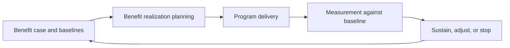

# Transformation Governance and Benefits

> **Core skill:** The architect keeps transformation coherent across programs — dependencies, risk, and change control through governance that actually decides — and defines, baselines, measures, and pursues the benefits that justified the transformation in the first place.

## Why This Matters

Transformation is not one program; it is a portfolio of programs, each with its own manager, budget, and pressures, all reshaping the same estate over years. Without governance at the transformation level, local optimizations collide: two programs rebuild the same capability, a dependency slips in one and blocks three others, and the target architecture quietly becomes whatever the sum of local decisions produces. Transformation governance exists to hold the whole.

This governance is different from delivery governance. Delivery governance asks whether a project is on track against its plan; transformation governance asks whether the portfolio of changes still adds up to the intended destination — sequencing across programs, dependencies between them, risk aggregated rather than viewed in fragments, and changes to the target itself made deliberately rather than by drift.

The benefit side is where governance earns its name. Transformation cases promise outcomes — lower cost, better resilience, faster change — and those promises must be defined, baselined before the change, measured after it, and owned by the people who benefit. A transformation that delivers every milestone but never checks whether the outcomes arrived has governed activity, not value.

## Transformation versus Delivery Governance

| Dimension | Transformation Governance | Delivery Governance |
|-----------|---------------------------|---------------------|
| Unit of attention | Portfolio of programs and their interactions | Individual project or workstream |
| Central question | Is the whole still coherent and valuable? | Is this deliverable on time and to spec? |
| Cadence | Quarterly and at major gates | Iteration or milestone cadence |
| Decisions | Sequence, scope, dependencies, target changes | Execution detail, resources, quality |
| Risk view | Aggregated exposure across programs | Program-specific risk register |
| Failure mode | Programs succeed; transformation fails | Project slips; scope varies |

## The Benefit Lifecycle

| Stage | Activity | Artifact |
|-------|----------|----------|
| Identify | Name the outcomes the change should produce | Benefit statement |
| Baseline | Record current performance before change | Measured baseline |
| Plan | Decide how, when, and by whom each benefit is realized | Realization plan |
| Measure | Compare actual outcomes to baseline post-change | Measurement report |
| Sustain | Adjust operations, incentives, and ownership to hold the gain | Sustained benefit confirmed |

## Benefits Register

```markdown
## Benefits Register — <transformation>

| Benefit | Baseline | Target | Owner | Measure | Realized |
|---------|----------|--------|-------|---------|----------|
| <outcome> | <current value> | <intended value> | <role> | <source> | <status> |
```

## Assurance Gates

| Gate | Question | Evidence |
|------|----------|----------|
| Before commitment | Is the case sound and the path viable? | Business case; transition plan; risk view |
| Mid-flight | Are outcomes emerging on the evidence so far? | Early indicators; benefit tracking |
| At completion | Did the change deliver what it promised? | Post-implementation review against baseline |
| Post-sustain | Are the gains holding after attention moves on? | Operational metrics months later |

## The Benefits Loop



## Steering Decisions

| Decision Type | The Question It Answers |
|---------------|------------------------|
| Sequence change | What moves next, given dependencies and capacity? |
| Resolve conflict | Which program yields when resources or designs collide? |
| Accept or reject risk | Is this exposure within appetite, and who owns it? |
| Adjust the target | Does evidence justify changing the destination? |
| Continue or stop | Does the next gate's evidence justify more funding? |

## Practical Applications

### Transformation Governance Checklist

- [ ] Cross-program dependencies are visible and actively managed
- [ ] Risk is aggregated across programs, not reviewed as a patchwork
- [ ] Every promised benefit has a baseline, an owner, and a measurement source
- [ ] Gates can genuinely stop, redirect, or reshape funding
- [ ] Target architecture changes are governed decisions, not drift

### Transformation Status Template

```markdown
## Transformation Status — <period>

| Dimension | Assessment | Watch Items |
|-----------|------------|-------------|
| Delivery progress vs waves | <status> | <item> |
| Dependencies and sequencing | <status> | <item> |
| Aggregated risk | <status> | <item> |
| Benefits emerging | <status> | <item> |
| Decisions required | <list> | <owner and date> |
```

## Common Pitfalls

| Pitfall | Why It Is a Problem | Better Approach |
|---------|---------------------|-----------------|
| **Benefits as forecast only** | Promises made at approval are never checked afterward | Baseline, measure, and sustain; report against baseline |
| **Governance as re-deciding** | Steering relitigates execution detail and stalls delivery | Set decision scope: sequence, conflict, risk, target, funding |
| **No stop mechanism** | Every program continues regardless of evidence | Gates with genuine stop or reshape criteria |
| **Orphaned benefits** | Nobody owns the outcome; it evaporates after go-live | Named benefit owners inside the business, not the program |
| **Report theater** | Status is green until sudden failure; numbers serve optimism | Honest metrics; bad news valued for the options it buys |
| **Dependencies unmanaged** | Each program optimizes locally; the whole desynchronizes | Cross-program dependency map reviewed at every cycle |

## Success Indicators

- Steering meetings resolve cross-program conflicts and record decisions
- Benefits are measured against baselines, and shortfalls are addressed
- The sequence adapts as evidence arrives, without the transformation losing direction
- Programs that are failing to justify themselves are stopped
- The target architecture as delivered matches the target as governed

## Related Topics

- [[02_Transformation_Roadmap_Development]]
- [[05_Investment_and_Funding_Models]]
- [[06_Migration_and_Coexistence_Strategies]]
- [[career-path/12_Technical_Program_Manager/07_Benefits_and_Outcome_Measurement/00_overview|Benefits and Outcome Measurement (TPM)]]
- [[career-path/13_Project_and_Program_Manager/00_overview|Project and Program Manager]]

## Summary

Transformation governance and benefits keep the whole journey coherent: cross-program dependencies and aggregated risk managed at the level where the estate is reshaped, target changes governed deliberately, and every promised benefit baselined, owned, measured, and sustained. Governance that cannot stop, redirect, or reshape funding is ceremony; governance that can is how an architect ensures the transformation delivers its destination and its value, not just its milestones.
