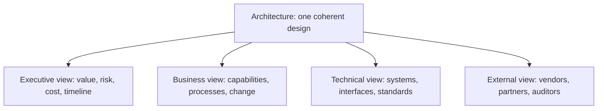

# Architecture Communication

> **Core capability:** The architect presents architecture in stakeholder-relevant views — business language for executives, capability language for product, technical language for engineers — and makes the architecture a shared reference rather than a personal document.

## Why This Matters

Enterprise architecture lives or dies on communication. The board does not read component diagrams; the engineering team does not want a capability map. The architect's job is translation: the same architecture expressed in the language each audience uses to make decisions — and enough shared artifacts that the audiences reference the same truth.

This area also covers the architect's external voice: vendors, partners, auditors, and customers all interact with the architecture through the architect's communication. Whether the architecture is trusted often depends less on whether it is right and more on whether it is understood.

## Topics in This Capability Area

| Topic | Core Skill | When It Matters |
|-------|------------|-----------------|
| [[01_Stakeholder_Specific_Architecture_Views]] | Selecting and producing views for each audience | Every architecture communication |
| [[02_Architecture_Documentation_at_Enterprise_Scale]] | Maintaining usable architecture documentation | Practice management |
| [[03_Presenting_to_Executives_and_Boards]] | Making architecture legible at the highest level | Funding; strategy; governance |
| [[04_Architecture_Facilitation_and_Workshops]] | Facilitating design sessions with mixed audiences | Design decisions |
| [[05_Bridging_Business_and_Technical_Language]] | Translating between vocabularies | Every cross-functional interaction |
| [[06_Vendor_and_Partner_Communication]] | Technical conversations with vendors and partners | Procurement; partnerships |
| [[07_Architecture_Advocacy_and_Enablement]] | Winning adoption of the architecture across the organization | Transformation; change |

## Audience-View Mapping

One architecture — four translations. Inconsistency between them destroys trust.

## Practical Applications

### Architecture Communication Checklist

- [ ] Each stakeholder group receives views in their own language
- [ ] Architecture documentation is findable and usable across the organization
- [ ] Executives receive architecture communication in value and risk terms
- [ ] Workshops produce decisions, not just diagrams
- [ ] Vendor conversations are grounded in architecture requirements

## Common Pitfalls

| Pitfall | Why It Is a Problem | Better Approach |
|---------|---------------------|-----------------|
| **One-deck-for-everyone** | Oversimplified for engineers, jargon for executives | Audience-specific views from one coherent architecture |
| **Diagram-as-communication** | Diagrams shown, decisions unmade | Facilitation: walk through, discuss, decide |
| **Documentation graveyard** | Architecture docs written once, never maintained | Living documentation with clear owners |

## Success Indicators

- Executives act on architecture recommendations in their own language
- Engineers cite the same architecture artifacts as the business
- Vendor and partner interactions start from architecture requirements
- Workshops and reviews produce recorded decisions

## Related Capabilities

- [[03_Enterprise_Architecture_Practice/00_overview|Enterprise Architecture Practice]]: communication makes the practice influential
- [[06_Transformation_Roadmaps_and_Portfolio/00_overview|Transformation Roadmaps and Portfolio]]: roadmaps are communication artifacts
- [[career-path/06_Software_Architect/03_Architecture_Description_and_Views/00_overview|Architecture Description and Views (Architect)]]: the view techniques this builds on
- [[career-path/11_Engineering_Manager/07_Manager_Communication/00_overview|Manager Communication (EM)]]: the organizational communication craft

## Summary

Architecture communication is translation at scale: one coherent architecture expressed in as many views as there are audiences, documentation that stays alive, facilitation that turns meetings into decisions, and an external voice that keeps vendors and partners aligned. The architecture that cannot be explained to the board cannot be funded — and the one that cannot be explained to engineers cannot be built.