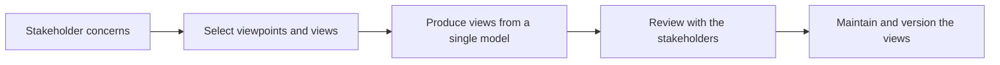

# Stakeholder Specific Architecture Views

> **Core skill:** The architect maps stakeholders to their concerns and produces the minimal set of views that answers each concern — one coherent architecture, expressed as many views as the audiences require, all derived from the same underlying model.

## Why This Matters

Stakeholders do not read architecture; they read answers to their own questions. An operations lead wants to know what to monitor and what fails first; a finance director wants to know what it costs and what it saves; a security reviewer wants to know where trust boundaries fall and what crosses them; a delivery lead wants to know what to build first. None of them will extract those answers from a component diagram, and none of them should have to.

View selection is therefore translation, and it is the architect's craft. The same architecture supports a context view for scope, capability views for business change, data views for ownership and flow, application views for structure and integration, technology views for platforms and hosting, security views for boundaries and controls, and roadmap views for timing. The discipline is choosing the smallest set that answers the concerns in front of the architect — not producing every view for every meeting.

The consistency between views is what makes the approach credible. Each view answers its question fully enough to be used; all views remain traceable to one model. When a stakeholder asks a question that lies between views, the architect can show that the views agree — and when the underlying architecture changes, every affected view moves with it.

## Stakeholder Concern Mapping

| Stakeholder | Primary Concerns | View to Produce | Notation |
|-------------|------------------|-----------------|----------|
| Executive | Value, risk, cost, timeline | Capability roadmap and decision view | Simple boxes; value language |
| Business owner | Capabilities, processes, change impact | Capability and process views | Capability maps; process flows |
| Product | Features, users, data touchpoints | Context and data flow views | Context diagram; flow sketch |
| Engineering | Structure, interfaces, standards | Component, interface, deployment views | Component and sequence diagrams |
| Operations | Runtime behavior, failure modes, runbooks | Deployment and operational views | Topology; runbook references |
| Security and risk | Trust boundaries, controls, data classes | Security and data views | Boundary diagrams; control mapping |
| Finance | Cost structure, funding waves | Investment and roadmap views | Cost breakdowns; wave plans |
| Compliance | Obligations, evidence, residency | Compliance and data views | Matrices; residency maps |
| Partners and vendors | Boundaries, interfaces, responsibilities | Interface and responsibility views | Interface contracts; RACI-style maps |

## View Selection Principles

| Principle | Rule | Failure If Ignored |
|-----------|------|--------------------|
| One view per concern | Each view answers a stated question for a stated audience | Views pile up; nobody knows which to read |
| Minimal sufficient set | Produce the smallest set that covers current decisions | Effort spent on unused diagrams |
| Derived from one model | All views trace to the same architecture | Inconsistency; eroded trust |
| Audience legible | Language and notation match the reader | Correct diagrams nobody can use |
| Maintained, not one-off | Views carry owners and update triggers | Decay; the meeting deck becomes the only copy |

## The View Catalog

| View | Question It Answers | Typical Audience |
|------|--------------------|------------------|
| Context | What is in scope and what does it touch? | Everyone, at different depths |
| Capability | What does the business do and how does this change it? | Business owners, executives |
| Data | Where does data come from, go, and who owns it? | Product, compliance, data teams |
| Application | What systems exist, and how do they connect? | Engineering, delivery |
| Technology | What runs where, on what platforms? | Operations, platform teams |
| Security | Where are the boundaries and what crosses them? | Security, audit, risk |
| Roadmap | What changes when, and in what order? | Executives, finance, program teams |

## From Concerns to Views



Each review with a stakeholder group validates the view against the concern it was built to answer — and surfaces the next concern worth designing a view for.

## Consistency across Views

| Mechanism | Effect |
|-----------|--------|
| Single architecture model | One source from which views are derived, not redrawn |
| Cross-view naming | The same component, capability, and data names everywhere |
| Change propagation | A model change updates every affected view |
| View register | Every view has an owner, audience, and last-updated record |
| Traceability | A question traceable from one view to its answer in another |

## Practical Applications

### View Production Checklist

- [ ] The relevant stakeholder groups and their concerns are listed before any view is drawn
- [ ] Each view produced names the concern it answers and its audience
- [ ] All views derive from the same model and use consistent names
- [ ] Views are reviewed with the stakeholders they serve, and refined on feedback
- [ ] A view register tracks owners, audiences, and update triggers

### View Register

```markdown
## View Register — <architecture or landscape>

| View | Concern Answered | Audience | Owner | Last Updated | Trigger to Update |
|------|------------------|----------|-------|--------------|-------------------|
| <name> | <concern> | <group> | <role> | <date> | <change event> |
```

## Common Pitfalls

| Pitfall | Why It Is a Problem | Better Approach |
|---------|---------------------|-----------------|
| **One diagram for everyone** | Too abstract for engineers, too detailed for executives; nobody is served | Select views per audience concern; one model underneath |
| **View proliferation** | Every meeting spawns diagrams; maintenance collapses | Minimal sufficient set with owners and a register |
| **Views not traceable to a model** | Each diagram tells a slightly different story; trust erodes | Derive views from one model; keep names consistent |
| **Views nobody reads** | Drawn for completeness, not for a decision | Name the concern and the decision each view supports |
| **Notation mismatch** | The audience cannot parse the diagram's language | Match notation to readers; explain unfamiliar elements |
| **Stale views** | The landscape changes; the diagrams do not | Update triggers and owners recorded against each view |

## Success Indicators

- Each stakeholder group works from views built for its concerns
- Audiences use the views to make decisions without a live architect narration
- A change to the architecture visibly updates every affected view
- The view register stays small and current — additions are justified by a concern
- Stakeholders surface new concerns, which become new views rather than misunderstandings

## Related Topics

- [[02_Architecture_Documentation_at_Enterprise_Scale]]
- [[05_Bridging_Business_and_Technical_Language]]
- [[01_Business_Analysis_and_Capability_Mapping/00_overview|Business Analysis and Capability Mapping]]
- [[career-path/06_Software_Architect/03_Architecture_Description_and_Views/00_overview|Architecture Description and Views (Architect)]]

## Summary

Stakeholder specific architecture views are the core translation device of the architect: map the audiences, name their concerns, and produce the minimal set of views — context, capability, data, application, technology, security, roadmap — that answers each concern, all derived from one coherent model. Views are validated in use, maintained with owners, and kept consistent, so that every audience reads its own view and arrives at the same architecture.
