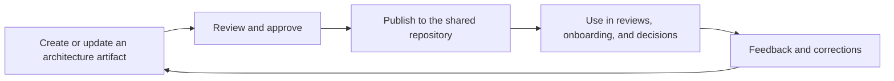

# Architecture Documentation at Enterprise Scale

> **Core skill:** The architect keeps architecture documentation usable across a large organization — layered detail, clear ownership, living artifacts tied to decisions — so the documentation is referenced in daily work rather than completed once and archived.

## Why This Matters

At enterprise scale the documentation problem is not authorship, it is findability and freshness. An enterprise generates thousands of pages of architecture material a year, and most of it decays within months: written for a moment, stored somewhere plausible, and superseded silently. Scale punishes exhaustive documentation hardest — the bigger the manual, the faster it goes stale and the less anyone trusts it.

The working answer is layered documentation, each layer with its own audience and update cadence: principles that change rarely, a landscape view that describes the estate at a point in time, domain and solution detail where the work happens, decision records that explain why, and standards that guide choices. Each layer serves a question; none attempts to serve all questions. The architect curates the layers and their connections rather than trying to write everything.

What makes documentation live is use. Documents referenced by real processes — onboarding, design reviews, procurement questions, audit preparation — get corrected when they drift, because somebody notices and cares. Documents that exist only for completeness have no users and therefore no maintenance. The architect designs documentation to be consumed: clear entry points, consistent templates, owned pages, and links from the workflows that depend on them.

## Documentation Layers

| Layer | Content | Audience | Update Cadence |
|-------|---------|----------|----------------|
| Principles | Enduring rules and rationale for decisions | Everyone designing anything | Rarely; deliberate review |
| Landscape | Current-state and target views of the estate | Executives, architects, delivery | On significant change |
| Domain and solution | Detail for a business domain or major solution | Engineering, delivery, operations | With the system's evolution |
| Decision records | Why a choice was made, what was traded | Future stakeholders, reviewers | On each significant decision |
| Standards | Technology positions and guidance | Project teams | Lifecycle review cycles |
| Glossary | Shared meaning of terms across layers | All audiences | As terminology shifts |

## Making Documentation Living

| Mechanism | Effect | Failure Mode It Prevents |
|-----------|--------|-------------------------|
| Named owner per artifact | Somebody is accountable for freshness | Orphaned pages nobody maintains |
| Update triggers | Edits happen when events occur, not on goodwill | Decay between annual cleanup drives |
| Template discipline | Consistent structure and headers | Re-learning where things live each time |
| Reference from processes | Onboarding, reviews, and audits link to the docs | Documentation without users |
| Small artifacts over monoliths | Pages that can be corrected cheaply | Enormous documents too costly to fix |

## Repository and Findability

| Need | Practice |
|------|----------|
| One entry point | A landing page that routes each audience to its layer |
| Search-friendly naming | Consistent, descriptive titles and tags across artifacts |
| Cross-linking | Decisions linked to the views they changed; standards linked to guidance |
| Version signals | Dates, owners, and status visible on every artifact |
| Minimal duplication | One authoritative page per subject, referenced elsewhere |

## The Documentation Loop



## Minimum Viable Documentation

| Question | Guidance |
|----------|----------|
| Who will read this artifact, and for what decision? | No reader, no decision — do not write it yet |
| What is the smallest version that answers the question? | Prefer one page and a diagram over a book |
| Where will it live, and who owns it? | Assign repository location and owner before writing |
| What event will make it outdated? | Record the trigger; schedule the review then |
| What can be linked instead of restated? | Restatement creates copies that drift |

## Practical Applications

### Documentation Practice Checklist

- [ ] Every artifact has a named owner, a location, and an update trigger
- [ ] The layers are defined and each artifact clearly belongs to one of them
- [ ] Onboarding, reviews, and audits reference the documentation directly
- [ ] Templates keep structure consistent across teams and artifacts
- [ ] Stale artifacts are archived or corrected on review, not left ambiguous

### Artifact Header Template

```markdown
## <Artifact title>

| Field | Value |
|-------|-------|
| Layer | <principles, landscape, domain, decision, standard> |
| Owner | <role or name> |
| Audience | <who reads this and why> |
| Status | <draft, current, superseded> |
| Last reviewed | <date> |
| Update trigger | <event that requires review> |
| Supersedes | <previous artifact, if any> |
```

## Common Pitfalls

| Pitfall | Why It Is a Problem | Better Approach |
|---------|---------------------|-----------------|
| **Write once, never revisit** | The artifact describes an estate that no longer exists; trust dies | Owners and update triggers on every artifact |
| **Exhaustive manuals** | Too large to maintain; readers use none of it | Layered, minimal artifacts per question |
| **Ownership vacuum** | Everyone assumes someone else maintains the pages | Named owner per artifact, visible in the header |
| **Docs divorced from decisions** | Decisions happen elsewhere; docs describe a fiction | Record decisions in the documentation itself |
| **No entry point** | Finding anything takes tribal knowledge | Landing page routing audiences to their layers |
| **Duplication across repositories** | Multiple versions conflict; nobody knows the truth | One authoritative page per subject; link, never restate |

## Success Indicators

- New joiners orient themselves from the documentation without a personal guide
- Review and audit questions are answered by linking to maintained artifacts
- Stale pages are flagged and corrected by their owners, not discovered by accident
- The same facts appear in one place and are referenced everywhere else
- Documentation effort is visibly proportional to use, not to completeness ambition

## Related Topics

- [[01_Stakeholder_Specific_Architecture_Views]]
- [[03_Enterprise_Architecture_Practice/00_overview|Enterprise Architecture Practice]]
- [[07_Architecture_Advocacy_and_Enablement]]
- [[career-path/06_Software_Architect/03_Architecture_Description_and_Views/00_overview|Architecture Description and Views (Architect)]]

## Summary

Architecture documentation at enterprise scale succeeds through layers, ownership, and use: principles, landscape, domain, decision, and standards artifacts each answering their audience's questions; owners and update triggers keeping them fresh; and real workflows — onboarding, reviews, audits — referencing them so drift is noticed. The architect curates a living system of knowledge, because at scale the alternative is a library that is technically correct about a landscape that no longer exists.
