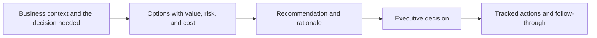

# Presenting to Executives and Boards

> **Core skill:** The architect presents architecture at the top of the organization in the currency executives use — value, risk, cost, and strategic fit — giving decision-makers exactly what they need to decide, and nothing they do not.

## Why This Matters

Executives and boards do not buy architecture; they buy outcomes and manage exposure. Their time with the architect is measured in minutes, their attention is competed for by everything else in the business, and their competence lies in judgment rather than in the technical detail. A briefing that walks through components and protocols wastes the scarcest resource in the conversation — after which the decision is made without architecture's input, or not made at all.

The executive lens has three questions: what does this mean for value, what does it expose us to, and what does it cost? Everything an architect knows has to be compressed into those terms. The board adds a fourth question — whether the enterprise is well governed — which is why board-level architecture communication leans on assurance, ownership, and trend, the evidence that the estate is under control rather than merely busy.

The most common failure is a presentation without an ask. Executives expect to decide: approve an option, accept a risk, fund a stage, or endorse a direction. An architect who presents without a decision request has delivered a lecture; an architect who frames a clear recommendation with options and trade-offs has done their job. The goal is not to be understood and admired — it is to have the right decision made and resourced.

## What Executives Decide

| Decision | What They Need from Architecture | What Works Against the Architect |
|----------|----------------------------------|----------------------------------|
| Approve a direction or option | Options with value, risk, cost, and recommendation | A single option presented as inevitable |
| Accept or mitigate exposure | Clear statement of risk, treatment, and residual | Technical detail that obscures the exposure |
| Fund a stage or gate | Evidence, cost, and what the money buys | Precision unrelated to the decision |
| Resolve a conflict | Trade-offs stated plainly, consequences of each path | Advocacy disguised as analysis |
| Endorse a target | Strategic fit and what changes for the business | Architecture jargon and completeness instinct |

## Framing for Executive and Board Audiences

| Topic | Strong Framing | Weak Framing |
|-------|----------------|--------------|
| Platform consolidation | Cost down, risk down, change faster — here is the evidence | Service inventories and protocol choices |
| Legacy risk | Exposure, likelihood, and what remediation buys | A diagram of an old system nobody has seen |
| Target architecture | What the business can do that it cannot do today | Layer diagrams with no value narrative |
| Security posture | Trends, residual risk, accountability, assurance cadence | Control counts and tool inventories |
| Transformation progress | Value realized to date against promised benefits | Percentage-complete reports |

## The One-Page Architecture Brief

```markdown
## Architecture Brief — <topic> — <date>

| Section | Content |
|---------|---------|
| The decision requested | <approve, accept, fund, endorse> |
| Why now | <forcing function or opportunity window> |
| Options | <two or three viable paths> |
| Recommendation | <preferred path and rationale> |
| Value | <benefits in business terms with evidence> |
| Risk and exposure | <top risks, treatment, residual> |
| Cost and funding | <what is being asked for and when> |
| Next step if approved | <immediate action and owner> |
```

## The Presentation Flow



## Handling Difficult Questions

| Question Type | The Trap | Strong Response |
|---------------|----------|-----------------|
| "Why not the cheaper option?" | Defending with detail the audience cannot verify | State what the cheaper option gives up, with a concrete consequence |
| "Is this safe?" | Absolute reassurance | Honest residual risk and how it is managed |
| "What happens if we do nothing?" | Treating it as rhetorical | Quantified cost of delay, in business terms |
| "Why should I trust this estimate?" | Launched into derivation | Name the confidence level and the first evidence checkpoint |
| "Who is accountable?" | Vague collective ownership | Named owner and governance path |

## Practical Applications

### Executive Presentation Checklist

- [ ] The briefing states the decision requested in the first minute
- [ ] Options are presented with trade-offs, not a single path
- [ ] Value, risk, and cost are expressed in the terms this audience measures
- [ ] Technical detail is available in an appendix, not on the main line
- [ ] Every presentation ends with next steps, owners, and dates

### Q&A Preparation Sheet

```markdown
## Anticipated Questions — <briefing>

| Question | Plain Answer | Supporting Evidence | Owner of Follow-up |
|----------|--------------|---------------------|--------------------|
| <hard question> | <two sentences> | <artifact or data> | <role> |
```

## Common Pitfalls

| Pitfall | Why It Is a Problem | Better Approach |
|---------|---------------------|-----------------|
| **Jargon as authority** | The audience disengages and defers instead of deciding | Business vocabulary; technical terms only when they change the decision |
| **Completeness instinct** | Everything included means nothing lands | One page: decision, options, recommendation, evidence |
| **No ask** | The meeting ends without a decision, and momentum is lost | Every briefing states the decision requested up front |
| **Trade-offs hidden** | Trust collapses when the discarded reality surfaces later | Name what is given up; it purchases credibility |
| **Surprise risk** | Bad news arriving unannounced at the board destroys confidence | Pre-brief key members; never let the board be the first to hear |
| **Rehearsal skipped** | A rambling delivery fails a good message | Rehearse with a critical colleague; time the opening |

## Success Indicators

- Briefings end with a recorded decision, an owner, and a date
- Executives restate the recommendation and its main trade-off accurately afterward
- The architect is invited back before decisions are made, not after
- Risk acceptances are made with the residual exposure stated openly
- Board-level sessions show trend and assurance, not project minutiae

## Related Topics

- [[05_Bridging_Business_and_Technical_Language]]
- [[01_Stakeholder_Specific_Architecture_Views]]
- [[07_Architecture_Advocacy_and_Enablement]]
- [[career-path/11_Engineering_Manager/07_Manager_Communication/00_overview|Manager Communication (EM)]]
- [[career-path/04_Principal_and_Distinguished_Engineer/04_Organizational_Influence/00_overview|Organizational Influence (Principal)]]

## Summary

Presenting to executives and boards is decision engineering: state the ask first, frame the architecture in value, risk, cost, and strategic terms, offer real options with honest trade-offs, and close with owners and dates. The architect's success is not being impressive in the room — it is walking out with the right decision made, resourced, and owned by people who understood exactly what they approved.
