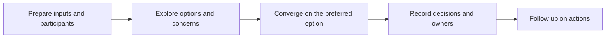

# Architecture Facilitation and Workshops

> **Core skill:** The architect designs and facilitates workshops that move a mixed audience from divergent views to recorded decisions — using structure, neutrality, and explicit capture — so sessions produce decisions, not just diagrams.

## Why This Matters

Architecture decisions are made in rooms: which option to pursue, where a boundary should fall, what a system must never do, who owns what. The quality of those rooms determines the quality of the architecture. A facilitated workshop is how the architect manufactures alignment — deliberately designing who is present, what they see before they arrive, how divergence is surfaced, and how convergence is reached and recorded.

Facilitation is a distinct skill from architecture. The facilitator manages the process — the sequence, the rules, the capture — while the content belongs to the participants. An architect who argues their own design while running the session loses the room's trust; an architect who designs a process that lets engineers, security, operations, and the business test each other's assumptions gets a decision that survives contact with reality.

The discipline lives or dies in the output. A workshop that ends with a wall of sticky notes and a promise to write things up has produced exercise, not architecture. Every session needs a decision log: what was decided, what was deferred, who owns each action, and when it is due. Follow-up is not administration after facilitation — it is the point of it.

## Workshop Types

| Workshop | Purpose | Key Output | Typical Duration |
|----------|---------|------------|------------------|
| Discovery | Understand needs, constraints, and context | Validated problem statement; concern list | Half day |
| Options and trade-offs | Compare candidate designs against criteria | Options analysis; scoring | Half to full day |
| Design validation | Test a proposed design against scenarios | Findings; required changes | Half day |
| Architecture review | Assess conformity and risk of a design | Review decision; exceptions | Two to three hours |
| Alignment | Resolve disagreement across functions | Recorded decision with owners | One to two hours |
| Retrospective | Learn from a delivered change | Improvements to patterns and process | One hour |

## Designing the Session

| Element | Design Question |
|---------|-----------------|
| Participants | Who can make the decision, who can veto it, who has information others lack? |
| Pre-reads | What must each participant know beforehand so the session debates rather than educates? |
| Inputs | Which views, data, or options are on display, and who prepared them? |
| Agenda | What sequence moves the group from divergence to convergence? |
| Materials | What medium lets everyone contribute — boards, shared documents, silent writing? |
| Outputs | What decision, log, and actions must exist when the session ends? |
| Follow-up | Who circulates the record, and what is the deadline for corrections? |

## Facilitation Techniques

| Technique | Use | Risk If Skipped |
|-----------|-----|-----------------|
| Silent writing first | Every participant forms a view before group dynamics set in | The loudest voice anchors the room |
| Round-robin | Each participant speaks in turn | Quiet experts stay silent; blind spots persist |
| Parking lot | Defer off-topic but important items visibly | Discussions derail and time dies |
| Dot voting | Fast, visible prioritization across options | Priority debates relitigate endlessly |
| Disagreement mapping | Make positions and objections explicit | False consensus; the objection resurfaces later |
| Decision log | Capture decisions, owners, and dates live | Decisions evaporate; the meeting is relitigated |

## The Workshop Flow



## The Decision Log

```markdown
## Workshop Decisions — <topic and date>

| # | Decision or Outcome | Rationale | Owner | Due |
|---|---------------------|-----------|-------|-----|
| 1 | <what was decided> | <why> | <role> | <date> |
| 2 | Deferred: <topic> | <why deferred> | <role> | <date> |
| 3 | Action: <task> | <context> | <role> | <date> |
```

Deferred items are decisions too — they are recorded so that deferral is visible rather than accidental.

## Facilitating Remote and Hybrid Sessions

| Challenge | Practice |
|-----------|----------|
| Attention fades online | Shorter segments; active contributions every few minutes |
| Silent participants | Round-robin and written input channels |
| Shared artifact access | One live document everyone can read and annotate |
| Hybrid imbalance | Remote participants speak first on each topic |
| Time zones | Rotate inconvenient slots or split the session |

## Practical Applications

### Facilitation Checklist

- [ ] The decision to be made is stated before the session, with its decision rights
- [ ] Participants include everyone needed to decide and everyone affected by the decision
- [ ] Pre-reads circulate early enough to be read, with specific questions to consider
- [ ] Divergence is deliberately surfaced before convergence is attempted
- [ ] The decision log is captured live and circulated within a day

### Session Design Canvas

```markdown
## Workshop Design — <topic>

| Element | Design |
|---------|--------|
| Decision to be made | <decision and who decides> |
| Participants and roles | <list> |
| Pre-work | <what each participant prepares> |
| Agenda segments | <sequence with timings> |
| Techniques to use | <techniques and where> |
| Outputs | <decisions, log, actions> |
```

## Common Pitfalls

| Pitfall | Why It Is a Problem | Better Approach |
|---------|---------------------|-----------------|
| **Presentation disguised as workshop** | Participants are audience, not contributors; no ownership of the outcome | Design for contribution; present only pre-reads |
| **No decision capture** | Agreements evaporate; the topic returns to the agenda next month | Live decision log with owners and dates |
| **Dominant voices** | The room converges on the most senior or loudest view | Silent writing and round-robin before open debate |
| **Wrong participants** | Decisions made without the decider or the affected parties | Map decision rights before invitations are sent |
| **No pre-reads** | Session time spent on context instead of decisions | Circulate concise inputs with questions to answer |
| **Facilitator takes sides** | Trust collapses; quiet participants withhold objections | Facilitate process, contribute content only as invited |

## Success Indicators

- Every workshop ends with a visible, circulated decision log
- Deferred items have owners and dates, and reappear on the agenda when due
- Participants who disagree in the room stay engaged afterward
- Follow-up sessions confirm earlier decisions held without relitigation
- The decision quality improves because objections surface before commitment

## Related Topics

- [[01_Stakeholder_Specific_Architecture_Views]]
- [[05_Bridging_Business_and_Technical_Language]]
- [[03_Enterprise_Architecture_Practice/00_overview|Enterprise Architecture Practice]]
- [[career-path/04_Principal_and_Distinguished_Engineer/04_Organizational_Influence/00_overview|Organizational Influence (Principal)]]

## Summary

Architecture facilitation turns meetings into decisions: sessions designed around a stated decision, participants mapped to decision rights, divergence deliberately surfaced before convergence, and a live decision log that travels out of the room and runs the follow-up. The architect's contribution is the process that lets a mixed audience legitimately decide — and the discipline that makes the decision stick.
