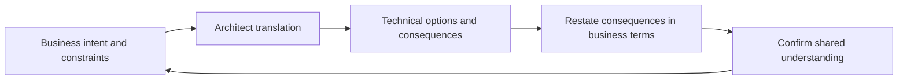

# Bridging Business and Technical Language

> **Core skill:** The architect translates fluently in both directions between business vocabulary and technical vocabulary — maintaining a shared glossary, restating in each audience's terms, and confirming understanding — so decisions rest on real agreement rather than on its appearance.

## Why This Matters

The same words carry different meanings on either side of the business-technology divide. "Real time" means sub-second to an engineer and "today rather than next week" to an operations director. "Flexible" means configurable to one and endlessly changeable to the other. "Secure" is a property to be designed and a feeling to be trusted. Translation failure is one of the most reliable causes of solutions that meet their specification and disappoint their users.

The architect is the organization's standing interpreter. This is not a soft skill layered on top of the technical work; it is the mechanism by which requirements become design and design becomes acceptance. Translating a business intent into precise technical constraints — and translating technical consequences back into the business outcomes they affect — is where the architect adds value that neither side can produce alone.

The asymmetry matters: business language is the final arbiter, because the business owns the outcomes. Technical translation serves that end. The danger is false fluency — the architect who believes each side has understood because each nodded. Understanding has to be tested: restated, played back, walked through scenarios, and written into a shared glossary that both sides can point to when memory and goodwill diverge.

## Why Translation Fails

| Failure Mode | Example | Consequence |
|--------------|---------|-------------|
| Polysemy | "Real time" meaning different things to each side | A system built to the wrong latency expectation |
| Abstraction mismatch | Business speaks outcomes; engineering speaks mechanisms | Requirements that cannot be tested; designs that miss the point |
| Acronym fog | Each side's shorthand excludes the other | Silent misunderstanding; decisions made on guesses |
| False fluency | Nods in the meeting; divergence in the build | Rework discovered late, or never |
| Translation at the end | Architecture explained after decisions are locked | The translation becomes justification, not design input |

## A Working Translation Table

| Business Phrase | Commonly Means | Question That Pins It Down |
|-----------------|----------------|----------------------------|
| "Real time" | Latest possible, or fast enough not to notice | What decision depends on the freshness, and how stale is too stale? |
| "The system must be flexible" | Must absorb change without rebuilds | Which changes, how often, and who makes them without engineering? |
| "Single source of truth" | One authoritative place for an entity | Authority for writes; what happens to the other copies? |
| "The system is slow" | Latency, throughput, or a specific journey feels wrong | Which step, for whom, and compared to what? |
| "It must be secure" | A risk appetite, expressed as a feeling | Which threats, which data, and what trade-off against convenience? |
| "We need it to scale" | Growth, spikes, or geography | How much growth, over what period, with what budget? |
| "Can we add AI to it?" | A capability outcome, or a technology wish | What decision should improve, and what would good look like? |

## Building the Shared Glossary

| Term | Business Definition | Technical Definition | Agreed Meaning | Owner |
|------|---------------------|----------------------|----------------|-------|
| <term> | <how the business uses it> | <how engineering uses it> | <the single agreed sense> | <role> |
| <term> | <usage> | <usage> | <agreement> | <role> |

The glossary is small, curated, and authoritative. Its value is not completeness but arbitration: when usage drifts, both sides point to the same page.

## The Translation Loop



## Techniques for Confirming Understanding

| Technique | How It Works | When to Use |
|-----------|--------------|-------------|
| Playback | One side restates the other's point in their own words | End of every significant conversation |
| Scenario walkthrough | A concrete story traced through the design | Requirements and design reviews |
| Example data | Real values and edge cases, not placeholders | Data and integration discussions |
| Prototype or wireframe | Something visible that can be pointed at | Whenever words keep sliding past each other |
| Test of commitment | "What would change your mind?" | Whenever agreement feels too easy |

## Practical Applications

### Translation Practice Checklist

- [ ] A shared glossary exists for the domain, small and owned, referenced in documents
- [ ] Requirements are restated in both languages and played back for confirmation
- [ ] Ambiguous phrases are pinned to testable meaning before design proceeds
- [ ] Technical consequences are always reported in outcome terms to business audiences
- [ ] Understanding is tested with scenarios, examples, or prototypes, not assumed from nods

### Glossary Entry Template

```markdown
## Glossary Entry — <term>

| Field | Content |
|-------|---------|
| Business usage | <how the business means it> |
| Technical usage | <how engineering means it> |
| Agreed meaning | <single authoritative sense> |
| Example | <one concrete example both sides accept> |
| Owner | <who arbitrates disputes> |
```

## Common Pitfalls

| Pitfall | Why It Is a Problem | Better Approach |
|---------|---------------------|-----------------|
| **Jargon as authority** | Exclusion creates deference, not understanding | Plain language first; define terms where they must be technical |
| **False fluency** | Nods hide divergent interpretations until late rework | Playback and scenarios; test the understanding, not the mood |
| **Translation asymmetry** | Only business-to-technical translation happens; consequences never come back | Close the loop: always restate technical outcomes in business terms |
| **Unwritten agreements** | Terms drift; memory conflicts; nobody can arbitrate | Shared glossary as the single point of reference |
| **Nod-and-agree culture** | Disagreement is impolite, so it goes underground | Make playback and "what would change your mind" routine |
| **Translating after the decision** | The interpretation arrives when it cannot change the design | Translate at framing time; keep it in the design loop |

## Success Indicators

- Both sides cite the same glossary meaning in decisions and reviews
- Requirements survive translation: what was built matches what was meant
- Business stakeholders can explain technical trade-offs in their own words
- Rework caused by misunderstanding trends down
- Disagreements surface early, in words both sides recognize

## Related Topics

- [[03_Presenting_to_Executives_and_Boards]]
- [[04_Architecture_Facilitation_and_Workshops]]
- [[01_Business_Analysis_and_Capability_Mapping/00_overview|Business Analysis and Capability Mapping]]
- [[career-path/11_Engineering_Manager/07_Manager_Communication/00_overview|Manager Communication (EM)]]

## Summary

Bridging business and technical language is the architect's core interpretive act: noticing where the same words mean different things, pinning ambiguous phrases to testable meaning, maintaining a small authoritative glossary, and closing the loop by restating technical consequences in outcome terms. Translation is not a courtesy on top of the work — it is how requirements become design, how designs become accepted, and how agreement becomes real instead of apparent.
