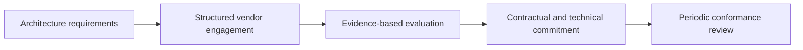

# Vendor and Partner Communication

> **Core skill:** The architect holds technical conversations with vendors and partners grounded in architecture requirements — testing claims with evidence, defining boundaries and interfaces precisely, and keeping the enterprise's options and interests visible throughout the relationship.

## Why This Matters

Vendors know their product and the arts of demonstration; the enterprise knows its requirements and its obligations. The architect stands between those two expertises, and the conversation's quality determines whether the enterprise buys a solution to its problem or a solution to a problem the vendor prefers to solve. Requirements stated precisely and tested against evidence are the architect's main instrument.

The default failure is subtle: a vendor demo is a designed experience, a capability narrative is a promise, and a roadmap is a direction of travel, not a commitment. Each of these communicates something real, and none of them is an assessment. The architect separates the communication into what was shown, what was claimed, and what has been verified — and designs the engagement so that verification happens before commitment, not during the first incident.

Partners and alliances are a different register of the same skill. With partners the architecture is shared and the boundary must be explicit: who owns which component, where the interfaces are, how change is coordinated, and how disagreements escalate. The communication here is less procurement and more joint design — and it works when both sides can point to the same boundary diagrams and the same recorded decisions.

## What Vendor Conversations Must Establish

| Topic | Question | Evidence to Seek |
|-------|----------|------------------|
| Fit | Does the product's structure match the architecture we need? | Architecture documentation; integration references |
| Integration | How do boundaries and interfaces actually work? | Interface specifications; sandbox access; reference customers |
| Security | Can they protect what the enterprise entrusts to them? | Independent reports; control evidence; incident history |
| Continuity | What happens to the enterprise when the vendor fails? | Availability data; continuity testing; exit commitments |
| Economics | What is the lifecycle cost, including exit? | Price structures; exit costs; growth multipliers |
| Roadmap | Where is the product going, and what does that mean for us? | Written commitments with dates, or honest uncertainty |

## Communicating Requirements, Not Wants

| Requirement | Weak Statement | Strong Statement | How to Test |
|-------------|----------------|------------------|-------------|
| Data export | "We need our data back" | "Complete export of all our data in an open format, on demand, within one business day" | Run an export during evaluation |
| Residency | "Data stays in country" | "All storage and processing, including subprocessors, stays in the stated jurisdiction" | Contractual list plus technical verification |
| Performance | "It must be fast" | "The transaction completes within the stated time at peak load" | Benchmarked in a pilot with our data |
| Change notice | "Tell us about changes" | "Material changes and new subprocessors notified with the stated notice period" | Contractual clause with operational monitoring |
| Exit | "We can leave" | "Termination assistance for the stated period at the stated cost" | Clauses drafted and reviewed with an exit plan |

## Evaluating Claims

| Claim | Verify By | Warning Sign |
|-------|-----------|--------------|
| "Mission critical customers rely on us" | Reference calls with operations counterparts | References curated to marketing |
| "It scales to our volumes" | Pilot at representative scale | Benchmarks from unrelated workloads |
| "Security is our priority" | Independent attestation and control evidence | Certificates without scope statements |
| "The roadmap includes that" | Written commitment with dates and dependencies | Verbal enthusiasm; unowned promises |
| "Integration is trivial" | Sandbox experiment by our engineers | Demos that dodge interface realities |

## The Engagement Sequence



## Partner and Alliance Communication

| Situation | Practice |
|-----------|----------|
| Joint architecture | One shared boundary diagram both organizations adopt; changes versioned together |
| Boundary ownership | Explicit responsibility per component and interface, written down |
| Interface change | Coordinated change windows; interface contracts with notice periods |
| Escalation | Named counterparts on both sides; a path that does not require a crisis |
| Roadmap alignment | Regular exchange of plans where mutual dependency exists |
| Lessons after incidents | Blameless review across the boundary; fixes recorded on both sides |

## Practical Applications

### Vendor Communication Checklist

- [ ] Requirements are documented and shared before any demonstration or proposal
- [ ] Every material claim is marked shown, claimed, or verified
- [ ] Evaluation includes hands-on testing with the enterprise's own data
- [ ] Commercial terms include exit, export, and change-notice provisions the architecture needs
- [ ] A single coordination point keeps consistent communication with the vendor

### Vendor Engagement Brief

```markdown
## Vendor Engagement Brief — <vendor and scope>

| Item | Content |
|------|---------|
| Requirements summary | <key architecture requirements> |
| Claims register | <claim: shown, claimed, or verified> |
| Verification plan | <pilots, references, evidence> |
| Boundary and interface questions | <open items> |
| Exit and portability questions | <open items> |
| Decision criteria and owner | <who decides, on what evidence> |
```

## Common Pitfalls

| Pitfall | Why It Is a Problem | Better Approach |
|---------|---------------------|-----------------|
| **Demo treated as assessment** | A rehearsed experience replaces evidence | Hands-on pilot with our data and interfaces |
| **Verbal roadmap promises** | Key capabilities quietly drop; the architecture depended on them | Written commitments with dates, or plan around uncertainty |
| **Architecture tailored to the vendor** | The estate bends to product quirks and the vendor gains lock-in | Requirements first; conformance assessed against them |
| **No exit conversation** | Departure becomes impossible at the moment it is needed | Exit and portability negotiated while leverage exists |
| **Many voices, one vendor** | Inconsistent signals; the vendor arbitrates internal disagreement | Single coordination point with consolidated messaging |
| **Pilot without an agreement** | Free leverage for the vendor; no commitment to convert or exit | Define pilot scope, evaluation criteria, and next step upfront |

## Success Indicators

- Requirements, not demonstrations, drive evaluations
- Claims are recorded and tested; unverified promises block commitments
- Contracts reflect the architecture's needs: export, residency, notice, exit
- Partner interfaces operate with versioned contracts and calm escalations
- The enterprise can articulate what it would do if any key vendor exited tomorrow

## Related Topics

- [[06_Third_Party_and_Supply_Chain_Risk]]
- [[05_Bridging_Business_and_Technical_Language]]
- [[03_Presenting_to_Executives_and_Boards]]
- [[career-path/06_Software_Architect/04_Architecture_Evaluation_and_Trade_Offs/00_overview|Architecture Evaluation and Trade Offs (Architect)]]

## Summary

Vendor and partner communication keeps technical conversations anchored to the enterprise's architecture: requirements stated in testable terms, claims separated into shown, claimed, and verified, evaluations that use real data and interfaces, and contracts that carry the exit, residency, and notice provisions the design depends on. The architect's goal is a relationship where the enterprise's options remain open and both sides work from the same boundary picture.
