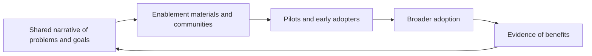

# Architecture Advocacy and Enablement

> **Core skill:** The architect wins adoption of the architecture through enablement — a clear narrative, usable materials, communities, and visible evidence — so teams follow it because it works, not because a review board mandates it.

## Why This Matters

An architecture adopted only under mandate is an architecture that has failed to persuade. Mandates produce compliance theater: teams route around slow gates, build parallel solutions, and treat the standard path as a tax. The alternative is enablement: making the architecture easy to adopt, useful in the moment of work, and visibly better than the local alternative. Adoption that is won rather than compelled is the only kind that lasts.

Enablement is a different motion from advocacy. Advocacy is the argument — why this matters, what it delivers, what it prevents. Enablement is the infrastructure of adoption: quickstarts that work, templates that fit, reference implementations to copy, office hours to ask, and a community where the questions actually get answered. The architect who argues without enabling is asking teams to do extra work for someone else's principle.

Adoption is also measurable, which keeps the whole effort honest. Awareness, understanding, trial, adoption, advocacy: each rung of the ladder has observable signs and different interventions. When adoption stalls, the measurement says whether the message is missing, the materials are weak, or the architecture itself is not good enough yet — and each of those has a different response.

## The Adoption Ladder

| Stage | What It Looks Like | What Moves Teams Forward |
|-------|--------------------|--------------------------|
| Awareness | Teams have heard of the architecture and its intent | Narrative shared in the venues teams already attend |
| Understanding | Teams can explain how it applies to their work | Walkthroughs, examples, and direct answers |
| Trial | A team uses it on a real piece of work | Support during the first adoption; visible quick wins |
| Adoption | It is the default choice for the domain | Paved road, templates, and frictionless conformance |
| Advocacy | Teams recommend it to others and contribute back | Recognition; ownership; improvements accepted from the field |

## Advocacy That Lands

| Audience | The Argument They Need | Evidence That Convinces |
|----------|----------------------|-------------------------|
| Engineering teams | Less rework, faster delivery, fewer painful decisions | Time saved on a real project; peer testimonials |
| Product and business | Capabilities arrive sooner; risk is lower | A delivered outcome they can point at |
| Operations | Fewer incidents; easier support; clear ownership | Incident trends; support load compared |
| Security and risk | Controls designed in; audit findings reduced | Review timelines; findings trend |
| Executives | Strategy made real; cost and risk managed | Benefits realized against baseline |

## Enablement Materials

| Material | Audience | Purpose |
|----------|----------|---------|
| Quickstart guides | Engineers starting work | Get to a conforming start in hours, not weeks |
| Templates and checklists | Teams producing architecture artifacts | Capture the right information once |
| Reference implementations | Engineers building similar features | Prove the pattern works; provide code to copy |
| Decision guides | Anyone choosing between options | Short, opinionated guidance aligned to the architecture |
| Office hours | Teams with open questions | Fast answers; feedback on where guidance is unclear |
| Community space | Everyone | Peer answers; shared patterns; collective memory |

## The Enablement Loop



## Communities and Champions

| Mechanism | How It Works |
|-----------|--------------|
| Community of practice | Regular forum where practitioners share patterns, problems, and improvements |
| Champions in teams | Respected engineers who carry the architecture into their own teams and feed field insights back |
| Contribution path | Teams can improve templates and guidance; authorship builds ownership |
| Recognition | Adoption and contribution are visible and appreciated, not just compliance-checked |
| Field feedback loop | Recurring friction triggers architecture improvement, not repeated reminders |

## Measuring Adoption

| Metric | Source | What It Tells You |
|--------|--------|-------------------|
| Conforming starts | Project onboarding records | Whether the paved road is the default |
| Template and guide usage | Repository analytics or surveys | Whether enablement materials are found and used |
| Time to approval | Review records | Whether conformance is fast or a bottleneck |
| Exception rate and shape | Exceptions register | Which guidance is missing or wrong |
| Reuse of reference implementations | Code and artifact searches | Whether patterns spread organically |
| Team sentiment | Lightweight surveys or retrospectives | Whether the architecture is seen as help or obstacle |

## Practical Applications

### Advocacy and Enablement Checklist

- [ ] The narrative starts from the teams' problems, not the architect's preferences
- [ ] Enablement materials exist for the most common starting points
- [ ] Early adopters are supported intensively and their wins are visible
- [ ] A community and feedback path let the field shape the architecture
- [ ] Adoption is measured, and stalls are diagnosed rather than decreed

### Enablement Plan

```markdown
## Enablement Plan — <architecture or change>

| Element | Design |
|---------|--------|
| Audience segments | <groups and their concerns> |
| Core narrative | <problem first, then the architecture> |
| Materials to produce | <guides, templates, examples> |
| Early adopters | <teams and support model> |
| Community mechanism | <forum, champions, cadence> |
| Adoption metrics | <what will be measured and when> |
```

## Common Pitfalls

| Pitfall | Why It Is a Problem | Better Approach |
|---------|---------------------|-----------------|
| **Mandate over persuasion** | Compliance theater and workarounds; adoption on paper only | Pair any mandate with enablement that makes conformance easy |
| **Documentation as advocacy** | Publishing a document is not a campaign; nobody changes behavior | Narrative in person, in teams' venues, starting from their problems |
| **No answer to "what is in it for my team?"** | Adoption asks for extra work with invisible benefit | Make the local benefit concrete: time, quality, fewer incidents |
| **Advocate-only architect** | Enthusiasm without materials or support; teams try and stall | Enablement infrastructure: examples, templates, office hours |
| **Adoption assumed after launch** | Attention moves on; adoption quietly decays | Measure usage; diagnose stalls; keep the loop alive |
| **Ignoring field feedback** | Friction repeats; the architecture looks deaf | Treat recurring exceptions and questions as design input |

## Success Indicators

- New work starts on the standard path by default, without chasing approvals
- Teams cite the architecture's benefits from their own experience
- The community generates improvements the architect adopts, not just questions
- Exception rates fall because guidance improved, not because gates tightened
- Executives see adoption evidence tied to business outcomes

## Related Topics

- [[02_Architecture_Documentation_at_Enterprise_Scale]]
- [[03_Presenting_to_Executives_and_Boards]]
- [[01_Stakeholder_Specific_Architecture_Views]]
- [[career-path/04_Principal_and_Distinguished_Engineer/04_Organizational_Influence/00_overview|Organizational Influence (Principal)]]

## Summary

Architecture advocacy and enablement win adoption the durable way: a narrative built from teams' own problems, materials and support that make the standard path the easy path, early adopters whose wins are visible, and a community that feeds improvements back into the architecture. The measure of success is behavioral — teams adopt because conforming helps them, and the architecture improves because the field tells the architect where it does not.
