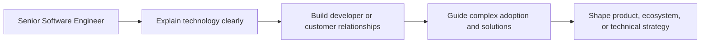

# Developer Advocate and Technical Consultant

> **Positioning:** A communication and ecosystem path focused on helping developers, customers, partners, and communities understand and successfully use technology.

## What This Path Is

A Developer Advocate builds trust and adoption through technical content, examples, workshops, community interaction, feedback, and public communication. A Technical Consultant helps customers or internal stakeholders understand problems, evaluate options, implement solutions, and achieve outcomes.

These paths are different from ordinary marketing because technical credibility and practical usefulness are central. They are also different from pure engineering because the work often happens at the boundary between technology and people.

## Primary Outcomes

- Developers and customers who can use a technology successfully
- Clear documentation, examples, workshops, and reference implementations
- Feedback from the ecosystem returned to engineering and product teams
- Faster adoption and fewer misunderstandings
- Successful technical discovery, implementation, and problem resolution
- Stronger relationships among a technology organization and its users

## Capability Areas

| Capability | Role behavior | Existing vault anchor |
|---|---|---|
| Technical communication | Explains complex ideas accurately for different audiences | [[14_Software_Engineering_Professional_Practice/03_Communication_Skills]] |
| Documentation | Creates usable guides, examples, references, and troubleshooting paths | [[04_Software_Construction/10_Code_Style_and_Documentation]] |
| Facilitation | Runs workshops, demos, discovery sessions, and technical reviews | [[BABOK/02_Elicitation_and_Collaboration]] |
| Customer understanding | Finds needs, constraints, and obstacles through interaction | [[BABOK v3 - Overview]] |
| Solution guidance | Connects a customer's problem to an appropriate technical approach | [[SEBoK v2 - Overview]] |
| Community building | Creates durable learning and feedback networks | [[14_Software_Engineering_Professional_Practice/06_Professional_Societies_and_Community]] |
| Product feedback | Converts ecosystem signals into product and engineering insight | [[14_Product_Manager]] |

## Typical Progression

## Signals for Moving Forward

- You enjoy teaching, writing, presenting, and helping others succeed.
- You can adapt the same technical idea for beginners, experts, customers, and executives.
- You are comfortable receiving feedback that may challenge the product or architecture.
- You can balance technical accuracy, user needs, and organizational goals.
- You gain energy from working at the boundary between teams and communities.

## Evidence to Build

- Developer guide or tutorial
- Reference implementation
- Technical workshop
- Conference or community presentation
- Customer discovery report
- Solution assessment
- Adoption or enablement plan
- Product feedback synthesis
- Troubleshooting and migration guide

## Nearby Paths

- [[15_Solutions_and_Enterprise_Architect|Solutions or Enterprise Architect]]: customer and enterprise solution design
- [[14_Product_Manager|Product Manager]]: product direction and value
- [[06_Software_Architect|Software Architect]]: technical design and system structure
- [[03_Staff_Engineer|Staff Engineer]]: internal technical influence

## Suggested Future Note Route

1. [[14_Software_Engineering_Professional_Practice/03_Communication_Skills]]
2. [[14_Software_Engineering_Professional_Practice/06_Professional_Societies_and_Community]]
3. [[BABOK/02_Elicitation_and_Collaboration]]
4. [[BABOK/07_Underlying_Competencies]]
5. [[BABOK/08_Techniques_Catalog]]
6. [[System Engineer BOK/10_Product_and_Service_Systems_Engineering]]
7. [[04_Software_Construction/10_Code_Style_and_Documentation]]

## Sources

- [[SWEBOK v4 - Overview]]
- [[BABOK v3 - Overview]]
- [[SEBoK v2 - Overview]]

## Related

- [[00_Career_Path_Overview]]
- [[02_Senior_Software_Engineer]]
- [[14_Product_Manager]]
- [[15_Solutions_and_Enterprise_Architect]]
