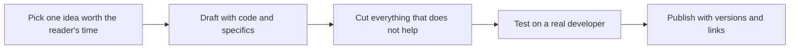

# Writing for Developers

> **Core skill:** The advocate writes technical prose that surviving engineers actually finish — precise, specific, code-forward, and free of marketing grammar that triggers a developer's skepticism reflex.

## Why This Matters

Developers read with a threat model. They scan for the catch, the missing caveat, the benchmark that omits the losing case. A single sentence of hype — "blazingly fast," "revolutionary," "effortless" — flips the whole document into marketing and re-weights every claim in it. Writing for developers is therefore not a softer form of technical writing; it is the hardest form, because credibility is the first feature of the text and it is destroyed by a single word.

The economics are equally unforgiving. Documentation is read in the first fifteen minutes of evaluation, the blog post is read before the docs, and the release note is read by someone deciding whether to upgrade production. Each artifact is a first impression that scales: a blog post is read by thousands, a doc page by tens of thousands. The cost of ambiguity, drift, and overstatement compounds with every reader who bounces.

The professional distinction is discipline: every claim traceable to a demonstration, every term defined on first use, every sentence carrying information the reader cannot get faster elsewhere. Developer writing earns attention the same way software earns trust — by working, and by not lying.

## Content Types and Their Conventions

| Artifact | Reader's Job | Conventions That Work |
|----------|--------------|-----------------------|
| Blog post | Decide whether this is worth an hour of my time | One idea; concrete problem in the first paragraph; working code before conclusions |
| Announcement | Decide whether to care and to click through | What changed, who it helps, what it costs, link to docs; no superlatives |
| Release note | Decide whether to upgrade and what breaks | Breaking changes first; migration link; copy-pasteable snippets |
| Documentation page | Complete a task | Task title; prerequisites; steps with expected output; no narrative detours |
| README | Decide in sixty seconds whether to use this repo | What it is, one runnable example, requirements, status and maturity honest |
| Design writeup | Understand a decision and its trade-offs | Decision, alternatives considered, evidence, what would change our mind |

## Prose Rules for Technical Audiences

| Rule | Why It Survives Contact with Developers |
|------|------------------------------------------|
| One idea per sentence | Readers are scanning for the load-bearing fact, not parsing subordinate clauses |
| Active voice with a named actor | "The client retries the request" beats passive constructions that hide who does what |
| Numbers over adjectives | "p99 latency of 40 ms" beats "extremely fast" and cannot be argued with |
| Define on first use | Abbreviations and product terms are jargon the moment they are new |
| Code before conclusion | Engineers trust execution output over authorial confidence |
| Cut every sentence that cannot be missed | Length is a cost the reader pays; each sentence must earn its place |
| Say what the software does not do | Limits stated up front are read as honesty; limits discovered later are read as fraud |
| Name the versions | Undated technical claims are stale claims waiting to mislead |

## The Writing Loop



The loop is deliberately last-mile heavy: drafts are cheap, but the cutting and the test read are where credibility is made. A post that was never read by a developer is a draft, whatever its publish date.

## Practical Applications

### Developer Prose Checklist

- [ ] The artifact says what the reader can do after reading that they could not do before
- [ ] Every performance or quality claim has evidence — benchmark, measurement, or reproduction steps
- [ ] Code samples are complete enough to run without guessing at the missing lines
- [ ] Product marketing language appears zero times — no superlatives, no adjectives standing in for numbers
- [ ] Limitations and prerequisites are stated before the reader discovers them
- [ ] The piece was tested on a developer who was not involved in writing it

### Blog Post Skeleton

```markdown
## <Specific outcome the reader gets>

One paragraph stating the problem and the result, with numbers.

[code block: minimal working example]

## How it works

<mechanism, one level deep>

## What this does not solve

<honest limits and alternatives>

Links: <docs, repo, reproduction>
```

## Common Pitfalls

| Pitfall | Why It Is a Problem | Better Approach |
|---------|---------------------|-----------------|
| **Superlative inflation** | One exaggerated claim re-reads the entire text as marketing | Numbers over adjectives; demonstrate, never declare |
| **Undefined jargon** | Terms that are obvious to the author are gates to the reader | Define on first use or link to a definition |
| **Dangling code fragments** | Samples that cannot be run force the reader to guess and resent | Complete, runnable samples with imports and expected output |
| **Burying the outcome** | Readers bounce from an opening that is throat-clearing | Lead with the result or the problem, keep the context after |
| **Undated claims** | "Currently supports" becomes false silently and misleads every later reader | Version-stamp claims and link to versioned docs |
| **Silent limitations** | Discovered limits read as deception and end trust | State what the tool does not do, in the same voice as what it does |

## Success Indicators

- Readers reproduce the code without asking clarifying questions
- The piece is cited in forums and docs rather than re-explained
- Correction requests decline over time as the voice becomes predictable and honest
- Peers and engineers forward the article with their own endorsement, not just the author's
- Marketing reviews the draft without asking to add superlatives — the value is visible without them

## Related Topics

- [[01_Audience_Analysis_and_Framing]]
- [[05_Content_Strategy_for_Advocacy]]
- [[07_Communication_Ethics_and_Accuracy]]
- [[career-path/02_Senior_Software_Engineer/06_Communication_and_Influence/01_Technical_Writing|Technical Writing (Senior)]]
- [[career-path/03_Staff_Engineer/07_Organizational_Learning_and_Mentoring/04_Writing_as_Scaling|Writing as Scaling (Staff)]]

## Summary

Writing for developers is credibility engineering: precise language, working code, defined terms, honest limits, and not one word of hype. The advocate who writes this way earns the scarcest resource in technical communication — a reader who believes the next sentence before verifying it — and that belief is what turns a piece of writing into adoption, contribution, and word of mouth.
