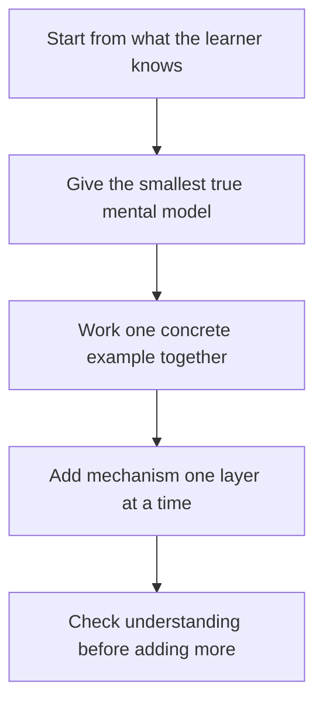

# Explaining Complex Concepts

> **Core skill:** The advocate transfers a working mental model of a complex system into another person's head — starting from what they already know, building one layer at a time, and marking exactly where the simplification stops being true.

## Why This Matters

Explanation is not describing a system; it is building a model of that system in someone else's mind. The difference shows up immediately: a description lists what exists, while an explanation predicts what the listener can now do with it. An engineer who understands a caching layer can reason about a cache miss they have never seen; an engineer who merely memorized the description cannot. The advocate's explanation is successful only when the learner can go beyond the material and handle cases the explanation did not cover.

Complex systems resist this because they are genuinely complex: many moving parts, interacting constraints, failure modes that only appear at scale. The novice's problem is not intelligence but context — they lack the anchors that make the deep details meaningful. The expert's failure mode is the opposite: starting at mechanism because mechanism is what the expert finds interesting, when the listener has no model to attach it to. Good explanations are engineered to the learner's current state, the way good APIs are designed to the caller's needs.

The discipline that separates a professional explainer from a knowledgeable one is honesty about simplification. Every explanation simplifies; the question is whether the learner knows where the edges are. An analogy that quietly misleads is worse than no analogy, because the learner will build on it and be surprised later — in production, at 3 a.m., when the surprise is most expensive. Marking the boundary of the model is what keeps simplification from becoming distortion.

## The Explanation Ladder

| Level | What the Learner Gets | Typical Form | Exit Test |
|-------|----------------------|--------------|-----------|
| Anchor | A familiar situation the new concept resembles | Analogy, story, shared experience | Learner nods and states the problem in their words |
| Mental model | The smallest true picture of how it works | One diagram, three boxes, one flow | Learner predicts the common case correctly |
| Worked example | The model executed once, end to end | Runnable code, annotated trace | Learner can run it and vary inputs |
| Mechanism | Why the model holds, layer by layer | Internals, invariants, diagrams | Learner explains why a variant behaves differently |
| Edge cases | Where the model bends or breaks | Limits, failure modes, sharp corners | Learner recognizes when the model is unsafe |

Each level stands alone and each is optional beyond the anchor. Most professional explanations fail by emitting the mechanism for a learner who has not accepted the model — or by stopping at the anchor for a learner who now needs to build.

## Analogies That Hold

| Property | Strong Analogy | Weak Analogy |
|----------|----------------|--------------|
| Maps the constraint | Preserves what the system cannot exceed | Maps only surface similarity |
| Breaks in the right place | Fails loudly where the real differences begin | Fails silently, misleading without warning |
| Single scope | Explains one behavior and stops | Stretched over three behaviors it no longer fits |
| Learner-owned | Uses experience the learner actually has | Uses the explainer's hobby or trade |
| Explicit boundary | Says where the analogy ends | Pretends the mapping is exact |

A strong analogy is a loan of intuition with clear terms — the learner should know when to return it.

## Explanation Techniques

| Technique | What It Does | Use When |
|-----------|--------------|----------|
| Progressive disclosure | Adds one layer per pass, each complete | Mixed-depth audiences; long-form content |
| Worked example first | Shows the machine running before the theory | Skeptical practitioners; new APIs |
| Contrast pair | Explains by difference against a known system | The learner knows a competing tool |
| Constraint narrowing | Removes variables until the core remains | The system has many interacting parts |
| Error-first teaching | Starts from a real failure the learner has seen | Debugging, troubleshooting, operations |
| Re-explanation | Asks the learner to explain it back | Confirming the model actually transferred |

## The Explanation Loop



The loop can exit at any layer for any learner: the concept talk ends at the model, the onboarding session ends at the worked example, the deep dive continues to the edges. The exit points are chosen, not accidental.

## Practical Applications

### Explanation Quality Checklist

- [ ] The explanation opens from something the learner already knows
- [ ] One mental model is given before any mechanism
- [ ] At least one worked example is executed, not just described
- [ ] Simplifications are flagged where they stop being true
- [ ] The learner is asked to restate or apply the model before more layers are added
- [ ] Jargon appears only after the concept it names has been built

### Explanation Canvas Template

```markdown
## Explanation Canvas — <concept>

| Learner Level | Anchor | Model | Example | Boundary to Mark |
|---------------|--------|-------|---------|------------------|
| <beginner>    | <analogy> | <three-box model> | <runnable sample> | <where it stops being true> |
| <practitioner> | <problem> | <mechanism summary> | <debug trace> | <failure modes> |
```

## Common Pitfalls

| Pitfall | Why It Is a Problem | Better Approach |
|---------|---------------------|-----------------|
| **Mechanism first** | The listener has no model to attach the details to; retention collapses | Anchor and model first; mechanism after the learner can predict |
| **Analogy overreach** | A stretched analogy misleads silently and surfaces in production | State where the analogy ends, in the same breath |
| **Explaining everything** | Complete coverage is indistinguishable from noise for a learner | Explain the core fully; leave the rest as linked depth |
| **No worked example** | The learner understands the story but cannot operate the thing | Execute one example end to end, in view of the learner |
| **Author's journey teaching** | The order the expert learned it is not the order a learner needs | Re-derive the path from the learner's starting point |
| **Unverified transfer** | The nod is politeness; the model may not have landed | Ask for a restatement or a small application task |

## Success Indicators

- Learners apply the model to cases that were never mentioned in the explanation
- Follow-up questions move deeper rather than back to basics
- Learners catch and state the simplification boundaries themselves
- Recorded explanations are still used months later without live narration
- Colleagues adopt the analogy or model as shared shorthand in design discussions

## Related Topics

- [[01_Audience_Analysis_and_Framing]]
- [[04_Presenting_and_Public_Speaking]]
- [[03_Facilitation_and_Enablement/00_overview|Facilitation and Enablement]]
- [[career-path/02_Senior_Software_Engineer/06_Communication_and_Influence/00_overview|Communication and Influence (Senior)]]

## Summary

Explaining complex concepts is model transfer, not coverage: start from what the learner knows, hand them the smallest true mental model, execute one concrete example, then add mechanism layer by layer while marking where each simplification stops being true. The proof of a good explanation is generative — the learner handles cases the explanation never mentioned — and the discipline that keeps it honest is stating the boundary of the model before the learner finds it in production.
