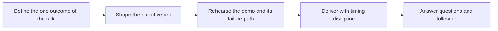

# Presenting and Public Speaking

> **Core skill:** The advocate delivers technical talks, demos, and sessions that a live audience can follow in real time — one outcome per talk, an arc that carries attention, and demos engineered to fail safely in front of a room.

## Why This Matters

A conference audience is the most leveraged conversation the advocate ever has: one room, one hour, thousands of practitioners and decision makers across the room and the recording. A talk that lands converts strangers into users and users into believers; a talk that rambles, oversells, or dies in a live coding failure teaches the audience something about the speaker's judgment, not just their competence. The stakes are higher than written content because the audience cannot skim — attention is either held in real time or lost, and it is lost irreversibly.

Presenting is a learnable engineering discipline, not a personality trait. The talk is a product with a specified outcome, an audience with a job to be done, and a delivery system with failure modes. Narrative structure decides whether the material survives contact with the audience; demo engineering decides whether the keynote moment is a proof or a disaster; timing discipline decides whether the session ends with a rushed call to action or a patient one. Every one of these is designed, rehearsed, and improved on evidence.

The professional standard is also the ethical one: the speaker on stage represents the technology, and every exaggerated claim, rigged benchmark, or unreproducible demo erodes the trust the whole field's learning depends on. The advocate who presents well and honestly is doing more than marketing — they are teaching an audience how to evaluate what they are being shown, and modeling what credible technical claims look like.

## Talk Formats and Their Contracts

| Format | Length | The Audience's Job | Preparation Lever |
|--------|--------|--------------------|-------------------|
| Keynote | 30 to 60 minutes | Decide what to believe and care about | Story and one strong claim |
| Deep dive | 30 to 45 minutes | Learn how something works | Structure and depth control |
| Lightning talk | 5 to 10 minutes | Take away one idea | Ruthless selection |
| Workshop | 90 minutes to a day | Build something themselves | Exercise design and setup time |
| Webinar | 30 to 60 minutes | Evaluate a capability from a screen | Demo and pacing without audience feedback |
| Panel | 30 to 60 minutes | Compare perspectives | Prepared positions and listening |
| Live stream | 20 to 90 minutes | Learn or follow along live | Demo recovery and chat flow |

Each format is a different contract with attention. The most common preparation error is preparing all formats as though they were a keynote.

## The Narrative Arc

| Stage | Job | Failure Mode |
|-------|-----|--------------|
| Opening | Name the problem the audience already feels; earn the next five minutes | Throat-clearing, biography, agenda slides |
| Setup | Establish the world and the stakes in their terms | Dumping the feature list before the problem is real |
| Turn | The core idea, one per talk, demonstrated | Three ideas competing; none lands |
| Evidence | Code, benchmark, architecture — shown, not asserted | Slides of adjectives instead of artifacts |
| Close | Restate the outcome and the one next action | Trailing off; running out of time; apology |
| Q and A | Extend, clarify, redirect hostile and off-scope questions | Defensiveness and speculation |

One talk carries one idea. Everything that does not serve that idea is a candidate for the wrong talk — or the follow-up blog post every speaker should have written anyway.

## Demo Discipline

| Rule | Why It Makes the Demo Survivable | Practice |
|------|----------------------------------|----------|
| Pre-recorded fallback ready | Live paths fail at the worst moment; the fallback preserves the proof | Record the exact demo path the day before |
| Smallest demoable state | Long setups introduce unknowns under stage conditions | Reset to a pinned checkpoint; one command to start |
| No live-only dependencies | Conference networks, registries, and quotas are hostile | Vendor, mirror, or cache everything the demo touches |
| Font sizes tested on stage | Readability collapses from laptop to projector | Rehearse on the same resolution and distance as the venue |
| Failure path rehearsed | The recovery is part of the performance | Practice saying what went wrong and continuing calmly |
| Visible honesty | Staged demos read as staged when they are too clean | Show real output, including the rough edges |

## The Presentation Loop



The loop is rehearsal-centric by design. First drafts of talks are usually correct in content and wrong in sequence; the arc and the demo only prove themselves against a stopwatch and an audience that does not know the material.

## Practical Applications

### Speaker Checklist

- [ ] The talk states one outcome in one sentence, and every slide serves it
- [ ] The opening starts from the audience's problem, not the speaker's biography
- [ ] The demo path is pinned, small, and rehearsed — including its failure path
- [ ] A pre-recorded fallback exists for every live demo segment
- [ ] The talk was rehearsed aloud with a timer at least three times
- [ ] The close restates the outcome and names one specific next action
- [ ] Follow-up links — repo, docs, slides — are on the final slide and in the chat or description

### Talk One-Pager Template

```markdown
## Talk One-Pager — <title>

| Field | Value |
|-------|-------|
| Audience | <role, level, what they want> |
| One outcome | <what they can do or decide afterwards> |
| Arc | <opening, turn, evidence, close> |
| Demo state | <pinned checkpoint, fallback recording, dependencies> |
| Timing | <section minutes that sum to the slot minus buffer> |
| Follow-up | <repo, docs, recording, contact> |
```

## Common Pitfalls

| Pitfall | Why It Is a Problem | Better Approach |
|---------|---------------------|-----------------|
| **Demo without a fallback** | Live failures strike once per conference; the key moment dies with them | Pre-record the same demo and switch without apology |
| **Content density** | More material than the slot can carry guarantees a rushed, unusable talk | Choose one idea; cut the rest to follow-up material |
| **Reading the slides** | The audience reads faster than the speaker talks and disengages | Slides carry the artifact; the speaker carries the meaning |
| **No rehearsal aloud** | Silent review misses pacing, transitions, and timing blowouts | Rehearse aloud with a timer, standing, at least three times |
| **Ignoring the timer** | The close — the whole point — is sacrificed to the middle | Design to the slot minus a buffer; know what to cut live |
| **Defensive Q and A** | Hostility is usually a missed concern; arguing ends the room | Answer the concern, park the debate, take it offline warmly |

## Success Indicators

- Attendees can state the talk's one idea without consulting their notes
- Demo failures, when they happen, cost seconds rather than the session
- Speakers are invited back, and recordings are cited months later
- Questions show the audience went deeper than the talk itself, not back to basics
- Follow-up traffic — repo visits, docs reads, trials — spikes measurably after the talk

## Related Topics

- [[03_Explaining_Complex_Concepts]]
- [[05_Content_Strategy_for_Advocacy]]
- [[06_Community_and_Ecosystem/00_overview|Community and Ecosystem]]
- [[03_Facilitation_and_Enablement/00_overview|Facilitation and Enablement]]
- [[career-path/15_Solutions_and_Enterprise_Architect/07_Architecture_Communication/00_overview|Architecture Communication (Solutions Architect)]]

## Summary

Presenting is engineering for a live audience: one outcome per talk, an arc that opens from the audience's problem and closes on one action, and demos pinned, rehearsed, and backed by a recording so the proof survives the failure. The advocate who prepares this way turns stage time into trust — the recording keeps teaching long after the room empties, and the audience leaves able to do something they could not do before.
