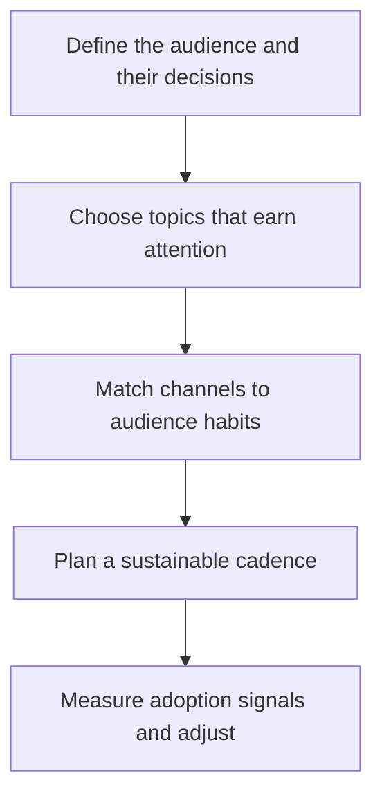

# Content Strategy for Advocacy

> **Core skill:** The advocate plans content as a portfolio rather than a stream of one-offs — mapping each piece to an audience, an adoption stage, and a measurable signal, and building a cadence the team can sustain without heroics.

## Why This Matters

Any single piece of content is a lottery ticket; a strategy is a portfolio. Advocates who publish opportunistically produce spikes — a hit post now and then, surrounded by silence — while the compounding asset in developer relations is a body of work that keeps answering the next user's question months after it was written. Strategy is what turns publishing from an act of hope into an operation with a target: a defined audience, a defined adoption gap, and a defined signal that says whether the content is working.

Advocacy content is also not neutral commentary — it serves adoption, which has stages. Someone who has never heard of the technology needs a different artifact than someone evaluating it against a competitor, which is different again from someone trying to get their first deployment through review, and different one more time from someone deciding whether to expand the rollout. Most advocacy content portfolios collapse into a single stage — usually awareness, because it is the most fun to write — and then wonder why committed evaluation and migration questions go unanswered.

The professional distinction is measurement discipline. Vanity metrics — page views, likes, applause — measure attention, which is an input, not the output. The output is adoption behavior: repositories cloned, quickstarts completed, versions upgraded, support questions that no longer need asking. The advocate who defines the signal before publishing writes differently, because the piece has a job and will be judged on whether it did that job.

## The Adoption Stages and What Content Serves Them

| Stage | Audience Question | Content That Serves It | Working Signal |
|-------|-------------------|------------------------|----------------|
| Awareness | What is this, and is it for me | Talks, posts, comparisons, community presence | Qualified traffic, mentions, trial starts |
| Evaluation | Does it actually solve my problem | Deep dives, benchmarks, case studies, demos | Quickstart completions, time to first call |
| Adoption | How do I build with it safely | Tutorials, examples, reference, migration guides | First deployments, docs-to-production paths |
| Retention | How do I operate and extend it | Troubleshooting, upgrade guides, best practices | Upgrade rates, support deflection |
| Expansion | How do I standardize across teams | Reference architectures, training, certifications | Team-wide rollouts, internal champions |

A healthy portfolio closes the whole loop; an advocacy program that only feeds the top of the funnel starves the middle where adoption actually happens.

## Channel Properties

| Channel | Reach | Depth | Control | Cost to Sustain | Strongest For |
|---------|-------|-------|---------|-----------------|---------------|
| Owned docs and blog | Medium | High | Full | High but compounding | Evaluation and adoption content |
| Conference talks | Medium | Medium | Low | High | Awareness; credibility by association |
| Video and streams | Medium to high | Medium | Partial | High | Onboarding; demonstration at scale |
| Community forums and chat | Low per thread | Medium | Low | Continuous | Retention; earning trust where questions live |
| Social and aggregators | High | Low | None | Continuous | Distribution of owned content |
| Newsletters | Low | High | Full | Medium | Retention with committed users |
| Podcasts and interviews | Medium | Medium | Low | Medium | Relationship-led awareness |

Channels are rented; owned properties and a portable audience are the assets. Strategy allocates effort in that order of priority, using rented channels primarily to route people to the owned ones.

## The Editorial Operating Rhythm

| Element | Principle | Practice |
|---------|-----------|----------|
| Theme map | Content anchors to product and adoption milestones | Quarterly themes drawn from roadmap and support data |
| Evergreen base | Half the effort goes to content that stays true | Guides and comparisons reviewed on a schedule |
| Launch bursts | Momentary spikes ride on the evergreen base | Launch material links back to permanent guides |
| Repurposing chain | One research effort feeds many artifacts | Talk to post to video to docs excerpt |
| Cadence over heroics | A sustainable rhythm beats sporadic excellence | A publishing cadence the team keeps on its worst week |
| Signal-first briefs | Every piece is born with its working signal defined | No brief approved without a success measure |

## The Advocacy Content Loop



The loop returns each cycle to the audience question, because adoption stages and audiences shift as the product grows. A strategy that never re-reads its own signals is a schedule, not a strategy.

## Practical Applications

### Content Strategy Checklist

- [ ] The portfolio names which adoption stages it serves and which it deliberately ignores this cycle
- [ ] Every planned piece has an audience, a job, and a defined signal before writing begins
- [ ] Evergreen content is scheduled for review at least twice a year
- [ ] Each large research effort has a repurposing chain into at least two other formats
- [ ] Attention metrics are tracked but not used as the primary success signal
- [ ] The cadence fits the team's worst week, not its best

### Editorial Calendar Template

```markdown
## Editorial Calendar — <quarter>

| Piece | Audience | Stage | Channel | Signal | Owner | Status |
|-------|----------|-------|---------|--------|-------|--------|
| <title> | <group> | <funnel stage> | <channel> | <measure> | <name> | <draft or live> |
```

## Common Pitfalls

| Pitfall | Why It Is a Problem | Better Approach |
|---------|---------------------|-----------------|
| **Vanity metrics leadership** | Views and likes rise while adoption does not; the program loses funding anyway | Define working signals per piece and report them first |
| **Awareness-only portfolio** | Evaluation and migration questions stay unanswered; deals stall at the middle of the funnel | Balance the portfolio across all adoption stages |
| **Launch-day content only** | Spikes decay; nothing compounds | Invest the base cadence in evergreen guides |
| **Channel spray** | Effort spread across every platform is strong on none | Concentrate on channels where the audience already lives |
| **Cadence heroics** | A rhythm that needs a heroic week breaks in the next release crunch | Design to the sustainable minimum and scale up opportunistically |
| **No repurposing** | Expensive research becomes one article and dies | Feed talk, video, and docs excerpts from the same effort |

## Success Indicators

- Adoption-stage metrics — trial starts, quickstart completions, upgrades — move after content cycles
- Evergreen pieces keep attracting and converting long after launch windows close
- The community cites and extends the content without prompt
- Support questions on documented topics decline over time
- The editorial calendar survives release crunches without going silent

## Related Topics

- [[02_Writing_for_Developers]]
- [[06_Multimedia_and_Video_Content]]
- [[07_Product_Feedback_and_Ecosystem_Strategy/00_overview|Product Feedback and Ecosystem Strategy]]
- [[06_Community_and_Ecosystem/00_overview|Community and Ecosystem]]

## Summary

Content strategy converts scattered publishing into a portfolio: map every piece to an audience and an adoption stage, allocate effort across channels where attention is rented and properties where it is owned, and define the working signal before writing a word. The advocate who plans this way stops hoping for hits and starts compounding — because the durable win state is a body of content that keeps answering questions, keeps shortening onboarding, and keeps the whole funnel from starving.
