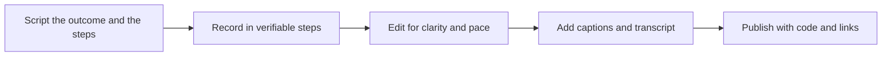

# Multimedia and Video Content

> **Core skill:** The advocate turns screen, voice, and code into video that teaches — screencasts, tutorials, and live coding where every step is shown, nothing is skipped, and the recording keeps working as onboarding material long after the stream ends.

## Why This Matters

Video is the highest-bandwidth teaching medium available to the advocate: a screencast transmits the environment, the tools, the errors, and the fix in one channel, and it scales — the same fifteen minutes answer the same question for thousands of developers. It is also the most expensive medium to produce badly. An unedited hour of wandering, poor audio, and skipped steps teaches the audience that the technology is as confusing as the video; a crisp five-minute walkthrough does more onboarding than a support rotation.

The medium has its own grammar, and it is different from writing and presenting. Text lets the reader skim, jump, and search; video demands linear attention at playback speed. That makes preparation the whole game: the outcome must be stated in the first thirty seconds, the steps must be the shortest real path, and the recording must survive being watched at two times speed by an expert and at half speed by a beginner. The advocate who understands this engineers the recording the same way they engineer a demo — pinned state, small steps, rehearsed failure path.

Two forces make video an especially high-leverage investment. The first is discoverability: video platforms are search engines where developers type the exact error or task they are struggling with, and the transcript is the index. The second is durability: conference recordings, streams, and tutorials become the reference that the docs link to and that new users find months and years later. The professional standard is to produce them as assets — captioned, transcribed, versioned — not as events.

## Video Formats and Their Jobs

| Format | Job | Production Weight | Shelf Life |
|--------|-----|-------------------|-----------|
| Screencast | Show one task completed on screen | Low to medium | Long with version notes |
| Explainer | Make an unfamiliar concept click in minutes | Medium, often with graphics | Medium to long |
| Tutorial series | Onboard from zero to a working result | High, scripted and tested | Long, needs maintenance |
| Conference recording | Preserve and redistribute a talk | Low after the event | Long; cited for years |
| Live stream and live coding | Build authenticity; answer in real time | Medium; recovery skills required | Medium; replay and clips extend it |
| Short clip | Distribute one moment to social channels | Low from existing footage | Short but high reach |

The portfolio principle applies: one researched topic can yield a screencast, a clip, and a docs embed. Plan the chain before recording, so the recording session captures everything the chain needs.

## Production Levels

| Level | Characteristics | Worth It When |
|-------|-----------------|---------------|
| Raw capture | Screen and voice, minimal editing, honest and fast | Internal enablement, quick answers, stream replays |
| Lightly edited | Cuts, zooms on the action, callouts, chapters | Public tutorials and onboarding content |
| Produced | Scripted, graphics, music, branded segments | Flagship explainers and launch material |
| Live with production | Multiple inputs, moderator, live captions | Major streams and community events |

Production value should scale with the audience and shelf life of the piece — not with the producer's ambition. Signals must survive the format: for most developer education, clear audio and visible steps beat cinematic polish every time.

## Recording Discipline

| Rule | Why It Matters in Practice |
|------|----------------------------|
| State the outcome in the first thirty seconds | The viewer decides to stay before the intro ends |
| One task per video | Mixed goals double the length and halve the completion rate |
| Record the steps you tested | Post-record drift is the most common quality collapse |
| Show the terminal and the editor | The audience reproduces keystrokes, not descriptions |
| Fix audio before picture | Poor sound loses viewers faster than poor image |
| Caption and transcribe | Accessibility, search, and non-native speakers all depend on text |
| Chapter markers | Experts jump; beginners are not lost |
| Pin versions on screen | Undated recordings become confidently wrong |
| Prioritize the failure recovery | A shown fix teaches more than a flawless run |

## The Video Production Flow



The flow is front-loaded on purpose: scripting is cheap and re-recording is not. The published artifact should link to the repository, the docs page it serves, and the exact versions it used — the video is the demonstration, not the source of truth.

## Practical Applications

### Video Pre-Flight Checklist

- [ ] The outcome is stated in the first thirty seconds and matched by the video's title
- [ ] The steps were executed end to end less than a day before recording
- [ ] Audio is tested with the same microphone, room, and levels as the final take
- [ ] The environment is pinned — versions visible, dependencies vendored, network dependencies removed
- [ ] Captions and a transcript are produced, and chapters mark the major steps
- [ ] The description links to code, docs, and a version note with the recording date

### Video Brief Template

```markdown
## Video Brief — <title>

| Field | Value |
|-------|-------|
| Outcome | <what the viewer can do after watching> |
| Audience | <level and context> |
| Length target | <minutes> |
| Steps | <numbered list, tested> |
| Failure segment | <what will be shown failing and fixed> |
| Links | <repo, docs, versions> |
```

## Common Pitfalls

| Pitfall | Why It Is a Problem | Better Approach |
|---------|---------------------|-----------------|
| **Unedited wandering** | Length hides the lesson; viewers drop before the payoff | Cut to the tested path; keep every second earning attention |
| **Skipped steps** | The viewer cannot reproduce the result and blames the tool | Record the whole loop — setup, run, output |
| **Bad audio** | Sound problems lose viewers faster than any visual issue | Prioritize microphone and room treatment over camera quality |
| **No captions or transcript** | Excludes deaf and non-native audiences and loses search traffic | Caption everything; publish the transcript |
| **Stale versions on screen** | The recording teaches an interface that no longer exists | Show versions and recording dates; link to current docs |
| **Live with no recovery plan** | Streams fail live; the audience watches the failure compound | Rehearse the failure path; keep a prepared clip to fall back on |

## Success Indicators

- Viewers complete the tutorial and arrive at support with advanced questions, not setup questions
- Videos are embedded in docs, onboarding, and answers — reused far beyond their original audience
- Transcripts surface the video in searches for the exact errors they solve
- Recorded sessions are cited at conferences and in community threads months later
- Recording cadence holds up without compromising written content or shipping work

## Related Topics

- [[04_Presenting_and_Public_Speaking]]
- [[05_Content_Strategy_for_Advocacy]]
- [[02_Writing_for_Developers]]
- [[03_Facilitation_and_Enablement/00_overview|Facilitation and Enablement]]

## Summary

Multimedia and video turn the advocate's demonstrations into durable teaching assets: script the outcome, record only tested steps, prioritize audio and captions, and publish with code, versions, and links so the recording keeps onboarding developers at scale. The medium rewards preparation and punishes improvisation — which is why the professional treats a recording session like a release, not a performance.
