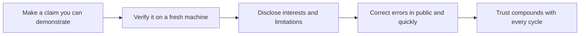

# Communication Ethics and Accuracy

> **Core skill:** The advocate tells the truth under commercial pressure — demonstrable claims, disclosed interests and limits, public corrections — treating accuracy as the profession's core asset rather than a constraint to manage.

## Why This Matters

Every piece of advocate communication is a loan against trust, and trust is the only currency that makes the role work. A developer who finds one exaggerated benchmark learns to discount everything the advocate says; a customer who discovers a hidden limitation stops forwarding the material; a community that smells undisclosed sponsorship re-reads the whole relationship. The damage is asymmetric: credibility takes years of demonstrable claims to build and one conveniently omitted caveat to spend. Nothing in the role is more expensive than the shortcut that saves an afternoon.

Advocates sit on the fault line between the organization and the people it serves — employed by the company, accountable to the technical community's standard of truth. That tension is structural, not occasional: release schedules slip, launches need hero copy, competitors deserve comparison, and the honest answer is never the convenient one. The professional resolution is not to choose one loyalty over the other but to recognize that long-term commercial interest and technical honesty are the same interest — the organization's adoption depends on its claims being true when users test them.

Accuracy is also procedural, not aspirational. Claims that can be demonstrated, limits stated before they are discovered, interests disclosed where they could shape perception, errors corrected in public and quickly — these are practices, checkable in a review, not virtues to be invoked after a scandal. The advocate who runs those practices builds a reputation that survives the pressure, and a correction history that proves the standard is real.

## Ethical Commitments

| Commitment | What It Means in Practice | Cost When Broken |
|------------|---------------------------|------------------|
| Demonstrable claims | Every performance and capability statement has a reproduction path | The community tests it; the failure is permanent and public |
| Stated limits | What the technology does not do ships with what it does | Users discover limits in production; trust ends there |
| Disclosed interests | Employment, sponsorship, and material relationships are visible | Discovery of a hidden interest re-frames all prior content |
| No rigged comparisons | Benchmarks and contrasts use fair, current, reproducible setups | Comparison tables become a joke the community shares |
| Correction duty | Errors are fixed publicly, visibly, and promptly | Silent edits told the audience that being right was optional |
| No roadmap promises | Direction is described as direction, never as commitment | Customers build plans on promises; the miss is remembered |

## Pressure Situations and the Professional Move

| Situation | Tempting Shortcut | Professional Move |
|-----------|-------------------|-------------------|
| Launch deadline slips | Describe future capability as current | State what ships today; put the rest on the roadmap honestly |
| Competitor comparison looks bad | Cherry-pick the workload that favors you | Publish the fair comparison and name where you lose |
| Benchmark result is embarrassing | Omit the number and tell the story instead | Publish it with context; shortcomings are credibility assets |
| Feature demoed does not fully work | Show the happy path only | Demonstrate the real behavior; name the gaps explicitly |
| Mistake found after publishing | Edit silently and hope nobody cached it | Post a visible correction with the corrected claim |
| Sponsored or paid content | Blend it into the editorial voice | Label it clearly; sponsorship never buys conclusions |
| Executive wants certainty on direction | Echo the promise back as fact | Communicate confidence levels; keep commitments and direction separate |
| Embargo or competitive pressure | Withhold a known defect from users | Never sign a silence that would harm users; negotiate the disclosure |

## Corrections and Their Protocol

| Error Class | Response | Timing |
|-------------|----------|--------|
| Factual slip in prose | Visible correction note on the artifact | Same day |
| Wrong technical claim | Correction plus the corrected reproduction | As soon as verified |
| Misleading benchmark | Re-run, republish, or retract with explanation | Within days, before third parties do it |
| Broken example code | Fix and note the change; reply to everyone who reported it | Immediate |
| Unintentional undisclosed interest | Disclose and re-frame the affected content | Immediate |
| Overstated roadmap language | Restate plainly; thank whoever noticed | At the next communication touch |

Corrections are not confessions; they are the visible machinery of an accuracy standard. The audience should see that the standard is enforced — silently corrected content teaches onlookers that claims are not load-bearing.

## The Trust Compounding Cycle



The cycle is a flywheel: each demonstrated claim lowers the burden of proof for the next one, which is precisely why a single breached claim is so costly — it resets a flywheel that took years to spin up.

## Practical Applications

### Accuracy Review Checklist

- [ ] Every claim in the artifact has a demonstration, measurement, or source attached
- [ ] Limits and prerequisites appear in the artifact before deployment, not after
- [ ] Comparisons against alternatives are fair, dated, and reproducible
- [ ] Material relationships and sponsorships are disclosed where they could shape perception
- [ ] A corrections channel exists and has been used at least once, visibly
- [ ] Nothing in the artifact promises a roadmap item as though it were shipping

### Claims Ledger Template

```markdown
## Claims Ledger — <artifact>

| Claim | Evidence | Verified On | Limits | Correction Path |
|-------|----------|-------------|--------|-----------------|
| <statement> | <benchmark or repro> | <date, machine> | <caveat> | <where fixes land> |
```

## Common Pitfalls

| Pitfall | Why It Is a Problem | Better Approach |
|---------|---------------------|-----------------|
| **Cherry-picked benchmarks** | The community re-runs them; the result is public humiliation | Publish fair, dated, reproducible numbers including losses |
| **Silent edits** | Hidden fixes teach the audience that being right was optional | Correct visibly with a note and a date |
| **Roadmap as commitment** | Customers plan on promises; the miss becomes the story | Separate direction from commitment in every telling |
| **Undisclosed interests** | Discovery re-frames all past and future content as suspect | Disclose employment, sponsorship, and gifts where relevant |
| **Success-only demos** | Omitted limits surface in the user's production, not the demo | Show real behavior and name the gaps in the same session |
| **Legal-first silence** | Users keep making the mistake while review cycles run | Disclose what is safe to disclose now; escalate the rest without delay |

## Success Indicators

- Claims are accepted without verification because the track record justifies it
- Corrections are rare, but handled fast and visibly when they happen
- The community defends the advocate's material when exaggerated third-party claims appear
- Engineers and product leaders route risky communications through the accuracy baseline
- Users report limits that were stated up front rather than limits that were hidden

## Related Topics

- [[02_Writing_for_Developers]]
- [[05_Content_Strategy_for_Advocacy]]
- [[04_Customer_and_Developer_Understanding/00_overview|Customer and Developer Understanding]]
- [[career-path/03_Staff_Engineer/04_Influence_and_Alignment/01_Writing_Proposals_That_Get_Adopted|Writing Proposals That Get Adopted (Staff)]]

## Summary

Communication ethics and accuracy are the advocate's operating standard: demonstrates every claim, states limits before they are found, discloses interests where they could shape perception, and corrects errors publicly and fast. The discipline is procedural — checkable in a review, exercised under real commercial pressure — and it compounds in the only direction that matters, because the audience that has tested the claims and found them true is the audience that will act on the next one without hesitation.
