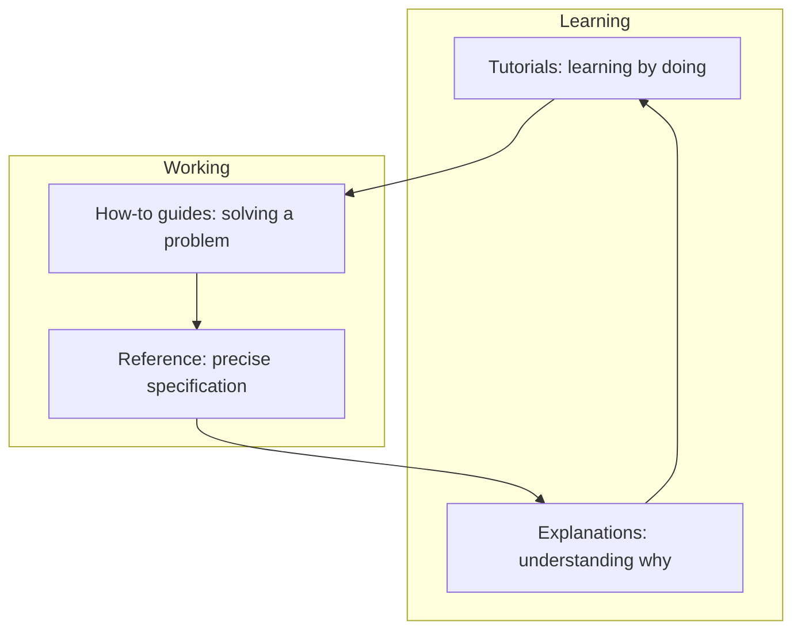

# Documentation and Learning Materials

> **Core capability:** The advocate creates documentation that works — guides, tutorials, examples, references, and troubleshooting paths that let developers and customers succeed without human intervention.

## Why This Matters

Documentation is the product's first user experience and its most scalable advocate. A developer's first hour with a framework is spent in the docs; if those docs fail, no conference talk or blog post repairs the impression. The best developer advocates treat documentation as engineering: tested, versioned, reviewed, and maintained — not an afterthought written by whoever lost the argument.

The discipline spans the canon: tutorials that teach, how-to guides that solve, references that document, and explanations that illuminate. The advocate's contribution is making them work together — coherent information architecture, examples that run, and troubleshooting that answers the questions support tickets actually contain.

## Topics in This Capability Area

| Topic | Core Skill | When It Matters |
|-------|------------|-----------------|
| [[01_Documentation_as_a_Product]] | Treating docs with product rigor: users, quality, roadmap | Establishing docs practice |
| [[02_Guides_and_Tutorials]] | Writing task-oriented learning content that works | Onboarding; adoption |
| [[03_Reference_and_API_Documentation]] | Documenting interfaces, options, and behavior precisely | Every API, SDK, and platform |
| [[04_Examples_and_Reference_Implementations]] | Building examples that run and patterns that inspire | Developer onboarding; proof |
| [[05_Information_Architecture_and_Search]] | Structuring content so people find what they need | Docs site design; scale |
| [[06_Troubleshooting_and_Migration_Guides]] | Answering the questions users actually have | Support load; version upgrades |
| [[07_Documentation_Quality_and_Maintenance]] | Keeping docs accurate, current, and reviewed | Always; docs rot without care |

## The Documentation Quadrant

Four content types, four jobs — mixing them into one document serves nobody.

## Practical Applications

### Documentation Checklist

- [ ] Content types (tutorial, how-to, reference, explanation) are clearly separated
- [ ] Every tutorial has been executed exactly as written by someone new
- [ ] Examples are maintained and run in CI where possible
- [ ] Troubleshooting covers the top support questions
- [ ] Information architecture matches how users search and navigate

## Common Pitfalls

| Pitfall | Why It Is a Problem | Better Approach |
|---------|---------------------|-----------------|
| **Docs as dumping ground** | Everything in one giant page; nobody finds anything | Separate content types; structure by user task |
| **Thankfully-untested tutorials** | Steps that fail on a fresh machine destroy trust | Test docs like code; automate where possible |
| **Write-once documentation** | Becomes wrong silently after the next release | Docs reviewed with each release; show versions |
| **Missing troubleshooting** | Users hit walls and leave; support absorbs the load | Start from actual support questions |

## Success Indicators

- Support load for documented topics declines
- New developers complete onboarding without asking questions
- Docs are contributed to by engineers, not only maintained by advocates
- Search analytics show users finding answers on first attempt

## Related Capabilities

- [[01_Technical_Communication/00_overview|Technical Communication]]: the broader communication craft
- [[03_Facilitation_and_Enablement/00_overview|Facilitation and Enablement]]: live learning complements written docs
- [[career-path/02_Senior_Software_Engineer/06_Communication_and_Influence/05_Documentation_Strategy|Documentation Strategy (Senior)]]: the engineering-side documentation discipline
- [[career-path/07_SRE_and_Platform_Engineer/06_Developer_Platform/00_overview|Developer Platform (SRE)]]: internal developer experience documentation

## Summary

Documentation is the advocate's most scalable artifact: tutorials that teach, guides that solve, references that specify, and troubleshooting that rescues — all tested, structured, and maintained with product discipline. When docs work, users succeed alone, support shrinks, and adoption accelerates without a single human conversation.