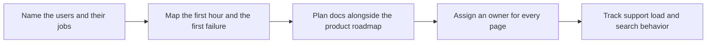

# Documentation as a Product

> **Core skill:** The advocate runs documentation like a product — named users, a quality bar, a roadmap tied to releases, owners for every page, and feedback signals — instead of treating docs as an artifact produced once and left to age.

## Why This Matters

For most developers, the documentation is the product's first and sometimes only experience. Before the first support ticket, the first sale, or the first community answer, there is a person in a docs site trying to get something done. When that visit succeeds, the product gains a user at zero marginal cost; when it fails, the visitor leaves without ever telling anyone why. Treating documentation as a product is simply accepting that this experience has users, quality requirements, and a cost of failure — and running it with the same discipline as any other surface of the system.

The alternative is the documentation graveyard: a pile of pages with no owners, no review cycle, and no idea who they serve. In that state, docs decay silently — screenshots age, examples rot, the quickstart fails on a fresh machine — and each rot point teaches arriving users that nothing here is trustworthy. Docs debt accrues like technical debt, with the difference that its interest is paid by every user in confusion rather than by a few engineers in patches. The advocate's job is to make the debt visible and then retire it in the order the users hurt most.

Running docs as a product also reframes who writes them. In healthy organizations, engineers contribute — the docs are part of the definition of done for a feature — while the advocate owns the system: structure, quality bar, review process, and the feedback loops that keep the content honest. That split is the difference between documentation that ships with the release and documentation that is written by whoever loses the argument about hiring a writer.

## The Documentation Product Model

| Dimension | Question It Answers | Practice |
|-----------|---------------------|----------|
| Users | Who arrives, with what job, at what skill level | Personas tied to journeys, validated against search and tickets |
| Journey | What happens in the first hour, and at the first failure | A mapped path from landing to first success, tested end to end |
| Quality bar | What must be true of every page | Review checklist: correct, tested, findable, scoped, minimal |
| Roadmap | What will be written, improved, retired, and when | Docs items planned alongside product milestones |
| Ownership | Who answers for each page staying true | Explicit owners; orphan pages are treated as defects |
| Feedback | How truth reaches the writers | Support tickets, search queries, page ratings, GitHub issues |
| Metrics | What success looks like beyond page views | Task success, search success, support deflection, onboarding completion |

## The Documentation Lifecycle

| Stage | Activity | Output |
|-------|----------|--------|
| Demand | Mine support, search, and roadmap for what users cannot do | A prioritized documentation backlog |
| Draft | Write to the brief: audience, task, outcome | Review-ready page with structure and examples |
| Review | Technical accuracy plus editorial clarity | Comments resolved; claims and versions verified |
| Test | Execute everything on a clean environment | A page proven to work as written |
| Publish | Place in the information architecture with metadata | Findable, versioned, linked content |
| Maintain | Review on release triggers, not on inspiration | Freshness notes and updated versions |
| Retire | Remove or redirect what no longer applies | A smaller, truer docs set |

Retirement is the stage most teams skip and the one that most improves trust: a docs set that cannot shrink cannot stay true.

## Roles and Contributions

| Role | Contribution | Accountability |
|------|--------------|----------------|
| Advocate | Structure, quality bar, review, feedback loops, backlog | The documentation system as a whole |
| Engineer | Technical draft, version truth, review of claims | Their feature's pages staying accurate with releases |
| Technical writer | Editorial depth, consistency, information architecture | Long-form and reference quality where staffed |
| Product | Priority, roadmap alignment, launch requirements | Docs presence in release criteria |
| Support | Signal from real failures; corrections | Routing recurring questions into the backlog |
| Community | Corrections, extensions, translations | Keeping the surrounding content healthy |

## The Docs Product Loop



The loop closes through measurement: support load and search behavior are the product's telemetry, and they re-prioritize the backlog each cycle. A docs practice without this loop is writing, not product work.

## Practical Applications

### Docs Product Checklist

- [ ] The primary journeys are documented and each was walked end to end by a new user recently
- [ ] Every page has an owner, or a retirement date
- [ ] Documentation tasks appear in release planning, not after it
- [ ] A review checklist exists and is applied to every new or changed page
- [ ] Support questions and failed searches are reviewed on a schedule and mapped to backlog items
- [ ] Success is measured by task completion and deflection, not only by traffic

### Docs Backlog Entry Template

```markdown
## Docs Backlog Entry

| Field | Value |
|-------|-------|
| User problem | <what a user cannot do today> |
| Evidence | <ticket count, failed search term, journey test> |
| Owner | <name> |
| Page or area | <location> |
| Definition of done | <tested page, journey walked, links updated> |
| Release tie | <milestone or date> |
```

## Common Pitfalls

| Pitfall | Why It Is a Problem | Better Approach |
|---------|---------------------|-----------------|
| **Docs after the release** | Written under deadline pressure, from memory, never tested | Documentation in the definition of done; draft with the feature |
| **Orphan pages** | No one notices when they rot; users find the rot first | Assign an owner or a retirement date to every page |
| **Writer of last resort** | Docs written by whoever is least able to refuse produce the least truth | Owner model with engineers accountable for feature pages |
| **No feedback loop** | The same complaints recur without changing the backlog | Schedule mining of tickets, searches, and ratings |
| **Traffic as success** | Page views rise while users still cannot finish tasks | Measure task success, search success, and deflection |
| **Unable to retire** | Every wrong page stays to mislead future readers | Treat retirement as a first-class docs activity |

## Success Indicators

- New developers complete the main journeys without asking a human
- Support volume on documented topics declines release over release
- Engineers bring docs changes with feature PRs as a norm
- Search and journey tests show users reaching answers on the first attempt
- The docs set stays roughly the same size while getting more true — writing and retiring balance

## Related Topics

- [[02_Guides_and_Tutorials]]
- [[07_Documentation_Quality_and_Maintenance]]
- [[career-path/02_Senior_Software_Engineer/06_Communication_and_Influence/05_Documentation_Strategy|Documentation Strategy (Senior)]]
- [[career-path/07_SRE_and_Platform_Engineer/06_Developer_Platform/00_overview|Developer Platform (SRE)]]

## Summary

Documentation as a product means giving docs what every product has: named users and journeys, a quality bar, a roadmap tied to releases, owners for every page, and feedback loops that convert support pain into backlog entries. The advocate who runs docs this way turns the most scalable surface of the organization — the pages that answer questions at three in the morning — into an asset that compounds, while a graveyard of orphan pages only compounds its cost.
