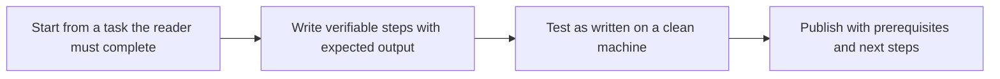

# Guides and Tutorials

> **Core skill:** The advocate writes task-first learning content — tutorials that walk a newcomer to a working result and guides that solve a specific problem — with every step tested as written and every waiting error answered.

## Why This Matters

The tutorial is where a technology either becomes usable or becomes abandoned. A developer's first thirty minutes with a new tool are spent inside a guide, and the guide's job is not to explain the tool but to make the reader succeed with it. That distinction changes everything: the tutorial that opens with architecture loses the reader before the first command, while the one that gets to a working result in five minutes converts curiosity into capability. Tutorials and guides are the product's onboarding classroom, and unlike a conference talk, they run unattended at three in the morning for every new user.

The craft lives in details that writers systematically underestimate. Steps must be verifiable — each one ending in an observable result the reader can compare against — because an unverifiable step is where readers quietly give up. Prerequisites must be complete, because a missing version or permission surfaces as an opaque error that the reader interprets as broken software. Choices must be removed rather than offered: the tutorial decides, the reader executes, and decisions are deferred to content whose explicit job is comparison. These are engineering constraints, not style preferences.

The professional distinction is testing. Anyone can write instructions; a guide is proven when someone follows it exactly on a clean machine and arrives, without improvisation, at the promised result. Testing is what converts a guide from a plausible document into a dependable one, and it is also what keeps the guide alive — every failure found in testing is a support ticket the team never receives. The advocate treats the test pass as part of writing, not as an optional review.

## Guide Types and Their Contracts

| Type | Reader State | The Guide's Promise | Success Test |
|------|--------------|---------------------|--------------|
| Quickstart | Curious, evaluating, impatient | A working result with minimal ceremony | Reader sees it work in minutes and wants more |
| Tutorial | Committed to learning by doing | Guided competence on a real task | Reader completes it and can retrace the steps alone |
| How-to guide | Has a specific problem to solve | A proven path to the solution | Reader solves the problem without detours |
| Recipe | Knows the tool, needs a pattern | A compact, runnable answer | Reader adapts it to their case immediately |
| Codelab | Wants structured practice | Skills built through a sequence of exercises | Reader finishes with demonstrable new capability |
| In-repo example README | Landed from search or a link | The example runs and explains itself | Reader runs it and understands each file's role |

Mixing the contracts is the most common structural failure: a quickstart that teaches theory, a how-to that re-explains fundamentals, a tutorial that leaves exercise design to the reader.

## The Anatomy of a Tutorial

| Part | Job | Rule |
|------|-----|------|
| Title and opening | Promise the concrete outcome | State what the reader will have built when done |
| Prerequisites | Eliminate every hidden unknown | Exact versions, accounts, permissions, and time estimate |
| Steps | Move one verifiable action at a time | One action, one expected result, no choices |
| Checkpoints | Let readers confirm they are on track | Expected output shown where confusion peaks |
| Recovery notes | Convert errors into progress | Name the common failure and its fix near the step it strikes |
| Cleanup | Leave no surprise costs or state | Remove resources the guide created |
| Next steps | Continue the journey | Link deeper guides, references, and related examples |

A tutorial that omits any of these parts is not shorter — it is a support ticket that has not been filed yet.

## Writing Steps That Work

| Rule | Why It Survives Contact with a Fresh Machine |
|------|----------------------------------------------|
| One action per step | Readers who are told three things do the first and panic about the other two |
| Show the expected result | The reader needs a comparison point to know the step worked |
| Complete, copy-pasteable commands | Partial commands force reconstruction and invent errors |
| Pin versions explicitly | Floating versions make the guide true only by luck |
| Decide, do not offer | Choices inside a tutorial stop the reader to evaluate |
| Say what success looks like | Silence after a command reads as failure |
| Keep prose out of steps | Narrative between steps breaks the action chain |
| Update on release triggers | Drift is the default state of any untested instruction |

## The Tutorial Writing Loop



The loop iterates on test findings, not authorial intuition. Every guide should carry an internal note of when and where it was last proven end to end — the freshest evidence the page can offer.

## Practical Applications

### Tutorial Review Checklist

- [ ] The title and opening promise a concrete, checkable outcome
- [ ] Prerequisites list exact versions, permissions, and the expected starting state
- [ ] Every step was executed on a clean machine in the last release cycle
- [ ] Steps show expected output at the checkpoints where readers most often stall
- [ ] Failure recovery notes appear next to the steps that most commonly fail
- [ ] Next steps link onward to the guides, references, and examples the reader now needs

### Tutorial Skeleton Template

```markdown
## Tutorial Skeleton

| Section | Content | Verified On |
|---------|---------|-------------|
| Outcome | <what the reader will have working> | n/a |
| Prerequisites | <versions, access, time> | <date> |
| Step | <single action plus expected output> | <date> |
| Checkpoint | <what success looks like> | <date> |
| Recovery | <common failure and fix> | <date> |
| Next | <links> | n/a |
```

## Common Pitfalls

| Pitfall | Why It Is a Problem | Better Approach |
|---------|---------------------|-----------------|
| **Untested steps** | The first failing step ends the reader's journey silently | Test on a clean machine every release cycle |
| **Hidden prerequisites** | Missing versions or permissions surface as unexplained errors | Enumerate everything the guide assumes, with exact strings |
| **Choice overload** | Each offered option stops the reader to evaluate instead of act | Decide for them in tutorials; defer choice to comparison content |
| **Prose detours** | Explaining inside the action chain breaks the reader's stride | Keep steps mechanical; move reasoning to explanation content |
| **No expected output** | Readers cannot tell success from failure | Show the output or state precisely what appears |
| **Screenshots as steps** | Screenshots age fastest and cannot be copied | Text steps with selective imagery; version the visuals |

## Success Indicators

- New developers reach a first working result without asking a human
- Support questions evolve from setup problems to advanced usage
- Guides are cited by users as the reason a trial converted
- The team receives few corrections because the review loop removed the common failures
- Tutorials survive releases with small, scheduled updates rather than rewrites

## Related Topics

- [[01_Documentation_as_a_Product]]
- [[04_Examples_and_Reference_Implementations]]
- [[05_Information_Architecture_and_Search]]
- [[03_Facilitation_and_Enablement/00_overview|Facilitation and Enablement]]

## Summary

Guides and tutorials are the product's unattended classroom: task-first writing, a complete anatomy from prerequisites to next steps, steps that each end in an observable result, and a test pass on a clean machine before anyone else reads the page. The advocate who builds this discipline converts the hardest moment of adoption — the first thirty minutes — from a gamble into a designed experience that scales to every future user.
