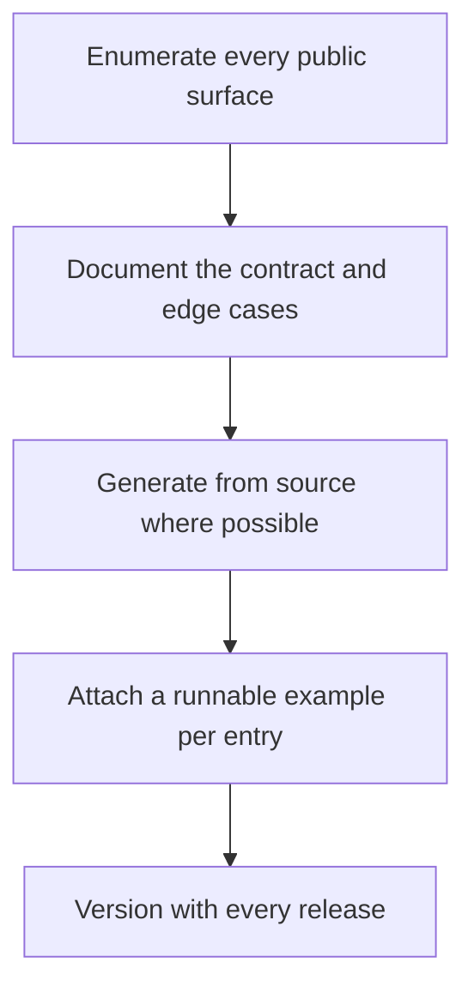

# Reference and API Documentation

> **Core skill:** The advocate documents the exact contract — every parameter, default, error, limit, and version — in a form that stays true to the code, because reference is where developers answer their own questions at scale.

## Why This Matters

Reference documentation is the contract between a system and everyone who calls it. Tutorials teach, guides solve, but reference answers the question a developer asks forty times a week: what exactly does this do, what can it accept, and what happens when I get it wrong. That audience arrives mid-task, scanning for one fact; it does not read, it looks up. The reference's value is measured in seconds saved per lookup and errors prevented per parameter — precision is not polish here, it is the entire product.

The failure mode of reference is drift. Documentation written from memory diverges from the code within one release; defaults change, errors are renamed, limits move, and every stale fact misleads a developer who trusted it. The professional response is structural: derive reference from the code wherever possible, keep handwritten prose tied to the same review cycle as the interface it describes, and treat an undocumented public surface as a defect in the interface itself. A public function without documentation is an unkept promise with a signature.

Reference also carries responsibilities the teaching content can ignore: completeness beyond the happy path — every error code, every quota, the behavior under retries — and stability communicated over time. Deprecations must arrive early and with a path; versions must be switchable; archived behavior must say which version it belonged to. Developers build on contracts they believe to be stable, and the reference is what tells them, precisely and currently, what that contract is.

## Elements of Complete Reference

| Element | Must Answer | Failure Mode When Missing |
|---------|-------------|---------------------------|
| Signature and parameters | Exact names, order, requiredness | Readers guess and call incorrectly |
| Types and formats | Accepted values, encodings, units | Silent coercion bugs in user code |
| Defaults | What happens when the field is omitted | Surprise behavior in production |
| Return values | Shape, guarantees, timing | Parsing errors and defensive code everywhere |
| Errors | Every code, condition, and remedy | Opaque failures attributed to the platform |
| Limits and quotas | Rate limits, sizes, timeouts | Production incidents at the documented edge |
| Side effects | State changed, events emitted, calls billed | Costs and couplings discovered by accident |
| Idempotency and retries | What is safe to repeat | Duplicate operations in retry storms |
| Per-entry example | One runnable call with output | Reference unusable without a parallel guide |
| Version and status | Stability level and deprecation state | Bets placed on surfaces about to change |

## Authoring Approaches

| Approach | Strengths | Weaknesses | Best For |
|----------|-----------|------------|----------|
| Annotated source | Cannot drift; lives with the code | Prose quality suffers; metadata must be enforced | Signatures, parameters, types |
| Handwritten reference | Richer explanation and examples | Drifts fastest; effort scales linearly | Concepts, nuances, error nuances |
| Hybrid with review tie | Precision where it is derivable, prose where it is not | Requires process discipline | Mature platforms |
| Contract-first specification | Machine-checkable, enables tooling and tests | Spec must be maintained as a first-class artifact | Public APIs with multiple consumers |

The professional pattern is a hybrid with a bias: derive everything mechanical, handwrite everything judgmental, and bind both to the same release review so neither drifts alone.

## Versioning and Deprecation

| Practice | Rule | Reader Experience |
|----------|------|-------------------|
| Versioned reference | Every version reachable and clearly labeled | The reader knows which contract they are reading |
| Deprecation notice | Announced with the replacement and a deadline | No surprise removals; time to migrate |
| Migration link | Deprecated element links to its migration guide | The upgrade path is one click from the problem |
| Changelog entry | Every behavioral change recorded | Comparisons across versions are possible |
| Archived versions | Old versions remain readable, marked as archived | Existing applications' questions still answerable |

## The Reference Flow



Enumerate first: the most dangerous undocumented surface is the one nobody remembered to list. The flow then alternates between derivation and human judgment, ending in the release discipline that keeps the whole set current.

## Practical Applications

### Reference Readiness Checklist

- [ ] Every public surface is enumerated and appears in the reference or has a documented reason not to
- [ ] Mechanical fields are derived from source; prose fields are reviewed with the interface
- [ ] Every error code has a condition and a remedy, not just a label
- [ ] Defaults, limits, and side effects are stated for every entry
- [ ] Each entry carries at least one runnable example with expected output
- [ ] Deprecations include replacement, deadline, and migration link

### Endpoint or Function Reference Template

```markdown
## <Surface> Reference Entry

| Field | Value |
|-------|-------|
| Signature | <exact form> |
| Parameters | <name, type, required, default> |
| Returns | <shape and guarantees> |
| Errors | <code, condition, remedy> |
| Limits | <quotas, timeouts, sizes> |
| Example | <request and response or invocation and output> |
| Version | <introduced, stability, deprecation state> |
```

## Common Pitfalls

| Pitfall | Why It Is a Problem | Better Approach |
|---------|---------------------|-----------------|
| **Reference drift** | The code moves; the page does not; every reader is misled | Derive mechanically; review prose with the interface |
| **No examples per entry** | Readers must switch documents to compose a single call | Attach one runnable example to every entry |
| **Errors as labels** | A code without a condition and remedy does not help | Document condition, remedy, and retry guidance |
| **Undocumented defaults** | Omitted fields behave surprisingly; bugs are born at defaults | State every default explicitly |
| **Mixing teaching into reference** | Lookups become reading; the scanning audience is lost | Keep tasks in guides; reference stays fact-shaped |
| **Surprise deprecations** | Developers discover removals at upgrade time, not before | Announce with replacement and deadline at deprecation, not removal |

## Success Indicators

- Developers answer their own interface questions from the reference alone
- Support questions about parameter meaning and defaults decline
- Automated checks confirm the derived sections match the current release
- Upgrades pass without messages asking what changed
- Community tools and content link into the reference as the canonical contract

## Related Topics

- [[02_Guides_and_Tutorials]]
- [[06_Troubleshooting_and_Migration_Guides]]
- [[07_Documentation_Quality_and_Maintenance]]
- [[career-path/02_Senior_Software_Engineer/06_Communication_and_Influence/05_Documentation_Strategy|Documentation Strategy (Senior)]]

## Summary

Reference and API documentation is the system's contract made readable: exact signatures, types, defaults, errors, limits, and versions — mechanically derived where possible, human-reviewed where judgment is required, and released with the code it describes. The advocate who keeps reference true gives developers the one thing that scales trust without human contact: answers they can rely on at the moment they need them.
