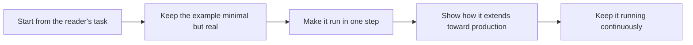

# Examples and Reference Implementations

> **Core skill:** The advocate builds examples that run, teach by doing, and survive being copied — from minimal snippets to production-shaped reference implementations that show how the technology is meant to be used.

## Why This Matters

Examples are the most-read documentation and the most-copied code in any ecosystem. A developer evaluating a technology does not read the reference first; they find an example, run it, and judge the entire platform by whether it worked. When it works, the example becomes the seed of a real project — often carried into production nearly as written. That is the power and the danger: whatever the example teaches, including its shortcuts and omissions, gets inherited by everything built on top of it.

The craft spans a spectrum from snippet to reference implementation, and each level has a different job. A snippet proves a concept in five lines; an example app shows a task completed end to end; a reference implementation demonstrates what a well-built production system looks like — structure, error handling, configuration, deployment — as a transferable pattern rather than a copy-paste destination. Confusing the levels is the classic failure: toy examples that silently teach unshippable patterns, or reference implementations so elaborate that nobody can adapt them. The professional matches the level to the lesson and labels the boundary honestly.

Examples also carry a maintenance contract that prose does not. A paragraph can be approximately true for years; an example either runs or it does not, and it stopped running the moment a dependency moved. The advocate treats examples as code: version-pinned, licensed, tested in continuous integration, and retired deliberately. Every uncared-for example is a trap set for a future reader, and the trap is more expensive than the example ever saved.

## The Example Spectrum

| Level | What It Proves | Maintenance Cost | Typical Placement |
|-------|----------------|-------------------|-------------------|
| Snippet | One concept or call in isolation | Low but real | Reference entries, blog posts |
| Example app | A task completed end to end | Medium | Tutorials, docs, template repos |
| Sample project | Structure, configuration, multiple features | Medium to high | Docs, workshops, starter kits |
| Reference implementation | A production-shaped pattern for a real scenario | High; needs an owner | Solution guidance, architecture docs |
| Starter template | A scaffold to begin real work | Medium; versioned | Onboarding, repositories |

Each level must state what it is: a template is not a reference architecture, and a snippet is not a starter kit. The label is part of the teaching.

## Example Quality Criteria

| Criterion | Rule |
|-----------|------|
| Runs in one step | A fresh checkout starts with a single documented command |
| Minimal but real | Small enough to read; realistic enough to transfer |
| No hidden magic | Every file has a visible purpose; no unexplained glue |
| Errors handled | Failure paths shown, because copied code copies its gaps |
| Pinned dependencies | Versions fixed so the example is true by construction |
| Licensed clearly | Copy-paste legality stated at the top of the repository |
| Labeled maturity | Production-shaped versus illustrative is never ambiguous |
| Tested continuously | CI runs the example the way a reader would |

The last criterion is the dividing line between a maintained example and a future defect report: if no machine executes it, its claims decay with every dependency release.

## Keeping Examples Alive

| Practice | Mechanism | Signal It Is Working |
|----------|-----------|----------------------|
| CI execution | Every example builds and runs on a schedule | Failures surface before readers find them |
| Dependency currency | Renovation pull requests plus a human test of the upgrade | Examples track the current supported versions |
| Ownership | Every repository lists an owner and a support expectation | Issues get answered; rot gets noticed |
| Sunset policy | Examples that cannot be maintained are archived with guidance | The archive explains what replaced them |
| Feedback intake | Issues from readers are treated as test failures | Corrections recur less over time |

## The Example Lifecycle



The lifecycle is reader-first by design: the task decides the example's shape, the runnable constraint decides its rigor, and the maintain loop decides whether it deserves to stay published at all.

## Practical Applications

### Example Review Checklist

- [ ] The example runs from a fresh checkout with the documented single command
- [ ] Every file exists for a visible reason; nothing is unexplained glue
- [ ] Error handling is shown, not stripped for brevity
- [ ] Dependencies are pinned and the license is stated
- [ ] The README names the maturity level and the production gaps
- [ ] CI runs the example on a schedule, and failures block nothing silently

### Example README Template

```markdown
## <Example name>

| Field | Value |
|-------|-------|
| What it is | <level: snippet, app, sample, reference> |
| Task it shows | <the reader's job> |
| Run it | <single command and expected result> |
| Structure | <the role of each directory or file> |
| Not included | <what this example omits on purpose> |
| Owner and support | <who maintains it, what response to expect> |
```

## Common Pitfalls

| Pitfall | Why It Is a Problem | Better Approach |
|---------|---------------------|-----------------|
| **Author-only examples** | They ran once on the author's machine and never again | CI execution from a fresh environment |
| **Toy-pattern transfer** | Readers copy shortcuts and omissions into production | Label brevity as illustrative; show the safe pattern too |
| **Unlabeled maturity** | A demo mistaken for production design spreads insecure patterns | State the level and the gaps in the README |
| **No error paths** | Copied examples inherit the missing handling | Include the failure branch in every significant flow |
| **Dependency rot** | Unpinned or unupdated examples stop working silently | Pin versions and renovate on a schedule |
| **Abandoned repositories** | The ecosystem keeps faith with code that no longer runs | Archive with guidance and a replacement pointer |

## Success Indicators

- Readers report that examples worked exactly as written
- Examples are forked and extended rather than questioned and abandoned
- Issues about example correctness trend toward zero between releases
- Support and community answers routinely link to a living example
- Reference implementations lead to informed architectural decisions, not blind copies

## Related Topics

- [[02_Guides_and_Tutorials]]
- [[03_Reference_and_API_Documentation]]
- [[05_Solution_Guidance/00_overview|Solution Guidance]]
- [[career-path/07_SRE_and_Platform_Engineer/06_Developer_Platform/00_overview|Developer Platform (SRE)]]

## Summary

Examples and reference implementations are the ecosystem's most-copied teaching material: snippets that prove concepts, apps that complete tasks, and production-shaped references that transfer judgment about structure and failure. The advocate who keeps the spectrum honest — labeled levels, runnable in one step, errors included, dependencies pinned, executed in CI — turns examples from plausible artifacts into trusted seeds that produce users, patterns, and production systems that actually work.
