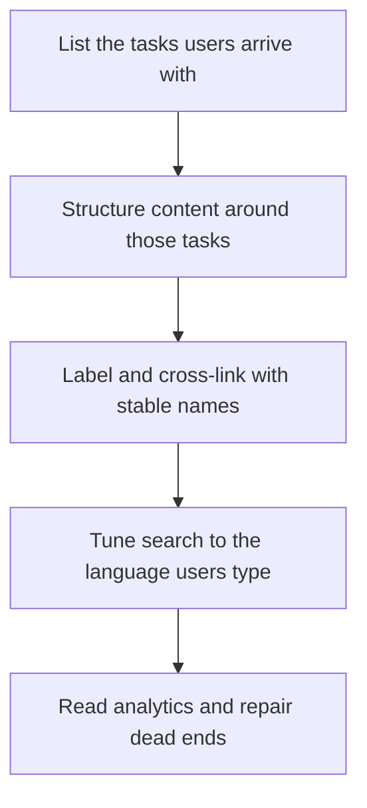

# Information Architecture and Search

> **Core skill:** The advocate structures documentation around the tasks users arrive with — stable names, shallow paths, sensible cross-links — and tunes search so the answer appears for the words a struggling developer actually types.

## Why This Matters

A perfect page that nobody finds is worth zero. Documentation quality is routinely judged page by page, while the user experience is determined by the system above the pages: whether a person lands, orients, and reaches the right answer in seconds. Information architecture is that system — the naming, grouping, ordering, and linking that turns a pile of pages into a place where users can navigate. It is invisible when it works and indistinguishable from missing content when it fails, because a user who cannot find a page concludes the page does not exist.

The design constraint that matters most is task orientation. Organizations naturally structure docs the way the organization is structured — by team, by internal component, by release history — but users arrive with tasks: get this running, fix this error, understand this decision, decide between these two options. Every unit of distance between the user's task language and the site's vocabulary becomes a dead end, and dead ends are where adoption quietly stops. The advocate's discipline is to derive structure from user language — search queries, tickets, forum threads — rather than from the org chart.

Search is the second half of the system and the more honest half, because it records exactly what users wanted in their own words. A docs site's search logs are a research instrument: zero-result queries are missing content, high-exit queries are misleading titles, and repeated synonym queries mean the vocabulary needs fixing. The professional runs this loop deliberately — structure informs search, search repairs structure — instead of treating search as a widget that was installed once.

## Information Architecture Principles

| Principle | Rule | Failure When Ignored |
|-----------|------|----------------------|
| Task-based structure | Organize around what users do, not how the org is built | Users cannot find familiar tasks; navigation feels foreign |
| Stable names | One concept, one term, everywhere — including redirects from old terms | Synonymous pages multiply; trust in links collapses |
| Shallow paths | Any answer within a few clicks of the entry point | Content exists but is effectively hidden |
| One canonical home | Each fact lives in exactly one place; everywhere else links | Contradictory copies drift apart and confuse |
| Predictable page types | Tutorials, guides, reference, and explanation are visibly different | Readers misjudge what they are about to get |
| Cross-links at decision points | Wherever a reader must choose or act, the next page is linked | Readers stall at page boundaries |
| Labels in user language | Navigation and titles echo the words users type | Search becomes the only working entry point |

## Entry Modes and Their Obligations

| Entry Mode | User State | Design Obligation |
|------------|------------|-------------------|
| Search | Knows the problem, not the site | Results rank the task over the brand |
| Top navigation | Orienting, exploring | Categories name user goals, not internals |
| External link | Arrived from a forum, ticket, or search engine | The landing page confirms it matches the promise |
| Internal link | Mid-journey, following steps | The next page continues the task without re-orientation |
| On-page scan | Has opened the page, wants one fact | Headings, tables, and code carry the structure |

Each mode is a different door into the same building; a documentation set that serves only one of them loses every user who arrives through the others.

## Search Quality Levers

| Lever | Practice | Evidence It Works |
|-------|----------|-------------------|
| Title discipline | Titles use the words users search with, not internal names | Query-to-click rates rise on task terms |
| Synonym and alias handling | Common names for a concept resolve to the canonical page | Synonym queries stop ending in zero results |
| Error indexing | Error messages and codes appear verbatim in searchable content | Error-text queries land on remedies |
| Canonical boosting | The maintained page outranks stale duplicates | Users reach the current answer first |
| Zero-result mining | Empty and abandoned searches reviewed on a schedule | Missing content becomes backlog, then content |
| Feedback capture | Results pages offer a correction path | Reported misses flow to owners |

## The Findability Loop



The loop never closes permanently: new tasks, new terminology, and new failures reopen it every cycle. Dedicated maintenance time — not inspiration — is what keeps the loop rotating.

## Practical Applications

### Findability Checklist

- [ ] Every primary task has an obvious entry page reachable in a few clicks from the docs home
- [ ] Navigation labels match the words users search with, verified against query data
- [ ] Each concept has one canonical page; duplicates are redirected or removed
- [ ] Search handles the top error messages and codes users paste in
- [ ] Zero-result and abandoned queries are reviewed on a fixed schedule
- [ ] Page titles and descriptions are written to be useful as search results, not only on the page

### Page Metadata Template

```markdown
## Page Record

| Field | Value |
|-------|-------|
| Title | <in user language> |
| URL | <stable slug> |
| One-line description | <the answer this page gives> |
| Task served | <the user job> |
| Canonical for | <concepts this page owns> |
| Links out | <next pages at decision points> |
| Owner | <name> |
```

## Common Pitfalls

| Pitfall | Why It Is a Problem | Better Approach |
|---------|---------------------|-----------------|
| **Org-chart navigation** | Users do not know or care how the company is structured | Derive categories from user tasks and language |
| **Deep nesting** | Answers hidden five levels down are effectively absent | Flatten toward shallow, task-named paths |
| **Synonym sprawl** | Multiple pages for one concept contradict each other | One canonical page; aliases and redirects from the rest |
| **Search ignored** | The most honest research instrument in the docs sits unused | Mine zero-result and exit queries every cycle |
| **Jargon-only labels** | Users searching their own words hit dead ends | Mirror user vocabulary in labels and titles |
| **Link rot** | Moves and renames break the paths readers actually follow | Redirect discipline and link checking in CI |

## Success Indicators

- Users reach answers on the first attempt, measured by search success and task completion
- Zero-result queries decline as content gaps close
- Inbound deep links land on current, correct pages
- Community answers increasingly link to docs instead of re-explaining
- Navigation changes are justified by query data rather than aesthetic preference

## Related Topics

- [[01_Documentation_as_a_Product]]
- [[06_Troubleshooting_and_Migration_Guides]]
- [[07_Documentation_Quality_and_Maintenance]]
- [[career-path/07_SRE_and_Platform_Engineer/06_Developer_Platform/00_overview|Developer Platform (SRE)]]

## Summary

Information architecture and search are the finding system of documentation: task-based structure, stable user-language names, shallow paths, canonical pages, and search tuned to the errors and phrasing users actually bring. The advocate who treats findability as a designed property — measured, mined, and repaired continuously — multiplies the value of every page the team writes, because the best content in the world only works if the person who needs it can reach it.
