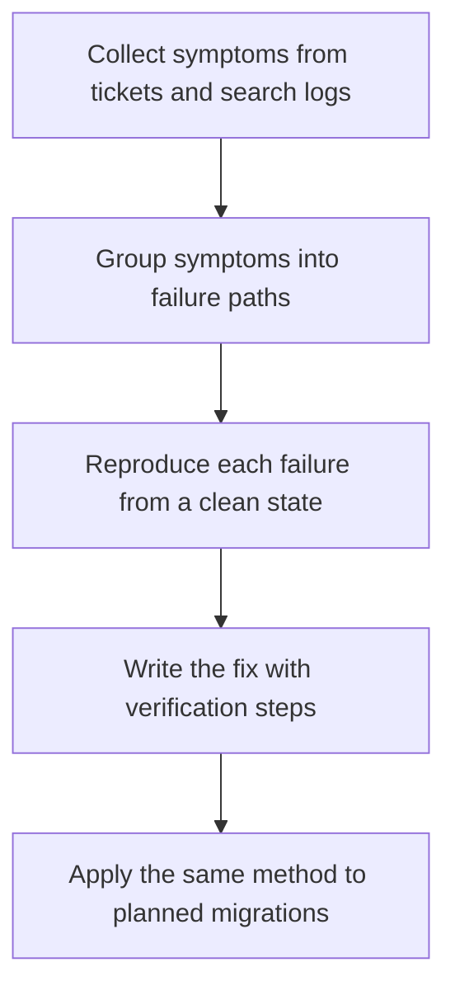

# Troubleshooting and Migration Guides

> **Core skill:** The advocate turns real failures into rescue content — troubleshooting pages organized by the symptoms users report and migrations mapped as planned breakage — so problems are solved in the docs instead of in a support queue.

## Why This Matters

Troubleshooting documentation meets users at their most motivated and least patient moment. Something is broken, the clock is running, and the person searching is not reading carefully — they are scanning for their exact error text. This is the single most valuable content in the docs set, because a page that resolves the failure preserves the entire adoption journey, while a missing page sends the user to support, to a competitor, or to a decision that this tool is not ready for production. The support ticket is where trust leaks; troubleshooting content is the repair.

The discipline that makes it work is starting from symptoms, not from causes. Engineers document failures by root cause, because that is how they understand them; users search by observable symptoms, because that is all they have. A page titled with internal error categories is invisible; a page that begins with the literal error message and walks a diagnosis is found and used. Great troubleshooting content reads like an expert sitting beside the user — reproduce, isolate, resolve, verify — and it is built from the raw material of actual support conversations, not from the author's imagination.

Migration guides are troubleshooting's higher-stakes sibling: failure that is planned, scheduled, and still surprising. Upgrades are where long-lived trust is won or lost, because a botched migration takes production systems with it and its story circulates for years. The professional treats a version upgrade as a documented operation — what breaks, in what order, with what tooling, and how to roll back — so that customers move forward confidently instead of deferring upgrades until the old version's support ends.

## Mining Real Failures

| Source | What It Yields | Cadence |
|--------|----------------|---------|
| Support tickets | The symptoms users actually hit and the words they use | Weekly sampling |
| Community threads | Symptoms before they reach support, often with workarounds | Continuous skimming |
| Search logs | The exact error strings and phrasings typed into docs search | Monthly review |
| QA and bug trackers | Known breaks before customers find them | Each release |
| Sales and field calls | Integration obstacles in real customer environments | Per deal cycle |

The backlog writes itself if the intake is regular: every recurring ticket is a troubleshooting page that has not been written yet, and its absence is measurable in ticket volume.

## Anatomy of a Troubleshooting Page

| Element | Job | Rule |
|---------|-----|------|
| Symptom statement | Confirm the reader is in the right place | Lead with the literal error text or observable behavior |
| Quick resolution | Serve the common case first | The most frequent fix appears before the full diagnosis, clearly marked |
| Diagnostic path | Isolate the cause for the rest | Ordered checks, each with expected observations |
| Resolution steps | Apply the fix | Precise, verifiable steps with the result to expect |
| Verification | Confirm the problem is gone | A command or check that proves success |
| Prevention | Stop the next occurrence | The configuration or practice that avoids the failure |
| Related symptoms | Keep the reader moving | Links to adjacent failure pages and the relevant reference |

The quick-resolution-first structure serves both audiences: the majority who need the common fix now, and the minority whose case requires the walk.

## What a Migration Guide Must Contain

| Section | Content | Why It Cannot Be Omitted |
|---------|---------|--------------------------|
| Impact statement | Who is affected and what breaks | Readers decide within seconds whether this applies to them |
| Breaking changes list | Every behavior change, named precisely | Each hidden break becomes a production incident |
| Before and after examples | The change shown in code | Readers translate patterns faster than rules |
| Automation and tooling | Commands, codemods, compatibility switches | Manual work scales with the reader's system size |
| Staged plan | The order that keeps the system working mid-migration | Big-bang upgrades fail at scale |
| Rollback path | How to reverse if something is wrong | Teams hesitate to start without an exit |
| Verification | How to prove the migration succeeded | Confidence comes from checks, not optimism |
| Support route | Where unusual cases go | The guide does not pretend to cover every system |

## The Failure-to-Fix Flow



The flow is cumulative: each fix adds a reproducible scenario to the team's understanding, and that understanding is what makes the next migration's breaking-change list honest.

## Practical Applications

### Troubleshooting Intake Checklist

- [ ] The page opens with the literal symptom text users paste into search
- [ ] The common fix appears first, clearly marked as the quick resolution
- [ ] The diagnostic path uses ordered checks with expected observations
- [ ] Every resolution ends with a verification step that proves success
- [ ] Prevention guidance and related symptoms are linked
- [ ] The page names the versions it applies to and its last verification date

### Migration Guide Template

```markdown
## Migration Guide — <from version to version>

| Section | Content |
|---------|---------|
| Impact | <who is affected; what breaks> |
| Breaking changes | <precise list with before and after> |
| Tooling | <commands or codemods that automate the change> |
| Staged plan | <order of steps that keeps systems running> |
| Rollback | <how to reverse safely> |
| Verification | <checks that prove success> |
| Support | <where unusual cases are routed> |
```

## Common Pitfalls

| Pitfall | Why It Is a Problem | Better Approach |
|---------|---------------------|-----------------|
| **Cause-first titles** | Users search symptoms; cause-named pages are never found | Title and open with the literal symptom |
| **Fix without verification** | Readers cannot tell whether it worked or just moved the failure | End every resolution with a proof step |
| **Versionless pages** | Advice silently expires and misleads on newer releases | State the applicable versions and re-verify on release |
| **Migration written late** | Authored under release pressure, it misses exactly the breaking changes that matter | Draft the migration guide with the change itself |
| **No rollback path** | Teams delay upgrades indefinitely rather than risk a one-way door | Document the reverse path as a first-class section |
| **Support as the ending** | Every page funneling to support wastes the content's leverage | Resolve in the page; route only genuinely unusual cases |

## Success Indicators

- Support ticket volume on documented symptoms declines release over release
- Users arrive at troubleshooting pages through their exact error text
- Migrations are completed on schedule with few emergency escalations
- Field teams cite migration guides to customer objections about upgrading
- Recurring community questions now link to a page instead of a thread

## Related Topics

- [[03_Reference_and_API_Documentation]]
- [[05_Information_Architecture_and_Search]]
- [[04_Customer_and_Developer_Understanding/00_overview|Customer and Developer Understanding]]
- [[07_Product_Feedback_and_Ecosystem_Strategy/00_overview|Product Feedback and Ecosystem Strategy]]
- [[career-path/02_Senior_Software_Engineer/06_Communication_and_Influence/05_Documentation_Strategy|Documentation Strategy (Senior)]]

## Summary

Troubleshooting and migration guides are rescue content: pages that open with the user's exact symptom, serve the common fix first, walk a diagnosis with verification, and prevent recurrence — plus migrations mapped as planned breakage with tooling, staging, and rollback. The advocate who mines real failures and answers them in the docs converts the most fragile moment of technology adoption into the moment that earns enduring trust.
