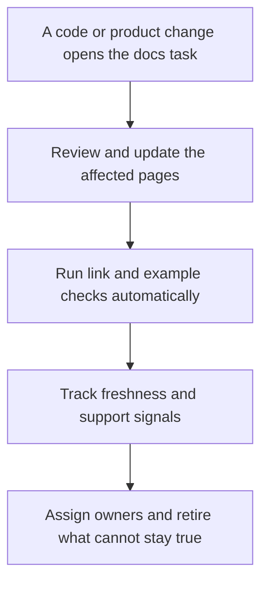

# Documentation Quality and Maintenance

> **Core skill:** The advocate keeps documentation true over time — quality defined and checked, freshness tracked, changes reviewed with releases, and content that cannot be maintained deliberately retired.

## Why This Matters

Documentation does not decay because anyone broke it; it decays because everything around it moved. A dependency shipped a new major version, a default changed, a UI was redesigned, a permission model was tightened — and every page that references those things slid from true to false without a single edit. Stale documentation is worse than missing documentation, because missing content invites a search while a confidently wrong page invites a production incident. The maintenance system, not the writing, is what decides whether a docs set can be trusted after its first release.

The quality problem is equally procedural. "Good docs" is not a feeling; it is a set of checkable dimensions — accurate, complete, current, clear, findable, consistent, accessible — each with evidence and a failure mode. Teams that never define the bar cannot review against it, and reviews degrade into taste debates. The advocate converts quality from an argument into a checklist, so that any contributor, including an engineer writing their first page, can tell whether their work passes.

Maintenance is also a scoping discipline. Every page added is a promise to keep it true, and a docs set that only grows eventually exceeds anyone's ability to maintain it. Healthy documentation practices balance creation with retirement: pages that no longer serve a task are archived or absorbed, owners are named, freshness is measured, and the set stays roughly the same size while getting truer. The garden metaphor is the right one — documentation is tended, not built.

## Quality Dimensions and Their Evidence

| Dimension | Question | Evidence to Check |
|-----------|----------|-------------------|
| Accurate | Is every claim and command still true | Execution on a clean environment |
| Complete | Can the task finish without leaving the page | Journey test with no improvisation |
| Current | Does it match the current version | Version stamps and release review |
| Clear | Does one reading suffice for the target audience | Readability review with a real reader |
| Findable | Can the audience locate it | Search success and navigation tests |
| Consistent | Does it use the same names and formats as everywhere else | Terminology and template checks |
| Accessible | Can every audience consume it | Alt text, contrast, captions, structure |

Each dimension is verified differently, which is why quality cannot be assessed by a single pass — execution tests accuracy, journeys test completeness, and users test clarity.

## Maintenance Triggers

| Trigger | Documentation Action | Owner |
|---------|---------------------|-------|
| Release with behavior changes | Update affected pages with the release | Feature engineer |
| Dependency or platform change | Re-verify tutorials and examples | Docs owner |
| Support spike on a topic | Review, refresh, or write the missing page | Advocate |
| Search misses or dead queries | Repair titles and coverage in the affected area | Advocate |
| Interface or terminology change | Sweep for stale names and screenshots | Docs owner |
| Deprecation announced | Publish migration content and mark the old pages | Product and advocate |
| Scheduled freshness review | Re-execute and re-stamp pages in a rotation | Page owner |

Triggers beat calendars: a maintenance system that reacts to change catches drift at its source, while periodic review alone always lags.

## Review Types

| Review | Scope | Cadence |
|--------|-------|---------|
| Change review | Pages touched by a release | Every release |
| Freshness rotation | Assigned pages re-verified in batches | Continuous rotation |
| Journey walk | A full user path end to end | Quarterly per major journey |
| Automated checks | Links, examples, spelling, structure | Every commit |
| Contribution review | New and changed pages against the quality bar | As submitted |

Automation handles what machines can prove — links resolve, examples run, structure is valid — so human review spends its time on meaning.

## The Maintenance Loop



The loop ends in triage, not accumulation: what cannot be kept true is retired rather than re-queued. The docs set shrinks its debt every cycle instead of carrying it into the next one.

## Practical Applications

### Documentation Maintenance Checklist

- [ ] Every page carries versions, a last-verified date, and an owner
- [ ] Releases open documentation tasks automatically for affected pages
- [ ] Link checking and example execution run on every relevant change
- [ ] A freshness rotation re-verifies pages in batches on a schedule
- [ ] Stale pages are retired or archived with a replacement pointer
- [ ] Support and search signals feed the maintenance backlog on a fixed cadence

### Page Freshness Record Template

```markdown
## Page Record — <page>

| Field | Value |
|-------|-------|
| Owner | <name> |
| Versions covered | <versions> |
| Last verified | <date and method> |
| Next review trigger | <release, date, or signal> |
| Retirement condition | <what would make this page obsolete> |
```

## Common Pitfalls

| Pitfall | Why It Is a Problem | Better Approach |
|---------|---------------------|-----------------|
| **Write-once pages** | Each release silently falsifies more content | Docs tasks tied to release triggers |
| **No owners** | Unclaimed pages rot without anyone noticing until users report it | Name an owner or a retirement date for every page |
| **Trusting headlines over checks** | Pages look maintained while examples no longer run | Automate link and example verification |
| **Endless accumulation** | The set outgrows the team's ability to sustain it | Balance creation with deliberate retirement |
| **Review without the technical owner** | Editorial passes cannot catch technical drift | Technical review required for behavior claims |
| **Docs freeze in crunches** | The release that needed docs most ships with none | Reduce scope rather than skip the docs task |

## Success Indicators

- Freshness records show most pages verified within their review window
- Automated checks are green, and failures are fixed rather than muted
- Support and search signals decline on maintained topics
- Engineers update their pages as part of delivering changes
- The docs set stays roughly stable in size while rising in accuracy

## Related Topics

- [[01_Documentation_as_a_Product]]
- [[05_Information_Architecture_and_Search]]
- [[06_Troubleshooting_and_Migration_Guides]]
- [[career-path/02_Senior_Software_Engineer/06_Communication_and_Influence/05_Documentation_Strategy|Documentation Strategy (Senior)]]
- [[career-path/07_SRE_and_Platform_Engineer/06_Developer_Platform/00_overview|Developer Platform (SRE)]]

## Summary

Documentation quality and maintenance are a system, not an intention: a checkable quality bar, release-triggered updates, automated verification of links and examples, freshness records with owners, and the deliberate retirement of content that cannot stay true. The advocate who runs this loop keeps trust with every reader — because a docs set that is measured, tended, and allowed to shrink stays accurate, and accuracy is the only quality that users can feel.
