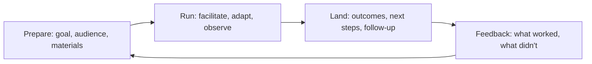

# Facilitation and Enablement

> **Core capability:** The advocate and consultant run sessions that produce outcomes — workshops, demos, discovery conversations, technical reviews — and design enablement programs that multiply capability through other people.

## Why This Matters

Live interaction is where adoption accelerates or stalls: a workshop that leaves developers confident, a discovery session that surfaces the real constraint, a demo that makes the abstract concrete, a review that saves a customer from a costly mistake. The facilitator owns the room's outcome — not the slides.

Enablement goes further: instead of helping one customer or developer at a time, the consultant builds programs that make others effective — partner enablement, customer engineer training, internal onboarding. It is the difference between consulting and multiplying consultation.

## Topics in This Capability Area

| Topic | Core Skill | When It Matters |
|-------|------------|-----------------|
| [[01_Workshops_and_Hands_On_Sessions]] | Designing and running workshops that teach by doing | Adoption; training; partners |
| [[02_Discovery_Sessions]] | Facilitating conversations that surface real needs | Customer engagement; solution scoping |
| [[03_Technical_Demos_and_Presentations]] | Demonstrating tech credibly — live, remote, and recorded | Sales-adjacent; adoption |
| [[04_Technical_Reviews_and_Assessments]] | Leading architecture and implementation reviews | Customer projects; partner work |
| [[05_Enablement_Programs]] | Building partner and team enablement at scale | Ecosystem growth; training |
| [[06_Training_and_Curriculum_Design]] | Structuring learning journeys with exercises and assessment | Courses; certifications |
| [[07_Facilitation_Techniques]] | Group dynamics, exercises, and session productivity | Every facilitated session |

## The Facilitation Arc

Every session has a goal beyond "presenting" — the test is what participants can do afterwards.

## Practical Applications

### Facilitation Checklist

- [ ] Every session has a stated outcome and an agenda mapped to it
- [ ] Hands-on sessions use working environments, tested beforehand
- [ ] Demos are rehearsed; live-coding has fallbacks (recordings, branches)
- [ ] Discovery sessions capture needs and constraints verbatim
- [ ] Enablement programs have adoption metrics, not just attendance

## Common Pitfalls

| Pitfall | Why It Is a Problem | Better Approach |
|---------|---------------------|-----------------|
| **Slide-first sessions** | Passive audiences retain little; confidence untested | Hands-on, exercise-first design |
| **Demo fails live** | Unrehearsed demos break credibility instantly | Rehearse twice; prepare fallbacks |
| **Discovery as interrogation** | Customers defend instead of reveal | Structured elicitation; listen more than ask |
| **Enablement as content dump** | Training consumed, not adopted; no behavior change | Follow-through: practice, assessment, support |

## Success Indicators

- Participants can demonstrate the skill after the session, not just recall it
- Discovery sessions yield constraints and needs that shape real solutions
- Demos create qualified next steps, not just applause
- Enablement programs show measurable capability uplift in participants

## Related Capabilities

- [[01_Technical_Communication/00_overview|Technical Communication]]: the presentation craft this operationalizes
- [[04_Customer_and_Developer_Understanding/00_overview|Customer and Developer Understanding]]: discovery feeds here
- [[career-path/15_Solutions_and_Enterprise_Architect/07_Architecture_Communication/04_Architecture_Facilitation_and_Workshops|Architecture Facilitation and Workshops (Solutions Architect)]]: the architecture-scale counterpart
- [[career-path/13_Project_and_Program_Manager/00_overview|Project and Program Manager]]: program-scale enablement delivery

## Summary

Facilitation and enablement turn technology into capability: workshops that teach by doing, discovery that finds real needs, demos that convince credibly, and enablement programs that multiply through partners and teams. The measure is never attendance — it is what participants can do afterwards.