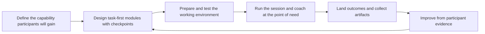

# Workshops and Hands-On Sessions

> **Core skill:** Designing and running sessions where participants build something real with the technology — the workshop succeeds only if people can do the thing after they leave.

## Why This Matters

A demo shows the technology; a workshop hands it over. For a Developer Advocate or Technical Consultant, the workshop is the highest-bandwidth adoption format there is: participants touch the API, hit the error, read the message, fix it, and leave with a working mental model that no slide deck can install. Workshops are where adoption is manufactured — for partner teams preparing to build on a platform, for customer engineers before an implementation, and for internal teams taking on a new tool.

The design constraint is simple to state and hard to honor: every minute of explanation is a minute not spent doing. Strong workshop designers think in tasks, not topics. Each module is a problem to solve, and teaching happens at the moment of need, when the participant is stuck and curious. This inverts the normal presentation instinct, which is why people who over-explain struggle with hands-on formats.

The economics reinforce the discipline. You can only run so many workshops in person, so each one must produce durable capability, artifacts participants keep, and ideally trainers who can run it again. A workshop that ends with applause but no working code has consumed trust and delivered nothing.

## What Separates a Workshop from a Talk

| Dimension | Talk | Workshop |
|---|---|---|
| Center of gravity | Presenter | Participant's keyboard |
| Success measure | Attention and applause | Something working; capability |
| Content unit | Topics and slides | Tasks and checkpoints |
| Failure mode | Boredom | Stuck participants; silent drift |
| Facilitator role | Explains | Coaches and unblocks |
| Ideal size | Any | 8-25 with support; smaller for hard material |

## Designing for Doing

| Design Rule | What It Means | Failure When Ignored |
|---|---|---|
| Outcome first | Name what participants will have built and be able to do | The agenda collapses into a topic list |
| Task-first agenda | Every module starts with a problem to solve | Participants watch instead of do |
| Time-boxed steps | Each step is 5-15 minutes with a visible checkpoint | Nobody knows if they are on track |
| Working baseline | Participants start from a repository that already runs | Setup consumes the teaching time |
| Stretch and hint paths | Extra tasks for fast finishers; hints for slow starters | Mixed pace; part of the room idles |
| Failure as material | Common errors are planted and explained on purpose | The first real error feels like a betrayal |



## Formats and Their Trade-Offs

| Format | Shape | Best For | Watch-Outs |
|---|---|---|---|
| Full-day workshop | 5-6 hours; 4-5 modules | Deep skills; partner onboarding | Energy management; afternoon dip |
| Half-day lab | 2-3 hours; 2-3 modules | One capability; conference pre-day | Scope creep |
| Hands-on segment in a talk | 20-40 minutes | A taste of the capability | Environment failures; no time to recover |
| Multi-week cohort | Weekly sessions with homework | Complex platforms; certification prep | Drop-off between weeks |
| Self-paced with office hours | Recorded tasks plus live questions | Scaling reach | Completion rates need tracking |

## Preparing the Environment

| Concern | Standard Practice | Why |
|---|---|---|
| Setup | Pre-built repository, container, or hosted sandbox | Setup failures consume time and confidence |
| Versions | Pin every dependency; freeze shortly before the session | Drift breaks instructions mid-session |
| Credentials | Pre-provisioned accounts or seeded keys | Signup friction kills momentum |
| Connectivity | Local-first or mirrored dependencies | Venue networks fail |
| Fallbacks | Known-good branch and tested recovery steps | A broken environment should never end the session |
| Dry run | Full rehearsal on a clean machine | The only proof the instructions work |

## Running the Room

| Phase | Facilitator Focus | Signals to Watch |
|---|---|---|
| Open | Frame the outcome; show the finished result | Confusion about the goal |
| Work blocks | Circulate; unblock quietly; narrate timing | Raised hands; idle screens |
| Checkpoints | Verify everyone reached the checkpoint | Quiet drift; skipped steps |
| Debrief | Name the concept behind the task; connect to real work | Questions about why it mattered |
| Close | Point to next steps and keep-going materials | No articulated next action |

## Coaching Mixed Skill Levels

| Participant | Symptom | Move |
|---|---|---|
| Fast finisher | Finishes early and disengages | Stretch task from the backup list |
| Stuck beginner | Same error for several minutes | Pair with a neighbor; give a hint, not the answer |
| Silent expert | Does not ask; may already be skeptical | Ask for their production angle in the debrief |
| Partial attender | Joins late or leaves early | Pre-session reading and a recording |

## Practical Applications

**Workshop readiness checklist:**

- [ ] The outcome is stated as something participants will have built
- [ ] Every module is a task with a visible checkpoint
- [ ] The environment was dry-run on a clean machine within the last week
- [ ] Fallback branch and recovery steps are tested
- [ ] Stretch and hint paths exist for mixed pace
- [ ] Follow-up materials are prepared before the session, not after

**Participant exercise card template:**

```markdown
# Exercise [N]: [Task Name]

**Goal:** [what will work when this exercise is done]
**Time:** [expected minutes]
**Steps:**
1. [step]
2. [step]
**Checkpoint:** [how to verify success]
**If stuck:** [hint path]
**Stretch:** [optional next challenge]
```

## Common Pitfalls

| Pitfall | Why It Is a Problem | Better Approach |
|---------|---------------------|-----------------|
| **Slide-first design** | Passive stretches lose the room; capability never forms | Task-first modules; teach at the point of need |
| **Setup on the day** | Installation failures eat the session and the confidence | Pre-built environments tested on a clean machine |
| **No checkpoints** | Participants drift silently; the group fragments | Visible verification after every step |
| **Facilitator types the whole time** | The room watches someone else learn | Circulate; let participants hit and fix errors |
| **One pace for all** | Fast finishers idle; slow starters panic | Stretch tasks and hint paths |
| **No next step** | Energy ends with the room; nothing continues | Keep-going repository and follow-up challenge |

## Success Indicators

- Participants leave with working code and can explain what they built
- The exercises run without facilitator rescue for most of the room
- Follow-up questions reference the workshop materials, not the theory
- Partner or customer teams run the workshop again without you
- Feedback names specific capabilities, not general enthusiasm

## Related Topics

- [[07_Facilitation_Techniques]] — the general craft these sessions depend on
- [[06_Training_and_Curriculum_Design]] — the structure underneath task-first modules
- [[02_Discovery_Sessions]] — where the needs that shape workshops surface
- [[02_Documentation_and_Learning_Materials/00_overview|Documentation and Learning Materials]] — the materials that outlive the room
- [[career-path/02_Senior_Software_Engineer/06_Communication_and_Influence/04_Facilitation|Facilitation (Senior)]] — the meeting-scale facilitation foundation

## Summary

Workshops turn technology into capability by making participants do the work: outcomes stated as artifacts, task-first modules with checkpoints, environments prepared and rehearsed so nothing stands between the participant and the keyboard, and coaching that meets each skill level where it is. The measure is never the applause — it is what participants can build, and teach others to build, after the room has emptied.
