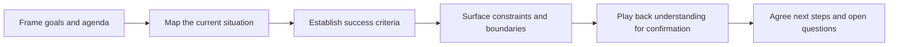

# Discovery Sessions

> **Core skill:** Facilitating structured conversations that surface the customer's real needs, constraints, and success criteria before anyone proposes a solution.

## Why This Matters

Discovery is where engagements are won or lost — not in the proposal. A session that surfaces the real constraint, whether a legacy system, a compliance rule, or a team of two, changes the entire recommendation. A session that collects a wish list produces a generic solution that fails quietly during implementation, long after the meeting where everyone nodded.

Advocates run discovery in a lighter form: conversations with developers about what they are building and where the platform helps or hurts. Consultants run it in a heavier form: stakeholders, timelines, budget, and integration reality. The craft is identical — ask about the situation before the solution, and test your understanding out loud before writing it down.

The failure mode to fear is not a bad meeting but a polished one that produced nothing verifiable: everyone agreed, and nobody said the actual constraint. Facilitation exists to prevent that. Structured phases, deliberate silence, verbatim capture, and a confirm-back that gives stakeholders the chance to correct you are what turn a conversation into evidence.

## Stated Wants and Underlying Needs

| What the Customer Says | What to Probe For | What It Often Reveals |
|---|---|---|
| We need a dashboard | Which decision changes when you see it | A reporting gap, not a visualization need |
| We want to migrate to your platform | What triggered the evaluation now | Deadline, incident, or reorg — timeline reality |
| It must be real time | What breaks with a five-minute delay | A latency assumption never tested |
| Security will never approve | Which control actually blocks approval | One specific requirement, not the whole checklist |
| We have no budget | What timeline the business expects anyway | A priority signal; creative commercial options |

## The Shape of a Discovery Session

| Phase | Purpose | Output |
|---|---|---|
| Frame | Agree goals, agenda, and what a good session produces | Shared expectations; permission to dig |
| Situation | Understand the current state and its pain | Context notes in the customer's words |
| Goals | Establish what success looks like and when | Success criteria and timeline |
| Constraints | Surface budget, compliance, legacy, and team limits | Boundary conditions for any solution |
| Synthesis | Play back what was heard; correct it in the room | Confirmed understanding; candidate next steps |

## Question Design

| Question Type | Example Stem | What It Surfaces | Watch-Out |
|---|---|---|---|
| Context | How does this work today? | Current state and workarounds | Do not interrupt with solutions |
| Outcome | What does success look like in six months? | Success criteria | Do not accept vague answers without follow-up |
| Constraint | What cannot change here? | Boundaries and dependencies | The unspoken political constraint |
| Evidence | When did this last cost you time or money? | Severity; real examples | Hypotheticals dressed as facts |
| Priority | If only one thing shipped, which would it be? | Trade-off order | Everyone ranks everything first |

## Who Belongs in the Room

| Participant | Why They Matter | Risk If Absent |
|---|---|---|
| Economic buyer or sponsor | Budget and priority signals | The solution is approved later by surprise |
| Hands-on practitioner | Real workflow and friction | Requirements that die in implementation |
| Operations or support | Constraints the design must honor | Expensive surprises at rollout |
| Procurement or compliance | Approval conditions | Late-stage blockers |
| The advocate or consultant | Facilitation and synthesis | Discussion without outcome |

## Capturing and Confirming

| Technique | Practice |
|---|---|
| Verbatim quotes | Keep the customer's exact words for constraints and complaints |
| Parking lot | Park solutions that surface early; return after the situation is mapped |
| Playback | Summarize in your own words; ask what you got wrong |
| Shared notes | Note in the open, or share a summary within a day |
| Open question log | List what is still unknown and who can answer it |



## From Session to Next Steps

| Outcome | Artifact | Typical Owner |
|---|---|---|
| Shared understanding | Discovery summary in the customer's language | Advocate or consultant |
| Prioritized needs | Ranked problem list with evidence | Jointly with the customer |
| Constraint register | Explicit boundaries any solution must honor | Consultant |
| Open questions | Owner and date for each answer | Customer stakeholders |
| Path forward | Options or a next-session plan | Jointly |

## Practical Applications

**Discovery session checklist:**

- [ ] Goals and agenda shared in advance; roles clarified
- [ ] Questions prepared for situation, goals, and constraints
- [ ] At least one practitioner, not only managers, in the room
- [ ] Constraints and complaints captured verbatim
- [ ] Playback done in the session; corrections captured
- [ ] Summary and open questions delivered within 48 hours

**Discovery summary template:**

```markdown
# Discovery Summary: [Customer or Team]

**Session goal:** [what this session set out to understand]
**Present:** [names and roles]

## Situation
[Current state in the customer's words; key quotes]

## Goals and Success Criteria
- [goal; how it will be measured; by when]

## Constraints
- [budget, compliance, legacy, timeline, team]

## Open Questions
- [question] — owner: [name] — by: [date]

## Proposed Next Steps
- [step] — owner: [name]
```

## Common Pitfalls

| Pitfall | Why It Is a Problem | Better Approach |
|---------|---------------------|-----------------|
| **Solutions in the first ten minutes** | The real problem never gets described; the room anchors on your idea | Map the situation before solution talk; use a parking lot |
| **Interrogation tone** | Stakeholders defend positions instead of describing reality | Conversational question chains; follow curiosity |
| **Manager-only rooms** | Requirements look tidy and break in implementation | Insist on practitioners who do the work |
| **Notes without playback** | Misunderstandings surface months later, expensively | Confirm understanding in the room |
| **No constraints captured** | The solution is elegant and unapprovable | Ask directly what cannot change |
| **Session without summary** | Memories diverge; nobody agreed to the same thing | Written summary within 48 hours |

## Success Indicators

- Customers correct or confirm your playback with specifics, not nods
- The constraint register later explains most design decisions
- Proposals reference discovery evidence rather than templates
- Stakeholders bring more colleagues to the next session
- Open questions close on schedule with named owners

## Related Topics

- [[01_Workshops_and_Hands_On_Sessions]] — where discovery-informed training continues
- [[04_Technical_Reviews_and_Assessments]] — the review side of the same relationship
- [[07_Facilitation_Techniques]] — the mechanics that keep sessions productive
- [[career-path/14_Product_Manager/01_Problem_Discovery/00_overview|Problem Discovery (PM)]] — the product-side discovery discipline
- [[career-path/15_Solutions_and_Enterprise_Architect/01_Business_Analysis_and_Capability_Mapping/00_overview|Business Analysis and Capability Mapping (Solutions Architect)]] — enterprise-scale context analysis

## Summary

Discovery sessions convert a customer conversation into evidence: framing the goals, mapping the situation before the solution, designing questions that separate stated wants from underlying needs, capturing constraints verbatim, and playing understanding back for correction while the people who can correct it are still in the room. The deliverable is not a deck — it is a confirmed, written understanding that every later recommendation can stand on.
