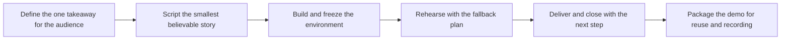

# Technical Demos and Presentations

> **Core skill:** Building and delivering technical demonstrations that make the abstract believable — live, remote, or recorded — and that end with the audience knowing the next step.

## Why This Matters

A demo is an argument made with running software. For the advocate it is how a new capability becomes concrete for developers who will never read the release notes; for the consultant it is how a customer sees their own problem solved before committing budget. When it works, skepticism converts to curiosity in minutes. When it fails, the audience remembers the failure, not the technology.

Credibility is the currency. Technical audiences have finely tuned fake detectors: they can feel when a demo is a scripted happy path designed to hide problems, and they discount everything that follows. A demo that shows real behavior — including a considered error and its recovery — earns more belief than one that glides over the edges. The advocate's job is not to pretend the product is finished; it is to show honestly what it does and why that matters.

Demos also scale badly if they are not built to last: the same demo is often delivered a dozen times, by you and by others, so the story, the environment, and the fallback plan must all be artifacts, not improvisation. Treating a demo as a designed deliverable rather than a rehearsal of your own knowledge is the difference between a talk you give and an asset your organization owns.

## What a Demo Must Prove

| Audience | What They Need to Believe | Proof That Works |
|---|---|---|
| Developers evaluating a stack | The tool is what it claims to be; it fits my workflow | Real code, real errors, real fix; measured behavior |
| Engineering leaders | The team will be more effective | End-to-end task that mirrors their team's work |
| Customer stakeholders | This solves our problem specifically | Their scenario, their data shape, their constraint honored |
| Partners | There is a business to build here | Extension points and integration path shown working |
| Internal teams | The change is worth adopting | Migration path from what they use today |

## Demo Formats and Trade-Offs

| Format | Strengths | Risks | Best For |
|---|---|---|---|
| Live demo | Immediacy; Q and A in context | Environment failure; nerves | Confident presenters; interactive audiences |
| Recorded demo | Deterministic; reusable; reviewable | Stale quickly; no questions | Repeat delivery; async sharing |
| Guided walkthrough in the product | Real depth as questions arise | Wanders; time overruns | Follow-up sessions; evaluations |
| Interactive sandbox | Audience does it themselves | Support burden | Developer events; post-talk exploration |
| Story demo with a known failure | Honesty; teaches recovery | Needs confident framing | Technical audiences; trust building |

## The Story Arc

| Beat | Purpose | Rough Share of Time |
|---|---|---|
| Problem | The audience sees themselves in the story | 15 percent |
| Promise | State exactly what will be shown working | 5 percent |
| Proof | The demo does the thing; narration ties to value | 60 percent |
| Payoff | What this means for their work; limits stated honestly | 15 percent |
| Next step | One concrete action they can take today | 5 percent |



## Building Demos That Survive

| Risk | Mitigation |
|---|---|
| Environment drift | Pin versions; freeze the environment days before; rehearse on the target machine |
| Network failure | Local dependencies; pre-seeded data; mirror of any downloads |
| Data sensitivity | Fabricated data in realistic shapes; never customer data |
| Long-running operations | Pre-computed results on a branch; show the operation at small scale |
| Live mistakes | Practice the recovery path; keep a recorded fallback ready |
| Reuse by others | Written script, environment note, and recording stored together |

## Delivery Craft

| Technique | Why It Works |
|---|---|
| Narrate the why before the how | Audiences track intentions, not keystrokes |
| Zoom into the artifact | Slow down at the code, the payload, the schema |
| Say the limits out loud | Naming constraints preempts the skeptical question |
| Pause after the payoff | Silence lets the result land before moving on |
| One idea per slide during setup | The screen argues for you before code runs |
| End on the next step | Memory follows the last instruction given |

## When the Demo Breaks

| Failure | Immediate Move | Recovery |
|---|---|---|
| Command errors | Read the error aloud; treat it as content | Fix calmly; narrate the diagnosis |
| Service down | Switch to the recorded fallback without drama | Follow up with the working case afterwards |
| Unexpected output | Acknowledge it; do not bluff | Investigate after; report what you found |
| Time overrun | Cut to the next step; offer depth afterwards | Send the deep material as follow-up |
| Audience confusion | Stop; ask what is unclear | Re-anchor before continuing |

## Practical Applications

**Demo readiness checklist:**

- [ ] The one takeaway is written in a single sentence
- [ ] The demo was rehearsed at least twice, including the failure path
- [ ] The environment is frozen, pinned, and tested on the delivery machine
- [ ] A recorded fallback exists and plays on the delivery machine
- [ ] The close contains one concrete next step
- [ ] The script, environment notes, and recording are stored for reuse

**Demo script template:**

```markdown
# Demo: [Title]

**Audience and takeaway:** [who; what they should believe afterwards]
**Story:** [problem; promise; proof; payoff; next step]
**Environment:** [repo or sandbox; frozen versions; credentials]
**Beats:**
1. [setup beat] — [narration point]
2. [main proof] — [what the audience watches for]
3. [close] — [next step offered]
**Fallbacks:** [recorded file; known-good branch; recovery steps]
**Limits to state honestly:** [what the demo does not show]
```

## Common Pitfalls

| Pitfall | Why It Is a Problem | Better Approach |
|---------|---------------------|-----------------|
| **Unrehearsed live demo** | First runs fail in public; credibility burns in seconds | Two rehearsals minimum; fallback recording ready |
| **Scripted happy path only** | Technical audiences discount anything too smooth | Show one honest edge case and its handling |
| **Feature parade** | The audience cannot repeat what they saw | One story, one takeaway, one next step |
| **Demo on dream data** | Production shapes break the promise immediately | Realistic fabricated data in production shapes |
| **No fallback** | One live failure becomes the memory of the meeting | Recorded version and known-good branch |
| **Demo that dies with you** | Every delivery requires your presence | Script and environment packaged for reuse |

## Success Indicators

- Audiences ask about adopting the demonstrated workflow, not the slides
- The demo is delivered successfully by a colleague without you
- Qualified follow-ups reference specific beats of the story
- Skeptical questions are answered from the demo itself, not from promises
- The recorded version stands alone for async audiences

## Related Topics

- [[07_Facilitation_Techniques]] — presence and room control for live delivery
- [[01_Workshops_and_Hands_On_Sessions]] — the deeper format when demos are not enough
- [[01_Technical_Communication/00_overview|Technical Communication]] — the explanation craft behind every beat
- [[05_Solution_Guidance/00_overview|Solution Guidance]] — the recommendations demos support
- [[career-path/02_Senior_Software_Engineer/06_Communication_and_Influence/02_Stakeholder_Communication|Stakeholder Communication (Senior)]] — tailoring the same proof for decision-makers

## Summary

Technical demos and presentations are arguments built from running software: the smallest believable story, an environment frozen and rehearsed until it cannot surprise you, honest handling of limits and failures, and a close that names one concrete next step. The measure of a demo is not applause but belief put into action — and a demo packaged well enough that others can carry it forward without you.
